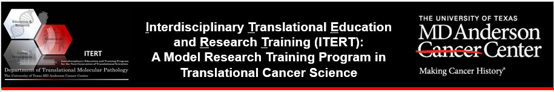

---
output:
  bookdown::gitbook:
    lib_dir: assets
    split_by: chapter
    config:
      toolbar:
        position: static
    sharing: 
      facebook: yes
      twitter: yes
      google: no
      weibo: no
      instapper: no
      vk: no
      all: ['facebook', 'google', 'twitter', 'weibo', 'instapaper']
  bookdown::pdf_book:
    keep_tex: yes
  bookdown::html_book:
    css: toc.css
documentclass: book
---

<style>
body {
text-align: justify}
figure figcaption {
    text-align: center;}
}
</style>


```{r setup, include=FALSE}
knitr::opts_chunk$set(echo = TRUE)
```

<div style="text-align:center" markdown="1">



</div>

---

<center> 
<h2 class="w3-xxxlarge" style="font-weight:bold"> Programming for Data Analysis </h2> </center>

---

### <span style="color: blue;"> Learning Objectives </span> {-}

Towards the end of this course the student will exhibit in-depth understanding of data science and analysis methods as well as proficiency in R. The student will produce a portfolio of data analysis projects from the course that demonstrates mastery of analysis and visualization methods. He /She will be equipped for analysis of biomedical and genomic data sets. Another main objective of the course is to communicate statistical results correctly and effectively.

### <span style="color: blue;"> Course Overview </span> {-}

This course is designed to empower students to learn R programming language to conduct data science. We will study a wide range of topics, including, handing and querying databases, exploratory/confirmatory analysis and visualization in R. We will closely follow the book R for Data Science, however the emphasis will be given to working with biomedical data than datasets illustrated and used in the textbook.

This course **does not** have any pre-requisites.

### <span style="color: blue;"> Office Hours </span> {-}

Through appointment and WebEx

### <span style="color: blue;"> Recommended Reading </span> {-}

1. R for Data Science by Garrett Grolemund & Hadley Wickham - available [here](http://r4ds.had.co.nz/)
2. R in Action by Robert I. Kabacoff
3. Several online tutorials (just type "R tutorial" in google and follow the lead)

### <span style="color: blue;"> Lectures </span> {-}

[[Lecture 01](introduction.pdf)] [[Lecture 02]](CopyOfLecture_02.html) [[Lecture 03]](Lecture_03/Lecture_03.html) 
[[Lecture 04]](Lecture_04/Lecture_04.html) [[Lecture 05]](Lecture_05/DS04.html) [[Lecture 06]](Lecture_06/DS05.html) [[Lecture 07]](Lecture_07/DS06.html) [[Lecture 08]](Lecture_08/DS07.html) [[Lecture 09]](Lecture_09/DS08.html)


