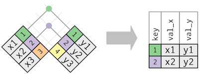
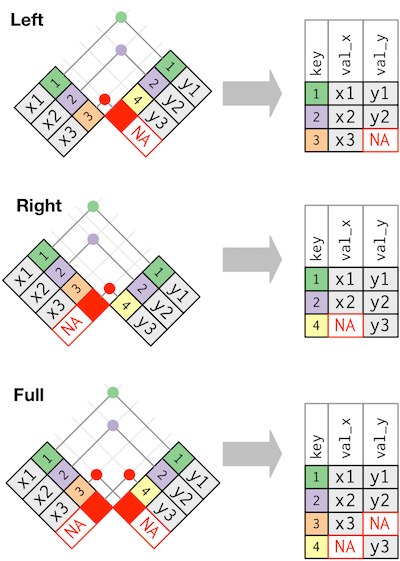
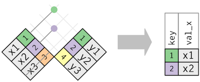
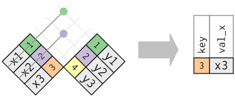

```{r setup, include=FALSE}
knitr::opts_chunk$set(echo = TRUE)
```

---

### Data Science: Wrangle and Explore

---

#### A note on tibbles

We already saw tibbles and how to convert data frames into tibbles (using `as.tibble()`). Tibbles have a refined print method that shows only the first 10 rows, and all the columns that fit on screen.  


```{r eval=TRUE, message=FALSE}
  # Load the package RCurl
  library(RCurl)
  # Import the HANES data set from GitHub; break the string into two for readability
  # (Please note this readability aspect very carefully)
  URL_text_1 <- "https://raw.githubusercontent.com/kannan-kasthuri/kannan-kasthuri.github.io"
  URL_text_2 <- "/master/Datasets/HANES/NYC_HANES_DIAB.csv"
  # Paste it to constitute a single URL 
  URL <- paste(URL_text_1,URL_text_2, sep="")
  HANES <- read.csv(text=getURL(URL))
  # Rename the GENDER factor for identification
  HANES$GENDER <- factor(HANES$GENDER, labels=c("M","F"))
  # Rename the AGEGROUP factor for identification
  HANES$AGEGROUP <- factor(HANES$AGEGROUP, labels=c("20-39","40-59","60+"))
  # Rename the HSQ_1 factor for identification
  HANES$HSQ_1 <- factor(HANES$HSQ_1, labels=c("Excellent","Very Good","Good", "Fair", "Poor"))
  # Rename the DX_DBTS as a factor
  HANES$DX_DBTS <- factor(HANES$DX_DBTS, labels=c("DIAB","DIAB NO_DX","NO DIAB"))
  # Omit all NA from the data frame
  HANES <- na.omit(HANES)
  # Observe the structure
  str(HANES)
  # Load the tidyverse library
  library(tidyverse)
```


To subset a variable name in a pipe, we have to use a special placeholder `.` when we use tibble.


```{r eval=FALSE, message=FALSE, warning=FALSE, echo=TRUE, na.rm=FALSE}
  # Convert HANES to tibble
  HANES_tibble <- as.tibble(HANES) 
  # Subset A1C variable from the tibble HANES
  HANES_A1C <- HANES_tibble %>% .$A1C 
  # You can set the print options for the 
  # number of lines to be printed
  options(tibble.print_min = 7)
  as.tibble(HANES_A1C)
```
  
```{r eval=TRUE, message=FALSE, warning=FALSE, echo=FALSE}
  # Convert HANES to tibble
  HANES_tibble <- as.tibble(HANES) 
  # Subset A1C variable from the tibble HANES
  HANES_A1C <- HANES_tibble %>% .$A1C 
  # You can set the print options for the 
  # number of lines to be printed
  options(tibble.print_min = 7)
  as.tibble(HANES_A1C)
```

---

#### Reading files and parsing

Comma Seperated Values (CSV) are the most common types of files. We can read a `.csv` file through the function `read_csv()`.

```{r eval=FALSE, message=FALSE, warning=FALSE, echo=TRUE, na.rm=FALSE}
  # Read the HANES orginal csv file 
  URL_text_1 <- "https://raw.githubusercontent.com/kannan-kasthuri/kannan-kasthuri.github.io"
  URL_text_2 <- "/master/Datasets/HANES/HANES.original.csv"
  # Paste it to constitute a single URL 
  URL <- paste(URL_text_1,URL_text_2, sep="")
  HANES_original <- read.csv(URL)
  # and convert into tibble
  as.tibble(HANES_original)
```
  
```{r eval=TRUE, echo=FALSE, message=FALSE, warning=FALSE}
  # Read the HANES orginal csv file 
  URL_text_1 <- "https://raw.githubusercontent.com/kannan-kasthuri/kannan-kasthuri.github.io"
  URL_text_2 <- "/master/Datasets/HANES/HANES.original.csv"
  # Paste it to constitute a single URL 
  URL <- paste(URL_text_1,URL_text_2, sep="")
  HANES_original <- read.csv(URL)
  # and convert into tibble
  as.tibble(HANES_original)
```

Parsing a vector can be done through the parsing function:

```{r eval=FALSE, message=FALSE, warning=FALSE, echo=TRUE, na.rm=FALSE}
  # Parse a logical vector
  str(parse_logical(c("TRUE", "FALSE", "NA")))
  # Parse an integer vector 
  # Actually EDUCATION is a factor variable 
  str(parse_integer(as.character(HANES_original$EDUCATION)))
  # Parse a date vector
  str(parse_date(c("2010-01-01", "1979-10-14")))
```
  
```{r eval=TRUE, message=FALSE, warning=TRUE, echo=FALSE}
  # Parse a logical vector
  str(parse_logical(c("TRUE", "FALSE", "NA")))
  # Parse an integer vector 
  # Actually EDUCATION is a factor variable 
  str(parse_integer(as.character(HANES_original$EDUCATION)))
  # Parse a date vector
  str(parse_date(c("2010-01-01", "1979-10-14")))
```

We can specify which education categories should be treated as NA. For instance, if we wish to denote all high schoolers (category 2) as NA:

```{r eval=FALSE, message=FALSE, warning=FALSE, echo=TRUE, na.rm=FALSE}
  # Replace EDUCATION variable with high schoolers as NA
  as.tibble(parse_integer(as.character(HANES_original$EDUCATION, na = "2")))
```
  
```{r eval=TRUE, message=FALSE, warning=TRUE, echo=FALSE}
  # Replace EDUCATION variable with high schoolers as NA
  as.tibble(parse_integer(as.character(HANES_original$EDUCATION, na = "2")))
```

If parsing fails we will get a warning:

```{r eval=FALSE, message=FALSE, warning=FALSE, echo=TRUE, na.rm=FALSE}
  # Parse EDUCATION as a logical when it is a number
  parse_logical(as.character(HANES_original$EDUCATION))
```
  
```{r eval=TRUE, message=FALSE, warning=TRUE, echo=FALSE, results=FALSE}
  # Parse EDUCATION as a logical when it is a number
  parse_logical(as.character(HANES_original$EDUCATION))
```

which can be output into a tibble format using the `problems()` function:

```{r eval=FALSE, message=FALSE, warning=FALSE, echo=TRUE, na.rm=FALSE}
  # Parse EDUCATION as a logical when it is a number
  x <- parse_logical(as.character(HANES_original$EDUCATION))
  # and output the result as a nice tibble
  problems(x)
```
  
```{r eval=TRUE, message=FALSE, warning=FALSE, echo=FALSE, results=TRUE}
  # Parse EDUCATION as a logical when it is a number
  x <- parse_logical(as.character(HANES_original$EDUCATION))
  # and output the result as a nice tibble
  problems(x)
```

Parsing different number formats are important as it comes in various styles:

1. People write numbers differently in different parts of the world. For example, some countries use . in between the integer and fractional parts of a real number, while others use ,.

2. Numbers are often surrounded by other characters that provide some context, like “$1000” or “10%”.

3. Numbers often contain “grouping” characters to make them easier to read, like “1,000,000”, and these grouping characters vary around the world.

The first problem is solved by the argument `locale` in `parse_double()` function, the second using `parse_number()` function and the third by combination of `locale` and `parse_number()`.

```{r eval=FALSE, message=FALSE, warning=FALSE, echo=TRUE, na.rm=FALSE}
  # Parse the number 1,23 where the decimal mark is written as a `,`
  parse_double("1,63", locale = locale(decimal_mark = ","))
  # Just parse the number for $120 and 60%
  parse_number("$120")
  parse_number("60%")
  # Parse the grouping as used in Europe
  parse_number("123'834'297", locale = locale(grouping_mark = "."))
  # or as used in Switzerland
  parse_number("123'834'297", locale = locale(grouping_mark = "'"))
```
  
```{r eval=TRUE, message=FALSE, warning=FALSE, echo=FALSE, results=TRUE}
  # Parse the number 1,23 where the decimal mark is written as a `,`
  parse_double("1,63", locale = locale(decimal_mark = ","))
  # Just parse the number for $120 and 60%
  parse_number("$120")
  parse_number("60%")
  # Parse the grouping as used in Europe
  parse_number("123'834'297", locale = locale(grouping_mark = "."))
  # or as used in Switzerland
  parse_number("123'834'297", locale = locale(grouping_mark = "'"))
```

All data sets are stored with encoding. Each hexadecimal number represents a byte of information: 48 is H, 61 is a, and so on. The mapping from hexadecimal number to character is called the encoding, and in the case of english the standard of encoding is ASCII. The function `charToRaw()` will list the encoding of characters in the ASCII format. 

```{r eval=FALSE, message=FALSE, warning=FALSE, echo=TRUE, na.rm=FALSE}
  # The function charToRaw will list the encoding of charecters in ASCII format
  charToRaw("This is a nice day")
```
  
```{r eval=TRUE, message=FALSE, warning=FALSE, echo=FALSE, results=TRUE}
  # The function charToRaw will list the encoding of charecters in ASCII format
  charToRaw("This is a nice day")
```

However, we need encodings for other languages and UTF-8 is the standard that can encode just about every character used by humans today, as well as many extra symbols (like emoji!). We can parse such encodings (that will appear gibberish if we read it in the english system) through `parse_charecter()` function:

```{r eval=FALSE, message=FALSE, warning=FALSE, echo=TRUE, na.rm=FALSE}
  # Define other encoded strings
  x1 <- "El Ni\xf1o was particularly bad this year"
  x2 <- "\x82\xb1\x82\xf1\x82\xc9\x82\xbf\x82\xcd"
  # Parse those strings
  parse_character(x1, locale = locale(encoding = "Latin1"))
  parse_character(x2, locale = locale(encoding = "Shift-JIS"))
  # We can even guess the encodings, if they are not available
  guess_encoding(charToRaw(x1))
  guess_encoding(charToRaw(x2))
```
  
```{r eval=TRUE, message=FALSE, warning=FALSE, echo=FALSE, results=TRUE}
  # Define other encoded strings
  x1 <- "El Ni\xf1o was particularly bad this year"
  x2 <- "\x82\xb1\x82\xf1\x82\xc9\x82\xbf\x82\xcd"
  # Parse those strings
  parse_character(x1, locale = locale(encoding = "Latin1"))
  parse_character(x2, locale = locale(encoding = "Shift-JIS"))
  # We can even guess the encodings, if they are not available
  guess_encoding(charToRaw(x1))
  guess_encoding(charToRaw(x2))
```

We see that KOI8-R is an 8-bit character encoding, designed to cover Russian, which uses a Cyrillic alphabet.

Parsing date and time is very important in health related data sets. For example, the MIMIC3 data has tons of data sets with time information. There are three main functions for parsing dates and times.

* `parse_datetime()` expects an ISO8601 date-time. ISO8601 is an international standard in which the components of a date are organised from biggest to smallest: year, month, day, hour, minute, second.

* `parse_date()` expects a four digit year, a - or /, the month, a - or /, then the day

* `parse_time()` expects the hour, :, minutes, optionally : and seconds, and an optional am/pm specifier

```{r eval=FALSE, message=FALSE, warning=FALSE, echo=TRUE, na.rm=FALSE}
  # Parse datetime
  parse_datetime("2010-10-01T2010")
  # Parse date
  parse_date("2010-10-01")
  # Parse time
  library(hms)
  parse_time("01:10 am")
```
  
```{r eval=TRUE, message=FALSE, warning=FALSE, echo=FALSE, results=TRUE}
  # Parse datetime
  parse_datetime("2010-10-01T2010")
  # Parse date
  parse_date("2010-10-01")
  # Parse time
  library(hms)
  parse_time("01:10 am")
```

If the deafults doesn't work, there are several options as follows:

* Year: %Y (4 digits), %y (2 digits); 00-69 -> 2000-2069, 70-99 -> 1970-1999.

* Month: %m (2 digits), %b (abbreviated name, like “Jan”), %B (full name, “January”).

* Day: %d (2 digits), %e (optional leading space).

* Time: %H 0-23 hour, %I 0-12, must be used with %p, %p AM/PM indicator, %M minutes, %S integer seconds, %OS real seconds, %Z Time zone (as name, e.g. America/Chicago). 

* Non-digits: %. skips one non-digit character, %* skips any number of non-digits.

As an example:

```{r eval=FALSE, message=FALSE, warning=FALSE, echo=TRUE, na.rm=FALSE}
  # Parse date in month/day/year format
  parse_date("01/02/15", "%m/%d/%y")
  # Parse date in day/month/year format
  parse_date("01/02/2015", "%d/%m/%Y")
  # Parse date in year/month/date format
  parse_date("01/02/15", "%y/%m/%d")
  # We can even set the `locale` option to specify different built in languages for the date
  parse_date("1 janvier 2015", "%d %B %Y", locale = locale("fr"))
```
  
```{r eval=TRUE, message=FALSE, warning=FALSE, echo=FALSE, results=TRUE}
  # Parse date in month/day/year format
  parse_date("01/02/15", "%m/%d/%y")
  # Parse date in day/month/year format
  parse_date("01/02/2015", "%d/%m/%Y")
  # Parse date in year/month/date format
  parse_date("01/02/15", "%y/%m/%d")
  # We can even set the `locale` option to specify different built in languages for the date
  parse_date("1 janvier 2015", "%d %B %Y", locale = locale("fr"))
```

<br>
<span style="color:blue">**Classwork/Homework**</span>: Read section 11.4 and 11.5 in the R for Data Science book.

---

#### Dealing with dates and times

Dealing with dates and times can be a very tough job. For example, consider the MIMIC3 admissions table which has several time variables. 

**Note**: MIMIC3 says "dates were shifted into the future by a random offset for each individual patient in a consistent manner to preserve intervals, resulting in stays which occur sometime between the years 2100 and 2200." so don't freak out looking at the dates.

If we import the dataset as such, we will see that they import as a factor and the `parse_date()` function as such fails:

```{r eval=FALSE, message=FALSE, warning=FALSE, echo=TRUE, na.rm=FALSE}
  # Load the package RCurl
  library(RCurl)
  # Import the admissions data set in MIMIC3 from GitHub; 
  URL_text_1 <- "https://raw.githubusercontent.com/kannan-kasthuri/kannan-kasthuri.github.io"
  URL_text_2 <- "/master/Datasets/MIMIC3/admissions.csv"
  URL <- paste(URL_text_1,URL_text_2, sep="")
  MIMIC3_ADM <- read.csv(text=getURL(URL))
  # Observe the structure
  str(MIMIC3_ADM)
  # Parse the admission time using `parse_date()` function
  head(parse_date(MIMIC3_ADM$admittime, "%Y%m%d%e"))
```

```{r eval=TRUE, message=FALSE, warning=FALSE, echo=FALSE, results=TRUE}
  # Load the package RCurl
  library(RCurl)
  # Import the admissions data set in MIMIC3 from GitHub; 
  URL_text_1 <- "https://raw.githubusercontent.com/kannan-kasthuri/kannan-kasthuri.github.io"
  URL_text_2 <- "/master/Datasets/MIMIC3/admissions.csv"
  URL <- paste(URL_text_1,URL_text_2, sep="")
  MIMIC3_ADM <- read.csv(text=getURL(URL))
  # Observe the structure
  str(MIMIC3_ADM)
  # Parse the admission time using `parse_date()` function
  head(parse_date(MIMIC3_ADM$admittime, "%Y%m%d%e"))
```

Another approach is to use the helpers provided by the library _lubridate_. They automatically work out the format once we specify the order of the component. To use them, we have to identify the order in which year, month, and day appear in our data, then arrange “y”, “m”, and “d” in the same order. That gives the name of the lubridate function that will parse our date. To use this, we need to load the lubridate library.

```{r eval=FALSE, message=FALSE, warning=FALSE, echo=TRUE, na.rm=FALSE}
  # Load the lubridate library
  library(lubridate)
  # Since admission time has the format year/month/time, we pass ymd
  MIMIC3_ADM$admittime <- ymd(MIMIC3_ADM$admittime)
  # View the format
  str(MIMIC3_ADM)
  # Print the first few dates
  head(MIMIC3_ADM$admittime)
```

```{r eval=TRUE, message=FALSE, warning=FALSE, echo=FALSE, results=TRUE}
  # Load the lubridate library
  library(lubridate)
  # Since admission time has the format year/month/time, we pass ymd
  MIMIC3_ADM$admittime <- ymd(MIMIC3_ADM$admittime)
  # View the format
  str(MIMIC3_ADM)
  # Print the first few dates
  head(MIMIC3_ADM$admittime)
```

We also see the discharge time has both date and time formats so we can use `parse_datetime()` function to convert from the factor format.

```{r eval=FALSE, message=FALSE, warning=FALSE, echo=TRUE, na.rm=FALSE}
  # Load the lubridate library
  library(lubridate)
  # Since discharge time has both date and time attributes we may parse using datetime function
  MIMIC3_ADM$dischtime <- parse_datetime(MIMIC3_ADM$dischtime)
  # View the format
  str(MIMIC3_ADM)
  # Print the first few dates and times
  head(MIMIC3_ADM$dischtime)
```

```{r eval=TRUE, message=FALSE, warning=FALSE, echo=FALSE, results=TRUE}
  # Load the lubridate library
  library(lubridate)
  # Since discharge time has both date and time attributes we may parse using datetime function
  MIMIC3_ADM$dischtime <- parse_datetime(MIMIC3_ADM$dischtime)
  # View the format
  str(MIMIC3_ADM)
  # Print the first few dates and times
  head(MIMIC3_ADM$dischtime)
```

Sometimes we may just want to work with the dates given the variable in date-time format. We can use `as_date()` function to extract just the date.

```{r eval=FALSE, message=FALSE, warning=FALSE, echo=TRUE, na.rm=FALSE}
  # Load the lubridate library
  library(lubridate)
  # Since discharge time has both date and time attributes we use as_date() to extract the date
  MIMIC3_ADM$dischtime <- as_date(MIMIC3_ADM$dischtime)
  # We can then select only the variables of interest
  MIMIC3_adm_dis <- select(MIMIC3_ADM,hadm_id, admittime,dischtime)
  as.tibble(MIMIC3_adm_dis)
```

```{r eval=TRUE, message=FALSE, warning=FALSE, echo=FALSE, results=TRUE}
  # Load the lubridate library
  library(lubridate)
  # Since discharge time has both date and time attributes we use as_date() to extract the date
  MIMIC3_ADM$dischtime <- as_date(MIMIC3_ADM$dischtime)
  # We can then select only the variables of interest
  MIMIC3_adm_dis <- select(MIMIC3_ADM,hadm_id, admittime,dischtime)
  as.tibble(MIMIC3_adm_dis)
```

<br>
<span style="color:blue">**Classwork/Homework**</span>: Read section 16.3 Date-time components in the book R for Data Science.

<br>

##### Time spans

Like we noted above MIMIC3 dates are shifted into the future, 2100-2200, by a random offset. To make sense, it might be worth to convert the dates to earlier dates, like 1900-2000. To do this, we may have to systematically convert the dates. We can make use of _time spans_. Time spans come in three important classes:

* durations, which represent an exact number of seconds.

* periods, which represent human units like weeks and months.

* intervals, which represent a starting and ending point.

In R, when we subtract two dates, we get a _difftime_ object:

```{r eval=FALSE, message=FALSE, warning=FALSE, echo=TRUE, na.rm=FALSE}
  # Load the lubridate library
  library(lubridate)
  # Subtract discharge time minus admission time
  MIMIC3_adm_dis <- MIMIC3_adm_dis %>% 
    mutate(time_spent = ymd(MIMIC3_adm_dis$dischtime) - ymd(MIMIC3_adm_dis$admittime))
  # And display as tibble
  as.tibble(MIMIC3_adm_dis)
```

```{r eval=TRUE, message=FALSE, warning=FALSE, echo=FALSE, results=TRUE}
  # Load the lubridate library
  library(lubridate)
  # Subtract discharge time minus admission time
  MIMIC3_adm_dis <- MIMIC3_adm_dis %>% 
    mutate(time_spent = ymd(MIMIC3_adm_dis$dischtime) - ymd(MIMIC3_adm_dis$admittime))
  # And display as tibble
  as.tibble(MIMIC3_adm_dis)
```

While this may be useful to find features such as the distribution of the time spent by the patients in hospital:

```{r eval=FALSE, message=FALSE, warning=FALSE, echo=TRUE, na.rm=FALSE}
  # And plot the frequency distribution of the time spent by the patients
  MIMIC3_adm_dis %>%
  ggplot(aes(time_spent)) + 
    geom_freqpoly(binwidth = 1)
```

```{r eval=TRUE, message=FALSE, warning=FALSE, echo=FALSE, results=TRUE}
  # And plot the frequency distribution of the time spent by the patients
  MIMIC3_adm_dis %>%
  ggplot(aes(time_spent)) + 
    geom_freqpoly(binwidth = 1)
```

time difference can be little painful to work with when we are interested in durations. The library lubridate provides an alternative which always uses seconds: the **duration**. We can convert our variable into duration by using the function `as.duration()`.

```{r eval=FALSE, message=FALSE, warning=FALSE, echo=TRUE, na.rm=FALSE}
  # Convert the time spent as duration (in seconds)
  MIMIC3_adm_dis <- MIMIC3_adm_dis %>%
                    mutate(time_spent_in_seconds = as.duration(time_spent))
  as.tibble(MIMIC3_adm_dis)
```

```{r eval=TRUE, message=FALSE, warning=FALSE, echo=FALSE, results=TRUE}
  # Convert the time spent as duration (in seconds)
  MIMIC3_adm_dis <- MIMIC3_adm_dis %>%
                    mutate(time_spent_in_seconds = as.duration(time_spent))
  as.tibble(MIMIC3_adm_dis)
```

Durations come with a bunch of convenient constructors:

```{r eval=FALSE, message=FALSE, warning=FALSE, echo=TRUE, na.rm=FALSE}
  # List the duration of 15s
  dseconds(15)
  # List the duration in 10 minutes
  dminutes(10)
  # List the duration in 12 hrs and 24 hours
  dhours(c(12, 24))
  # List the duration from 0 to 5 days
  ddays(0:5)
  # List the duration in 3 weeks
  dweeks(3)
  # List the duration in a year
  dyears(1)
```

```{r eval=TRUE, message=FALSE, warning=FALSE, echo=FALSE, results=TRUE}
  # List the duration of 15s
  dseconds(15)
  # List the duration in 10 minutes
  dminutes(10)
  # List the duration in 12 hrs and 24 hours
  dhours(c(12, 24))
  # List the duration from 0 to 5 days
  ddays(0:5)
  # List the duration in 3 weeks
  dweeks(3)
  # List the duration in a year
  dyears(1)
```

These constructors can help convert our years by a 200 year offset. Or alternatively we can use periods. **Periods** are time spans but don’t have a fixed length in seconds, instead they work with “human” times, like days and months. That allows them work in a more intuitive way. Like durations, periods can be created with a number of friendly constructor functions.

```{r eval=FALSE, message=FALSE, warning=FALSE, echo=TRUE, na.rm=FALSE}
  # Make 15s
  seconds(15)
  # Make 10m
  minutes(10)
  # Make 12 hrs and 24 hrs
  hours(c(12, 24))
  # Make 7 days
  days(7)
  # Make 1-6 months
  months(1:6)
  # Make 3 weeks
  weeks(3)
  # Make 1 year
  years(1)
```

```{r eval=TRUE, message=FALSE, warning=FALSE, echo=FALSE, results=TRUE}
  # Make 15s
  seconds(15)
  # Make 10m
  minutes(10)
  # Make 12 hrs and 24 hrs
  hours(c(12, 24))
  # Make 7 days
  days(7)
  # Make 1-6 months
  months(1:6)
  # Make 3 weeks
  weeks(3)
  # Make 1 year
  years(1)
```

You can add and multiply periods and add them to dates. Thus we can subtract a 200 year time peroid from our admission and discharge times:

```{r eval=FALSE, message=FALSE, warning=FALSE, echo=TRUE, na.rm=FALSE}
  # Makes times compatible with our times subtracting 200 years
  MIMIC3_adm_dis <- MIMIC3_adm_dis %>%
                    mutate(admission_time_minus_200 = ymd(admittime)-years(200),
                    dischtime_time_minus_200 = ymd(dischtime)-years(200)) %>% 
                    select(admission_time_minus_200,dischtime_time_minus_200, everything())
  as.tibble(MIMIC3_adm_dis)
```

```{r eval=TRUE, message=FALSE, warning=FALSE, echo=FALSE, results=TRUE}
  # Makes times compatible with our times subtracting 200 years
  MIMIC3_adm_dis <- MIMIC3_adm_dis %>%
                    mutate(admission_time_minus_200 = ymd(admittime)-years(200),
                    dischtime_time_minus_200 = ymd(dischtime)-years(200)) %>% 
                    select(admission_time_minus_200,dischtime_time_minus_200, time_spent, everything())
  as.tibble(MIMIC3_adm_dis)
```

We can then look at the frequency of discharge over the hundred year period 1900-now.

```{r eval=FALSE, message=FALSE, warning=FALSE, echo=TRUE, na.rm=FALSE}
  # Load the above admissions and discharge data
  MIMIC3_adm_dis %>% 
  # And plot the frequency distribution of discharge   
  ggplot(aes(dischtime_time_minus_200)) + 
    geom_freqpoly(binwidth = 100)
```

```{r eval=TRUE, message=FALSE, warning=FALSE, echo=FALSE, results=TRUE}
  # Load the above admissions and discharge data
  MIMIC3_adm_dis %>% 
  # And plot the frequency distribution of discharge 
  ggplot(aes(dischtime_time_minus_200)) + 
    geom_freqpoly(binwidth = 100)
```

Or for a single year, say 1980, distributed over a month:

```{r eval=FALSE, message=FALSE, warning=FALSE, echo=TRUE, na.rm=FALSE}
  # Load the above admissions and discharge data
  MIMIC3_adm_dis %>% 
  # and filter for the discharges in the year 1980
  filter(dischtime_time_minus_200 >= ymd(19800101) & dischtime_time_minus_200 <= ymd(19801231)) %>%
  # And plot the frequency distribution for 30 days
  ggplot(aes(dischtime_time_minus_200)) + 
    geom_freqpoly(binwidth = 30)
```

```{r eval=TRUE, message=FALSE, warning=FALSE, echo=FALSE, results=TRUE}
  # Load the above admissions and discharge data
  MIMIC3_adm_dis %>% 
  # and filter for the discharges in the year 1980
  filter(dischtime_time_minus_200 >= ymd(19800101) & dischtime_time_minus_200 <= ymd(19801231)) %>%
  # And plot the frequency distribution for 30 days
  ggplot(aes(dischtime_time_minus_200)) + 
    geom_freqpoly(binwidth = 30)
```

What should `years(1) / days(1)` return? Is it 365 or 366, since some years are leap years and periods are human interpretable values unlike duration? R will throw a warning if we try to perfom this operation.

```{r eval=FALSE, message=FALSE, warning=FALSE, echo=TRUE, na.rm=FALSE}
  # Find years(1) / days(1)
  years(1) / days(1)
```

```{r eval=TRUE, message=TRUE, warning=TRUE, echo=FALSE, results=TRUE}
  # Find years(1) / days(1)
  years(1) / days(1)
```

Thus we have to use an **interval**. An interval is a duration with a starting point: that makes it precise so you can determine exactly how long it is:

```{r eval=FALSE, message=FALSE, warning=FALSE, echo=TRUE, na.rm=FALSE}
  # Find years(1) / days(1) by converting to interval
  next_year <- today() + years(1)
  (today() %--% next_year) / ddays(1)
```

```{r eval=TRUE, message=TRUE, warning=TRUE, echo=FALSE, results=TRUE}
  # Find years(1) / days(1) by converting to interval
  next_year <- today() + years(1)
  (today() %--% next_year) / ddays(1)
```

<br>
<span style="color:blue">**Classwork/Homework**</span>: Read section 16.5 Date-time components in the book R for Data Science.

---

#### Tidying data

Same "kind of" data can be present in multiple columns that may denote a single variable. For example, consider MIMIC3 admissions table. There are two variables - `edregtime` and `edouttime` (emergency department registration time and emergency department out time, respectively) that represents one variable: `time stamp in emergency`, a larger class of variable. 

```{r eval=FALSE, message=FALSE, warning=FALSE, echo=TRUE, na.rm=FALSE}
  # Select subject_id, hadm_id, edregtime and edouttime variables
  MIMIC3_ADM_tibble <- MIMIC3_ADM %>% select(subject_id,hadm_id,edregtime,edouttime) %>% na.omit()
  as.tibble(MIMIC3_ADM_tibble)
```

```{r eval=TRUE, message=TRUE, warning=TRUE, echo=FALSE, results=TRUE}
  # Select subject_id, hadm_id, edregtime and edouttime variables
  MIMIC3_ADM_tibble <- MIMIC3_ADM %>% select(subject_id,hadm_id,edregtime,edouttime) %>% na.omit()
  as.tibble(MIMIC3_ADM_tibble)
```

The purpose of the **gather** function is to tidy the data by aggregating such data present in multiple columns into a new pair of variables. To accomplish this, we need three parameters:

* The set of columns that represent sub-classification/sub-variables. In this example, those are the columns `edregtime` and `edouttime`

* The name of a single variable that represents a larger class. This is called a key, and here it is `time stamp in emergency`. Lets call this variable `EdTimeStamp`.

* The values that are present in the cells corresponding to the sub-variables. Here it’s the time stamp when registering and when out of the emergency department. Lets call this variable `time`

Once we have these parameters, we can _gather_ data:

```{r eval=FALSE, message=FALSE, warning=FALSE, echo=TRUE, na.rm=FALSE}
  # Gather edregtime and edouttime, to form variable "EdTimeStamp" with
  # value "time"
  MIMIC3_ADM_gather <- MIMIC3_ADM_tibble %>% 
    gather(`edregtime`, `edouttime`, key = "EdTimeStamp", value = "time")
  as.tibble(MIMIC3_ADM_gather)
```

```{r eval=TRUE, message=FALSE, warning=FALSE, echo=FALSE, results=TRUE}
  # Gather edregtime and edouttime, to form variable "EdTimeStamp" with
  # value "time"
  MIMIC3_ADM_gather <- MIMIC3_ADM_tibble %>% 
    gather(`edregtime`, `edouttime`, key = "EdTimeStamp", value = "time")
  as.tibble(MIMIC3_ADM_gather)
```

<br>
<span style="color:blue">**Classwork/Homework**</span>: Find the number of times each patient was registered in emergency department.

<br>

**Spreading** is the opposite of gathering. We use it when an observation is scattered across multiple rows. For example, in the above data set, the patient denoted by `subject_id` can have several hospital admission id `hadm_id` depending on how many times they were admitted in the hospital.

To spread this data, we first analyse the representation in similar way to `gather()`. This time, however, we only need two parameters:

* The column that contains the key column. Here, it’s `subject_id`.

* The column that contains multiple values for the key column, the values column. Here it’s `hadm_id`. 

Once we have these two parameters we can _spread_ the data:

```{r eval=FALSE, message=FALSE, warning=FALSE, echo=TRUE, na.rm=FALSE}
  # Spread each patient (subject_id) for the hospital admission id - hadm_id
  MIMIC3_ADM_spread <- MIMIC3_ADM_tibble %>% head() %>%
    spread(key = subject_id, value = hadm_id) %>% select(`edregtime`, `edouttime`, '94', everything())
  as.tibble(MIMIC3_ADM_spread)
```

```{r eval=TRUE, message=FALSE, warning=FALSE, echo=FALSE, results=TRUE}
  # Spread each patient (subject_id) for the hospital admission id - hadm_id
  MIMIC3_ADM_spread <- MIMIC3_ADM_tibble %>% head() %>%
    spread(key = subject_id, value = hadm_id) %>% select(`edregtime`, `edouttime`, '94', everything())
  as.tibble(MIMIC3_ADM_spread)
```

We immediately see that patient no. 94 had two admissions in the hospital as emergency visits.

`separate()` pulls apart one column into multiple columns, by splitting wherever a separator character appears. For example, consider the `admissions_location` variable. Its made of 9 possible values:

* EMERGENCY ROOM ADMIT
* TRANSFER FROM HOSP/EXTRAM
* TRANSFER FROM OTHER HEALT
* CLINIC REFERRAL/PREMATURE
* INFO NOT AVAILABLE 
* TRANSFER FROM SKILLED NUR
* TRSF WITHIN THIS FACILITY
* HMO REFERRAL/SICK
* PHYS REFERRAL/NORMAL DELI

```{r eval=FALSE, message=FALSE, warning=FALSE, echo=TRUE, na.rm=FALSE}
  # Separate admission_location information
  MIMIC3_ADM_LOC_SEP <- MIMIC3_ADM %>% select(admission_location) %>% 
    separate(admission_location, into = c("Info1", "Info2"), sep = "/", convert = FALSE)
  as.tibble(MIMIC3_ADM_LOC_SEP)
```

```{r eval=TRUE, message=FALSE, warning=FALSE, echo=FALSE, results=TRUE}
  # Separate admission_location information
  MIMIC3_ADM_LOC_SEP <- MIMIC3_ADM %>% select(admission_location) %>% 
    separate(admission_location, into = c("Info1", "Info2"), sep = "/", convert = FALSE)
  as.tibble(MIMIC3_ADM_LOC_SEP)
```

By default `seperate()` would coerce into charector vectors even if we seperate numerical variables. To retain numerical type, we have to set `convert = TRUE` argument.

`unite()` is the inverse of `separate()`:  it combines multiple columns into a single column. For example, in the above data set we can _unite_ hospital admission id `hadm_id` and the admission type `admission_type` to tie a reason why the patient got admitted. By default the unite will use underscore. This can be overridden by using a seperator argument. This is done as follows:

```{r eval=FALSE, message=FALSE, warning=FALSE, echo=TRUE, na.rm=FALSE}
  # Unite hadm_id and admission_type
  MIMIC3_ADM_LOC_UNITE <- MIMIC3_ADM %>% select(subject_id, hadm_id, admission_type) %>% 
    unite(reason, hadm_id, admission_type, sep=":")
  as.tibble(MIMIC3_ADM_LOC_UNITE)
```

```{r eval=TRUE, message=FALSE, warning=FALSE, echo=FALSE, results=TRUE}
  # Unite hadm_id and admission_type
  MIMIC3_ADM_LOC_UNITE <- MIMIC3_ADM %>% select(subject_id, hadm_id, admission_type) %>% 
    unite(reason, hadm_id, admission_type, sep=":")
  as.tibble(MIMIC3_ADM_LOC_UNITE)
```

---

#### Missing values

Missing values can be:

1. Explicit and flagged with NA
2. Implicit with values absent

Consider this data:

```{r eval=FALSE, message=FALSE, warning=FALSE, echo=TRUE, na.rm=FALSE}
  # Make a tibble reporting the data on people affected with influenza 
  influenza <- tibble(
    year   = c(2015, 2015, 2015, 2015, 2016, 2016, 2016),
    qtr    = c(   1,    2,    3,    4,    2,    3,    4),
    no_sick = c(800, 450, 377,   NA, 900, 1300, 1257)
  )
  influenza
```

```{r eval=TRUE, message=FALSE, warning=FALSE, echo=FALSE, results=TRUE}
  # Make a tibble reporting the data on people affected with influenza 
  influenza <- tibble(
    year   = c(2015, 2015, 2015, 2015, 2016, 2016, 2016),
    qtr    = c(   1,    2,    3,    4,    2,    3,    4),
    no_sick = c(800, 450, 377,   NA, 900, 1300, 1257)
  )
  influenza
```

There are two missing values in this dataset:

The no of sick people for the fourth quarter of 2015 is explicitly missing, because the cell where its value should be instead contains NA.

The no of sick people for the first quarter of 2016 is implicitly missing, because it simply does not appear in the dataset.

There are several ways we can deal with the missing values.

1. We can make the implicit missing value explicit by putting years in the columns:

```{r eval=FALSE, message=FALSE, warning=FALSE, echo=TRUE, na.rm=FALSE}
  # Spread the data to make implicit absense explicit 
  influenza %>% 
    spread(year, no_sick)
```

```{r eval=TRUE, message=FALSE, warning=FALSE, echo=FALSE, results=TRUE}
  # Spread the data to make implicit absense explicit 
  influenza %>% 
    spread(year, no_sick)
```

2. Explicit missing values may not be important in other representations of the data so we can set `na.rm = TRUE` in `gather()` to turn explicit missing values implicit:

```{r eval=FALSE, message=FALSE, warning=FALSE, echo=TRUE, na.rm=FALSE}
  # Spread the data to make implicit absense explicit and
  # gather with na.rm = TRUE to turn explicit missing values implicit
  influenza %>% 
    spread(year, no_sick) %>%
    gather(year, no_sick, `2015`:`2016`, na.rm = TRUE)
```

```{r eval=TRUE, message=FALSE, warning=FALSE, echo=FALSE, results=TRUE}
  # Spread the data to make implicit absense explicit and
  # gather with na.rm = TRUE to turn explicit missing values implicit
  influenza %>% 
    spread(year, no_sick) %>%
    gather(year, no_sick, `2015`:`2016`, na.rm = TRUE)
```

3. We can use `complete()` which takes a set of columns, and finds all unique combinations. It then ensures the original dataset contains all those values, filling in explicit NAs where necessary:

```{r eval=FALSE, message=FALSE, warning=FALSE, echo=TRUE, na.rm=FALSE}
  # Complete the data by finding the combinations and replacing NA
  influenza %>% 
    complete(year, qtr) 
```

```{r eval=TRUE, message=FALSE, warning=FALSE, echo=FALSE, results=TRUE}
  # Complete the data by finding the combinations and replacing NA
  influenza %>% 
    complete(year, qtr) 
```

4. Or we can use `fill()` which takes a set of columns where you want missing values to be replaced by the most recent non-missing value (sometimes called last observation carried forward).

```{r eval=FALSE, message=FALSE, warning=FALSE, echo=TRUE, na.rm=FALSE}
  # Fill NA with the most recent value found - 377 in this case
  influenza %>% 
    fill(no_sick) 
```

```{r eval=TRUE, message=FALSE, warning=FALSE, echo=FALSE, results=TRUE}
  # Fill NA with the most recent value found - 377 in this case
  influenza %>% 
    fill(no_sick) 
```

---

#### Case study: TB data from WHO

The following case study illustrates the typical process involved in tidying up real world data. The data comes from the 2014 World Health Organization Global Tuberculosis Report, which can be downloaded from [WHO TB Data](http://www.who.int/tb/country/data/download/en/). The data is a part of _tidyverse_ package, so you don't have to download it.

Just querying the data results as follows:

```{r eval=FALSE, message=FALSE, warning=FALSE, echo=TRUE, na.rm=FALSE}
  # Query WHO TB data
  who
```

```{r eval=TRUE, message=FALSE, warning=FALSE, echo=FALSE, results=TRUE}
  # Query WHO TB data
  who
```

It contains redundant columns, odd variable codes, and many missing values.

The variables - country, iso2, and iso3 redundantly specify the country.

We don't know what the variables _new_sp_m014_, _new_ep_m014_, _new_ep_f014_ mean.

Therefore, we look them up in the given [dictionary](https://extranet.who.int/tme/generateCSV.asp?ds=dictionary). 

**Note**: This would save the .csv dictionary file into your computer. You need to open it, like using excel.

`iso2` and `iso3` are ISO standard country/territory codes. Also the variables that start with `new` are new cases. In particular,

1. The first three letters of each column denote whether the column contains new or old cases of TB. In this dataset, each column contains new cases.

2. The next two letters describe the type of TB:

    a. rel stands for cases of relapse
  
    b. ep stands for cases of extrapulmonary TB
  
    c. sn stands for cases of pulmonary TB that could not be diagnosed by a pulmonary smear (smear negative)
  
    d. sp stands for cases of pulmonary TB that could be diagnosed be a pulmonary smear (smear positive)
  
    e. The sixth letter gives the sex of TB patients. The dataset groups cases by males (m) and females (f).

3. The remaining numbers gives the age group. The dataset groups cases into seven age groups:

    a. 014 = 0 – 14 years old
  
    b. 1524 = 15 – 24 years old
  
    c. 2534 = 25 – 34 years old
  
    d. 3544 = 35 – 44 years old
  
    e. 4554 = 45 – 54 years old
  
    f. 5564 = 55 – 64 years old
  
    g. 65 = 65 or older


Thus we need to separate them. But first since each of these variables contains count of new cases, a natural way to organize them would be to gather these variables. We can make a meta-variable "group" and "case-count" to reflect this gathering removing missing values `NA`:

```{r eval=FALSE, message=FALSE, warning=FALSE, echo=TRUE, na.rm=FALSE}
  # Gather "new_" variables, removing NA, grouping them up and counting cases
  who_gathered <- who %>% 
    gather(new_sp_m014:newrel_f65, key = "group", value = "case-count", na.rm = TRUE)
  as.tibble(who_gathered)
```

```{r eval=TRUE, message=FALSE, warning=FALSE, echo=FALSE, results=TRUE}
  # Gather "new_" variables, removing NA, grouping them up and counting cases
  who_gathered <- who %>% 
    gather(new_sp_m014:newrel_f65, key = "group", value = "case-count", na.rm = TRUE)
  as.tibble(who_gathered)
```

Also observe that for `rel` we don't have underscore, whereas for `ep` we have underscore after `new`. Thus, we need to fix these to get consistent variables:

```{r eval=FALSE, message=FALSE, warning=FALSE, echo=TRUE, na.rm=FALSE}
  # Replace newrel by new_rel
  who_rel_replaced <- who_gathered %>% 
    mutate(group = stringr::str_replace(group, "newrel", "new_rel"))
  as.tibble(who_rel_replaced)
```

```{r eval=TRUE, message=FALSE, warning=FALSE, echo=FALSE, results=TRUE}
  # Replace newrel by new_rel
  who_rel_replaced <- who_gathered %>% 
    mutate(group = stringr::str_replace(group, "newrel", "new_rel"))
  as.tibble(who_rel_replaced)
```

We can now seperate the variables to reflect the type of TB, gender and the age group. First we seperate by underscore:

```{r eval=FALSE, message=FALSE, warning=FALSE, echo=TRUE, results=FALSE}
  # First we seperate by underscore
  who_seperated_by_underscore <- who_rel_replaced %>% 
    separate(group, c("new", "type", "sexage"), sep = "_")
  as.tibble(who_seperated_by_underscore)
```

```{r eval=TRUE, message=FALSE, warning=FALSE, echo=FALSE, results=TRUE}
  # First we seperate by underscore
  who_seperated_by_underscore <- who_rel_replaced %>% 
    separate(group, c("new", "type", "sexage"), sep = "_")
  as.tibble(who_seperated_by_underscore)
```

And then by the gender and age group which are linked together, so we can use `sep = 1` argument:

```{r eval=FALSE, message=FALSE, warning=FALSE, echo=TRUE, results=FALSE}
  # Then we seperate by gender and age using "sep = 1"
  who_seperated_by_gender_age <- who_seperated_by_underscore %>% 
    separate(sexage, c("sex", "age"), sep = 1)
  as.tibble(who_seperated_by_gender_age)
```

```{r eval=TRUE, message=FALSE, warning=FALSE, echo=FALSE, results=TRUE}
  # Then we seperate by gender and age using "sep = 1"
  who_seperated_by_gender_age <- who_seperated_by_underscore %>% 
    separate(sexage, c("sex", "age"), sep = 1)
  as.tibble(who_seperated_by_gender_age)
```

We can then drop the unwanted variables, such as `new`, `iso2`, `iso3` etc. Thus, our data will be tidy after this:

```{r eval=FALSE, message=FALSE, warning=FALSE, echo=TRUE, results=FALSE}
  # Drop "new" and "iso" variables and tidy the data
  tidy_who <- who_seperated_by_gender_age %>% 
    select(-new, -iso2, -iso3)
  as.tibble(tidy_who)
```

```{r eval=TRUE, message=FALSE, warning=FALSE, echo=FALSE, results=TRUE}
  # Drop "new" and "iso" variables and tidy the data
  tidy_who <- who_seperated_by_gender_age %>% 
    select(-new, -iso2, -iso3)
  as.tibble(tidy_who)
```

---

#### Relational data

Usually data in the real world comes in different tables. Multiple tables of data are called relational data because it is the relations, not just the individual datasets, that are important. Combining data in multiple tables is an imporant part of the wrangling process. Usually these combinations are facilitated by _joins_. There are three families of joins that are designed to work with relational data:

1. Mutating joins: these joins add new variables to one data frame based on the presence of data from the other data table.

2. Filtering joins: these filter observations from one data frame based on whether or not they match an observation in the other table.

3. Set operations: these operations treat observations as if they were set elements.

A variable that connects two tables are called _keys_. There are several types of keys:

1. A _primary key_ uniquely identifies an observation in its own table. 

2. A _foreign key_ uniquely identifies an observation in another table.

3. A _surrogate key_ uniquely identifies an observation in the absence of a primary key. They can be created, for instance using `mutate()` and `row_number()`.

**Note**: A primary key can also be a foreign key.

Once we identify if a variable is a key one way to verify is to use the `count()` function and look for entries where `n` is greater than one:

```{r eval=FALSE, message=FALSE, warning=FALSE, echo=TRUE, results=FALSE}
  # Verify if hadm_id is a primary key
  MIMIC3_ADM %>% 
    count(hadm_id) %>%
    filter(n > 1)
```

```{r eval=TRUE, message=FALSE, warning=FALSE, echo=FALSE, results=TRUE}
  # Verify if hadm_id is a primary key
  MIMIC3_ADM %>% 
    count(hadm_id) %>%
    filter(n > 1)
```

```{r eval=FALSE, message=FALSE, warning=FALSE, echo=TRUE, results=FALSE}
  # Verify if subject_id is a primary key
  is_subject_id_key <- MIMIC3_ADM %>% 
                        count(subject_id) %>%
                        filter(n > 1)
  as.tibble(is_subject_id_key)
```

```{r eval=TRUE, message=FALSE, warning=FALSE, echo=FALSE, results=TRUE}
  # Verify if subject_id is a primary key
  is_subject_id_key <- MIMIC3_ADM %>% 
                        count(subject_id) %>%
                        filter(n > 1)
  as.tibble(is_subject_id_key)
```

To describe the joins, we will work with input events data set from MIMIC3. A meta level description of the table is given as:

_Inputs and outputs are extremely useful when studying intensive care unit patients. Inputs are any fluids which have been administered to the patient: such as oral or tube feedings or intravenous solutions containing medications._

A description of input events table is given [here](https://mimic.physionet.org/mimicdata/io/).

```{r eval=FALSE, message=FALSE, warning=FALSE, echo=TRUE, na.rm=FALSE}
  # Load the package RCurl
  library(RCurl)
  # Import the input events data set in MIMIC3 from GitHub; 
  URL_text_1 <- "https://raw.githubusercontent.com/kannan-kasthuri/kannan-kasthuri.github.io"
  URL_text_2 <- "/master/Datasets/MIMIC3/inputevents_cv.csv"
  URL <- paste(URL_text_1,URL_text_2, sep="")
  MIMIC3_INE <- read.csv(text=getURL(URL))
  # Observe the structure
  as.tibble(MIMIC3_INE)
```

```{r eval=TRUE, message=FALSE, warning=FALSE, echo=FALSE, results=TRUE}
  # Load the package RCurl
  library(RCurl)
  # Import the input events data set in MIMIC3 from GitHub; 
  URL_text_1 <- "https://raw.githubusercontent.com/kannan-kasthuri/kannan-kasthuri.github.io"
  URL_text_2 <- "/master/Datasets/MIMIC3/inputevents_cv.csv"
  URL <- paste(URL_text_1,URL_text_2, sep="")
  MIMIC3_INE <- read.csv(text=getURL(URL))
  # Observe the structure
  as.tibble(MIMIC3_INE)
```


##### Inner join (mutating joins)

Mutating inner join can be described by the following figure:

---



---

The following code computes the inner join of admissionas and input events cv table:

```{r eval=FALSE, message=FALSE, warning=FALSE, echo=TRUE, results=FALSE}
  # Inner join of admissions table and input events (cv) table using the key "hadm_id"
  MIMIC_ADM_INE_inner_join <- MIMIC3_ADM %>% 
                                inner_join(MIMIC3_INE, by = "hadm_id")
                        
  as.tibble(MIMIC_ADM_INE_inner_join)
```

```{r eval=TRUE, message=FALSE, warning=FALSE, echo=FALSE, results=TRUE}
  # Inner join of admissions table and input events (cv) table using the key "hadm_id"
  MIMIC_ADM_INE_inner_join <- MIMIC3_ADM %>% 
                                inner_join(MIMIC3_INE, by = "hadm_id")
                        
  as.tibble(MIMIC_ADM_INE_inner_join)
```

##### Outer joins (mutating joins)

There are three types of outer joins:

---



---

Left join admissions and input events table:

```{r eval=FALSE, message=FALSE, warning=FALSE, echo=TRUE, results=FALSE}
  # Left join admissions table and input events (cv) table using the key "hadm_id"
  MIMIC_ADM_INE_left_join <- MIMIC3_ADM %>% 
                                left_join(MIMIC3_INE, by = "hadm_id")
                        
  as.tibble(MIMIC_ADM_INE_left_join)
```

```{r eval=TRUE, message=FALSE, warning=FALSE, echo=FALSE, results=TRUE}
  # Left join admissions table and input events (cv) table using the key "hadm_id"
  MIMIC_ADM_INE_left_join <- MIMIC3_ADM %>% 
                                left_join(MIMIC3_INE, by = "hadm_id")
                        
  as.tibble(MIMIC_ADM_INE_left_join)
```


Right join admissions and input events table:

```{r eval=FALSE, message=FALSE, warning=FALSE, echo=TRUE, results=FALSE}
  # Right join admissions table and input events (cv) table using the key "hadm_id"
  MIMIC_ADM_INE_right_join <- MIMIC3_ADM %>% 
                                right_join(MIMIC3_INE, by = "hadm_id")
                        
  as.tibble(MIMIC_ADM_INE_right_join)
```

```{r eval=TRUE, message=FALSE, warning=FALSE, echo=FALSE, results=TRUE}
  # Right join admissions table and input events (cv) table using the key "hadm_id"
  MIMIC_ADM_INE_right_join <- MIMIC3_ADM %>% 
                                right_join(MIMIC3_INE, by = "hadm_id")
                        
  as.tibble(MIMIC_ADM_INE_right_join)
```

Full join admissions and input events table:

```{r eval=FALSE, message=FALSE, warning=FALSE, echo=TRUE, results=FALSE}
  # Full join admissions table and input events (cv) table using the key "hadm_id"
  MIMIC_ADM_INE_full_join <- MIMIC3_ADM %>% 
                                full_join(MIMIC3_INE, by = "hadm_id")
                        
  as.tibble(MIMIC_ADM_INE_full_join)
```

```{r eval=TRUE, message=FALSE, warning=FALSE, echo=FALSE, results=TRUE}
  # Full join admissions table and input events (cv) table using the key "hadm_id"
  MIMIC_ADM_INE_full_join <- MIMIC3_ADM %>% 
                                full_join(MIMIC3_INE, by = "hadm_id")
                        
  as.tibble(MIMIC_ADM_INE_full_join)
```


**Note**: By default, `by = NULL`, which will use all common variables that appear in both tables as keys. This is called _natural join_. We can also us `by = c("a" = "b")`. This will match variable `a` in the first table to variable `b` in the second table.

---

##### Semi join (filtering joins)

`semi_join(table1, table2, key = "k")` would keep all observations in table 1 that have a match in table 2 identified by the key "k". 

---



---

Thus, in our tables:

```{r eval=FALSE, message=FALSE, warning=FALSE, echo=TRUE, results=FALSE}
  # Semi join admissions table and input events (cv) table using the key "hadm_id"
  MIMIC_ADM_INE_semi_join <- MIMIC3_ADM %>% 
                                semi_join(MIMIC3_INE, by = "hadm_id")
                        
  as.tibble(MIMIC_ADM_INE_semi_join)
```

```{r eval=TRUE, message=FALSE, warning=FALSE, echo=FALSE, results=TRUE}
  # Semi join admissions table and input events (cv) table using the key "hadm_id"
  MIMIC_ADM_INE_semi_join <- MIMIC3_ADM %>% 
                                semi_join(MIMIC3_INE, by = "hadm_id")
                        
  as.tibble(MIMIC_ADM_INE_semi_join)
```

this would result in keeping the observations in admissions that are present in input cv. This is particularly useful if we have a result in one table that we want to analyze related data in the other table. 

The opposite of `semi_join()` is the `anti-join(table1, table2, key = "k")`, where we would retain only the observations in table 1 that **does not** have a match in table 2, identified by the key "k".

---



---

In our data tables, this would pull out all the entries in admissions table where hospital admissions id (`hadm_id`) is not present in the input events (cv) table. 

```{r eval=FALSE, message=FALSE, warning=FALSE, echo=TRUE, results=FALSE}
  # Anti join admissions table and input events (cv) table using the key "hadm_id"
  MIMIC_ADM_INE_anti_join <- MIMIC3_ADM %>% 
                                anti_join(MIMIC3_INE, by = "hadm_id")
                        
  as.tibble(MIMIC_ADM_INE_anti_join)
```

```{r eval=TRUE, message=FALSE, warning=FALSE, echo=FALSE, results=TRUE}
  # Anti join admissions table and input events (cv) table using the key "hadm_id"
  MIMIC_ADM_INE_anti_join <- MIMIC3_ADM %>% 
                                anti_join(MIMIC3_INE, by = "hadm_id")
                        
  as.tibble(MIMIC_ADM_INE_anti_join)
```


Anti-joins are useful for diagnosing join mismatches. In the above example, we might be interested to know how many patients don’t have input event information.

---

#### Joining tips

1. Start by identifying the variables that form the primary key in each table. This is usually done by understanding the data set and not empirically by looking for a combination of variables that give a unique identifier. If we just look for variables without thinking about what they mean, we might find a combination that’s unique to our data but the relationship might not be true in general.

2. Having said the above, it is also dependent on the question of interest. In all of our examples above, we used hospital admissions id (`hadm_id`) as our key. This may fetch the statistics and analysis based on the admissions statistics, but not based on patients (or `subject_id`). So if we want to derive patient statistics, we may want to combine, say, `subject_id` with `hadm_id` and derive a primary key. Therefore, combination may sometimes work and can capture statistics of interest.

3. Check that none of the variables in the primary key are missing. If a value is missing then it can’t identify an observation!

4. Check if the foreign keys match primary keys in another table. The best way to do this is with an `anti_join()`. It’s common for keys not to match because of data entry errors. Fixing these is often a lot of work.

5. If we have missing keys, we’ll need to be thoughtful about the use of inner vs. outer joins, by carefully considering whether or not we want to drop rows that don’t have a match.

<br>
<span style="color:blue">**Classwork/Homework**</span>: Read and work on sections 14 and 15 (Strings and Factors) in the book R for Data Science.

---

#### Selected materials and references

[R for Data Science - Wrangle Part](http://r4ds.had.co.nz/wrangle-intro.html)

---