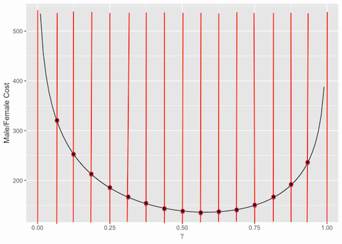
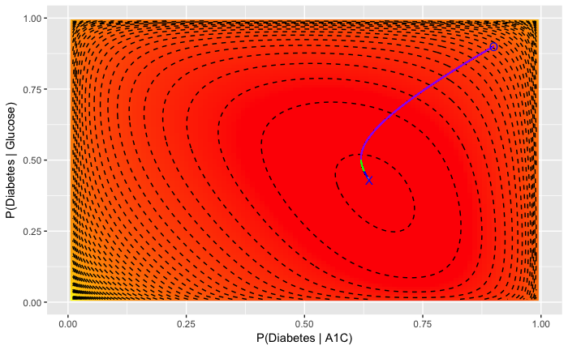
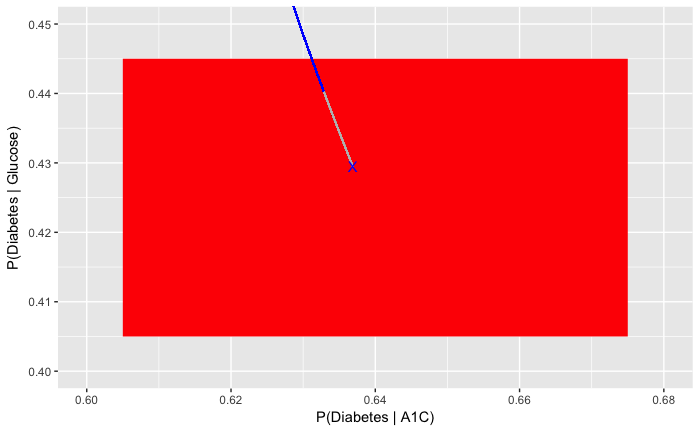
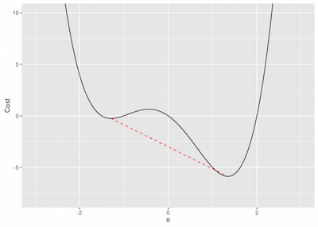

```{r setup, include=FALSE}
knitr::opts_chunk$set(echo = TRUE)
```

<style>
body {
text-align: justify}
</style>

---

### Data Science: Advanced modeling

---

#### Logistic regression

In the previous lectures we saw basic inference and linear regression. Linear regression as we saw comes with several assumptions, one of which is that the errors (or residuals) should be normally distributed. Also, the dependent/response variable is a continous variable. In several applications and in biomedicine the response variable is a categorical or a binary variable. For instance, a patient in an emergency ward could be dead or alive. Like wise a person in the HANES dataset could be diabetic, or not. In such cases, we cannot use simple linear regression to predict the outcomes. We thus have to use a special type of regression known as _logistic regression_. These models are captured under Generalized Linear Model (GLM) which is a flexible framework to handle such response variables. Before we see a specific example of how we apply logistic regression to our HANES dataset in R, we will watch this video that explains this regression technique:

---

<iframe width="560" height="315" src="https://www.youtube.com/embed/gNhogKJ_q7U" frameborder="0" allowfullscreen></iframe>

---

Previously in the HANES data set, we saw that there were two clusters when we log transform the A1C and UACR variables (Data science fundamentals 01). 

```{r eval=FALSE, message=FALSE, echo = TRUE}
  # Load the package RCurl
  library(RCurl)
  # Import the HANES data set from GitHub; break the string into two for readability
  # (Please note this readability aspect very carefully)
  URL_text_1 <- "https://raw.githubusercontent.com/kannan-kasthuri/kannan-kasthuri.github.io"
  URL_text_2 <- "/master/Datasets/HANES/NYC_HANES_DIAB.csv"
  # Paste it to constitute a single URL 
  URL <- paste(URL_text_1,URL_text_2, sep="")
  HANES <- read.csv(text=getURL(URL))
  # Rename the GENDER factor for identification
  HANES$GENDER <- factor(HANES$GENDER, labels=c("M","F"))
  # Rename the AGEGROUP factor for identification
  HANES$AGEGROUP <- factor(HANES$AGEGROUP, labels=c("20-39","40-59","60+"))
  # Rename the HSQ_1 factor for identification
  HANES$HSQ_1 <- factor(HANES$HSQ_1, labels=c("Excellent","Very Good","Good", "Fair", "Poor"))
  # Rename the DX_DBTS as a factor
  HANES$DX_DBTS <- factor(HANES$DX_DBTS, labels=c("DIAB","DIAB NO_DX","NO DIAB"))
  # Omit all NA from the data frame
  HANES <- na.omit(HANES)
  # Observe the structure
  str(HANES)
  # Load the tidyverse library
  library(tidyverse)
  # Make a ggplot for the log(A1C) and log(UACR) variables with asthetic color for the variable DX_DBTS
  ggplot(data = HANES) + 
    geom_point(mapping = aes(x = log(A1C), y = log(UACR), color=DX_DBTS))
```

```{r eval=TRUE, message=FALSE, echo = FALSE}
  # Load the package RCurl
  library(RCurl)
  # Import the HANES data set from GitHub; break the string into two for readability
  # (Please note this readability aspect very carefully)
  URL_text_1 <- "https://raw.githubusercontent.com/kannan-kasthuri/kannan-kasthuri.github.io"
  URL_text_2 <- "/master/Datasets/HANES/NYC_HANES_DIAB.csv"
  # Paste it to constitute a single URL 
  URL <- paste(URL_text_1,URL_text_2, sep="")
  HANES <- read.csv(text=getURL(URL))
  # Rename the GENDER factor for identification
  HANES$GENDER <- factor(HANES$GENDER, labels=c("M","F"))
  # Rename the AGEGROUP factor for identification
  HANES$AGEGROUP <- factor(HANES$AGEGROUP, labels=c("20-39","40-59","60+"))
  # Rename the HSQ_1 factor for identification
  HANES$HSQ_1 <- factor(HANES$HSQ_1, labels=c("Excellent","Very Good","Good", "Fair", "Poor"))
  # Rename the DX_DBTS as a factor
  HANES$DX_DBTS <- factor(HANES$DX_DBTS, labels=c("DIAB","DIAB NO_DX","NO DIAB"))
  # Omit all NA from the data frame
  HANES <- na.omit(HANES)
  # Observe the structure
  str(HANES)
  # Load the tidyverse library
  library(tidyverse)
  # Make a ggplot for the log(A1C) and log(UACR) variables with asthetic color for the variable DX_DBTS
  ggplot(data = HANES) + 
    geom_point(mapping = aes(x = log(A1C), y = log(UACR), color=DX_DBTS))
```

These two clusters are primarily composed of non-diabetic people. In the set of all non-diabetic people, if we call the lower cluster (i.e, `log(UACR) <= -2`) as `0` and the upper cluster (i.e, `log(UACR) >= -2`) as `1` (right now we will manually distingush the clusters, but in machine learning course we will see algorthms such as _k-means_ will do this for us), out of UCREATININE and UALBUMIN variables that makes this ratio UACR which variable distingushes these two clusters? We can answer this question through logistic regression. But to do this, we will first extract this data using data transformation techniques we learnt.

```{r eval=FALSE, message=FALSE, warning=FALSE, echo=TRUE, na.rm=FALSE}
  # Extract only non-diabetic people, name the ones with log(UACR) <= -2 as 0
  # and others 1 and exclude all other factor variables
  mydata <- HANES %>% filter(DX_DBTS == "NO DIAB") %>% 
    mutate(Cluster = ifelse(log(UACR) <= -2, 0, 1)) %>%
    select(everything(), -KEY, -GENDER, -AGEGROUP, -HSQ_1, -DX_DBTS)
  # Make a ggplot for the log(A1C) and log(UACR) variables with asthetic color for the variable Cluster
  ggplot(data = mydata) + 
    geom_point(mapping = aes(x = log(A1C), y = log(UACR), color=Cluster)) + 
    theme(legend.position="none")
```
  
```{r eval=TRUE, message=FALSE, warning=FALSE, echo=FALSE}
  # Extract only non-diabetic people, name the ones with log(UACR) <= -2 as 0
  # and others 1 and exclude all other factor variables
  mydata <- HANES %>% filter(DX_DBTS == "NO DIAB") %>% 
    mutate(Cluster = ifelse(log(UACR) <= -2, 0, 1)) %>%
    select(everything(), -KEY, -GENDER, -AGEGROUP, -HSQ_1, -DX_DBTS)
  # Make a ggplot for the log(A1C) and log(UACR) variables with asthetic color for the variable Cluster
  ggplot(data = mydata) + 
    geom_point(mapping = aes(x = log(A1C), y = log(UACR), color=Cluster)) + 
    theme(legend.position="none")
```

We can now perform a logistic regression where the predictor variables will be UCREATININE and UALBUMIN and the response variable would be the cluster.

```{r eval=FALSE, message=FALSE, warning=FALSE, echo=TRUE, na.rm=FALSE}
  # Build a logistic regression model for the predictor variable UCREATININE 
  # with the response variable Cluster
  logistic_model.UCREATININE <- glm(Cluster ~ UCREATININE, family=binomial(link='logit'),data=mydata)
  # And summarize the model
  summary(logistic_model.UCREATININE)
  # Build a logistic regression model for the predictor variable UALBUMIN 
  # with the response variable Cluster
  logistic_model.UALBUMIN <- glm(Cluster ~ UALBUMIN, family=binomial(link='logit'),data=mydata)
  # and summarize the model
  summary(logistic_model.UALBUMIN)
```

```{r eval=TRUE, message=FALSE, warning=FALSE, echo=FALSE}

  # Build a logistic regression model for the predictor variable UCREATININE 
  # with the response variable Cluster
  logistic_model.UCREATININE <- glm(Cluster ~ UCREATININE, family=binomial(link='logit'),data=mydata)
  # And summarize the model
  summary(logistic_model.UCREATININE)
  # Build a logistic regression model for the predictor variable UALBUMIN 
  # with the response variable Cluster
  logistic_model.UALBUMIN <- glm(Cluster ~ UALBUMIN, family=binomial(link='logit'),data=mydata)
  # and summarize the model
  summary(logistic_model.UALBUMIN)
```

The results of the summary is interpreted as follows:

1. The intercept of the UCREATININE fit = `r round(summary(logistic_model.UCREATININE)$coefficients[1,1],2)` is interpreted as the log odds of a patient with a UCREATININE value of zero being in the class where `log(UACR) <= -2` (that is in cluster 0).

2. The coefficient for UCREATININE = `r round(summary(logistic_model.UCREATININE)$coefficients[2,1],2)` which is interpreted as the expected change in log odds for a one-unit increase in the UCREATININE variable. The odds ratio can be calculated by exponentiating this value to get `r round(exp(summary(logistic_model.UCREATININE)$coefficients[2,1]),2)` which means we expect to see about `r (round(exp(summary(logistic_model.UCREATININE)$coefficients[2,1]),2)-1)*100`% increase in the odds of being in cluster 0, for a one-unit increase in UCREATININE variable.

The negative intercept in UALBUMIN means that the clusters are less likely seperated by UALBUMIN. Coupled with the statistically significant coeffcient of the UCREATININE variable (which rejects the null hypothesis that the UCREATININE variable is not related to the clusters), we can say UCREATININE distingushes the cluster better.

<br>
<span style="color:blue">**Classwork/Homework**</span>: Perform logistic regression on diabetic vs. non-diabetic populations and report which variable(s) distingush the populations.

<br>

Like noted in the introduction, logistic regression is usually modeled using Generalized Linear Model (GLM) in R. GLM's are usually solved using the method of maximum likelihood which in-turn uses optimization techniques like the gradient descent to find the parameters. We will study these modeling and optimization techniques now.

---

Likelihood is the probablity of observing the data given a model. In the univariate case, let us say that we have a set of data $X = \{x_1,x_2,\dots,x_n\}$ and model with parameter $\gamma$, then the likelihood is defined as,

$$ L(\gamma \mid X) = P(X \mid \gamma)$$

If our observations are independent and identically distributed, then we can treat this as product of probabilities of observing each individual data point. That is,

$$ L(\gamma \mid X) = \prod_{i=1}^{n} P(x_{i} \mid \gamma)$$

This may seem really abstract and so we can look at concrete example.

Suppose we draw two hundred people randomly and identify their gender:

```{r eval=FALSE, message=FALSE, warning=FALSE, echo=TRUE}

  # Randomly sample 200 people and identify their gender
  random_gender <- sample(HANES$GENDER, 200, replace = FALSE)
  random_gender
  no_of_females <- sum(sapply(gregexpr("F", random_gender, fixed = TRUE), function(x) sum(x > -1)))
  no_of_females
```

```{r eval=TRUE, message=FALSE, warning=FALSE, echo=FALSE}

  # Randomly sample 200 people and identify their gender
  random_gender <- sample(HANES$GENDER, 200, replace = FALSE)
  random_gender
  no_of_females <- sum(sapply(gregexpr("F", random_gender, fixed = TRUE), function(x) sum(x > -1)))
  no_of_females
```

The first thing we can do is assume that we know the proportion of males and females in the population, and ask ourselves how likely it would have been to draw this sequence if we were right about the proportion. We will call the proportion of females $\gamma$ in this case.

Since there are only two categories, male and the female and each person in sampled independently the distribution being identical, we can calculate the probability of getting that sequence as the product of the probabilities of sampling each individual:

$$
L(\gamma \mid X) = \prod_{i=1}^{200}
\begin{cases}
    \gamma,      & \text{if } x_{i} = F \\
    1-\gamma,    & \text{if } x_{i} = M
\end{cases}
$$
Now we can use the above equation to calculate the probability of getting the specific sequence if the gender were equally distributed:

```{r eval=FALSE, message=FALSE, warning=FALSE, echo=TRUE}

  # Assign probablities to the above seqence assuming men and women are equally distributed
  # in the general population
  probabilities = ifelse(random_gender == "F", 0.5, 1-0.5)
  # Likelihood is the product  of the probablities when samples are IID 
  likelihood = prod(probabilities)
  # Report the probability
  cat('Probability of observation when men and women are equally distributed:',likelihood)
```

```{r eval=TRUE, message=FALSE, warning=FALSE, echo=FALSE}

  # Assign probablities to the above seqence assuming men and women are equally distributed
  # in the general population
  probabilities = ifelse(random_gender == "F", 0.5, 1-0.5)
  # Likelihood is the product  of the probablities when samples are IID 
  likelihood = prod(probabilities)
  # Report the probability
  cat('Probability of observation when men and women are equally distributed:',likelihood)
```

If men are over-represented in the population, say, by 80%, then:

```{r eval=FALSE, message=FALSE, warning=FALSE, echo=TRUE}

  # Assign probablities to the above seqence assuming men represent 80% of
  # the general population
  probabilities = ifelse(random_gender == "F", 0.2, 1-0.2)
  # Likelihood is the product  of the probablities when samples are IID 
  likelihood = prod(probabilities)
  # Report the probability
  cat('Probability of observation when men are represented 80%:',likelihood)
```

```{r eval=TRUE, message=FALSE, warning=FALSE, echo=FALSE}

  # Assign probablities to the above seqence assuming men represent 80% of
  # the general population
  probabilities = ifelse(random_gender == "F", 0.2, 1-0.2)
  # Likelihood is the product  of the probablities when samples are IID 
  likelihood = prod(probabilities)
  # Report the probability
  cat('Probability of observation when men are represented 80%:',likelihood)
```

Thus we can easily generalize this as a function of $\gamma$, and graph the likelihood as a function of any value of the proportion of females ranging from 0 to 1:

```{r eval=FALSE, message=FALSE, warning=FALSE, echo=TRUE}

  # Make a function that returns likelihoods based on the above sequence
  # and the gamma parameter
  likelihoodMF = function(gamma, data = random_gender) {
    # Calculate the probabilities
    probabilities = ifelse(random_gender == "F", gamma, 1-gamma)
    # Calculate the product of probabilities, aka, likelihoods
    likelihood = prod(probabilities)
    # Return the likelihood
    return(likelihood)
  }
  # Make a vector of gammas
  gammas = seq(0.01, 0.99, by=0.01)
  # Compute likelihood through the function 
  likelihoods = sapply(gammas, likelihoodMF)
  # Plot gammas vs. likelihoods
  ggplot(mapping = aes(x = gammas, y = likelihoods)) + geom_line(se=FALSE)
```

```{r eval=TRUE, message=FALSE, warning=FALSE, echo=FALSE}

  # Make a function that returns likelihoods based on the above sequence
  # and the gamma parameter
  likelihoodMF = function(gamma, data = random_gender) {
    # Calculate the probabilities
    probabilities = ifelse(random_gender == "F", gamma, 1-gamma)
    # Calculate the product of probabilities, aka, likelihoods
    likelihood = prod(probabilities)
    # Return the likelihood
    return(likelihood)
  }
  # Make a vector of gammas
  gammas = seq(0.01, 0.99, by=0.01)
  # Compute likelihood through the function 
  likelihoods = sapply(gammas, likelihoodMF)
  # Plot gammas vs. likelihoods
  ggplot(mapping = aes(x = gammas, y = likelihoods)) + geom_line(se=FALSE)
```

The same idea can be used to estimate the proportion of people with diabetes, instead of males and females:

```{r eval=FALSE, message=FALSE, warning=FALSE, echo=TRUE}

  # Select only people with diabetes and no diabetes
  HANES_DIAB <- filter(HANES, DX_DBTS == "DIAB" | DX_DBTS == "NO DIAB") %>% select(DX_DBTS)
  # Randomly sample 200 people and identify their diabetes status
  HANES_DIAB_sampled_200 <- sample_n(HANES_DIAB,200) 
  # Count the number of people with diabetes and without diabetes
  find_count <- HANES_DIAB_sampled_200 %>% group_by(DX_DBTS) %>% count()
  # Find the number of people with diabetes
  DIAB_count <- find_count$n[1]
  # Make a function that returns likelihoods based on the above sequence
  # and the gamma parameter
  likelihoodDB = function(gamma, data = HANES_DIAB_sampled_200) {
    # Calculate the probabilities
    probabilities = ifelse(HANES_DIAB_sampled_200 == "DIAB", gamma, 1-gamma)
    # Calculate the product of probabilities, aka, likelihoods
    likelihood = prod(probabilities)
    # Return the likelihood
    return(likelihood)
  }
  # Make a vector of gammas
  gammas = seq(0.01, 0.99, by=0.01)
  # Compute likelihood through the function 
  likelihoods = sapply(gammas, likelihoodDB)
  # Plot gammas vs. likelihoods
  ggplot(mapping = aes(x = gammas, y = likelihoods)) + geom_line(se=FALSE)
```

```{r eval=TRUE, message=FALSE, warning=FALSE, echo=FALSE}

  # Select only people with diabetes and no diabetes
  HANES_DIAB <- filter(HANES, DX_DBTS == "DIAB" | DX_DBTS == "NO DIAB") %>% select(DX_DBTS)
  # Randomly sample 200 people and identify their diabetes status
  HANES_DIAB_sampled_200 <- sample_n(HANES_DIAB,200) 
  # Count the number of people with diabetes and without diabetes
  find_count <- HANES_DIAB_sampled_200 %>% group_by(DX_DBTS) %>% count()
  # Find the number of people with diabetes
  DIAB_count <- find_count$n[1]
  # Make a function that returns likelihoods based on the above sequence
  # and the gamma parameter
  likelihoodDB = function(gamma, data = HANES_DIAB_sampled_200) {
    # Calculate the probabilities
    probabilities = ifelse(HANES_DIAB_sampled_200 == "DIAB", gamma, 1-gamma)
    # Calculate the product of probabilities, aka, likelihoods
    likelihood = prod(probabilities)
    # Return the likelihood
    return(likelihood)
  }
  # Make a vector of gammas
  gammas = seq(0.01, 0.99, by=0.01)
  # Compute likelihood through the function 
  likelihoods = sapply(gammas, likelihoodDB)
  # Plot gammas vs. likelihoods
  ggplot(mapping = aes(x = gammas, y = likelihoods)) + geom_line(se=FALSE)
```


Likelihood is not a probability function. Also, given this function it can be used to identify the parameters (proportions or means) of the underlying population that is likely to maximize the chance of observing our data. This is the maximum likelihood estimate. Thus, maximum likelihood estimate is the value of the parameters of a given model that maximizes the likelihood function for the data. Mathematically,

$$
\gamma_{MLE} = \max_{\gamma}[L(\gamma \mid X)]
$$

The following code in R evaluates maximum likelihood parameter for the male/female distribution:

```{r eval=FALSE, message=FALSE, warning=FALSE, echo=TRUE}

  # Compute maximum likelihood parameter for male/female distribution
  mle.resultsMF <- optimize(function(gammas) {likelihoodMF(gammas,likelihoodMF)},
                        interval = c(0, 1), maximum = TRUE)
  mle.resultsMF
```

```{r eval=TRUE, message=FALSE, warning=FALSE, echo=FALSE}

  # Compute maximum likelihood parameter for male/female distribution
  mle.resultsMF <- optimize(function(gammas) {likelihoodMF(gammas,likelihoodMF)},
                        interval = c(0, 1), maximum = TRUE)
  mle.resultsMF
```

Similarly the following code in R evaluates maximum likelihood parameter for the diabetes distribution:

```{r eval=FALSE, message=FALSE, warning=FALSE, echo=TRUE}

  # Compute maximum likelihood parameter for the diabetes distribution
  mle.resultsDB <- optimize(function(gammas) {likelihoodDB(gammas,likelihoodDB)},
                        interval = c(0, 1), maximum = TRUE)
  mle.resultsDB
```

```{r eval=TRUE, message=FALSE, warning=FALSE, echo=FALSE}

  # Compute maximum likelihood parameter for the diabetes distribution
  mle.resultsDB <- optimize(function(gammas) {likelihoodDB(gammas,likelihoodDB)},
                        interval = c(0, 1), maximum = TRUE)
  mle.resultsDB
```

In our example of males and females, the maximum happens at `r round(mle.resultsMF$maximum,2)`, suggesting there are `r round(mle.resultsMF$maximum,2)*100`% of females in the population. This is unlike the diabetes observation where the maximum happens at `r round(mle.resultsDB$maximum,2)` (which is `r round(mle.resultsDB$maximum,2)*100`%). This is not far from the official estimate of about 9.3%. Thus, maximum likelihood can be extremely useful to determine the parameters of the underlying distribution.


Determining maximum likelihood can become difficult as the complexity of the models increase. That is why we need _cost functions_.

---

#### Cost Functions

---

Cost functions are functions that maps a set of events into a number that represents the _cost_ of that event occurring. Mathematically it is defined as the negative log of likelihood.

$$
C(\gamma,X)=−\log[L(\gamma \mid X)]
$$
But why?

Lets watch this video for a good explanation:

---

<iframe width="560" height="315" src="https://www.youtube.com/embed/R4OlXb9aTvQ" frameborder="0" allowfullscreen></iframe>

---

There are other cost functions in areas such as motion planning and traveling salesman where different types of modeling techniques are used. For this tutorial we will use this cost function.

With this cost function as a negative log likelihood we can reformulate the cost of the given parameterization of the population and plot it. In the case of male/female observations here is the cost:

```{r eval=FALSE, message=FALSE, warning=FALSE, echo=TRUE}

  # Compute the -log of the likelihood function
  MF.cost = function(gamma, data = random_gender) {
    return(-log(likelihoodMF(gamma, data)))
  }
  # Find the costs
  costs = sapply(gammas, MF.cost)
  # Plot the costs
  qplot(x = gammas, y = costs, geom = 'line', xlab = expression(gamma), ylab = "Male/Female Cost")
```

```{r eval=TRUE, message=FALSE, warning=FALSE, echo=FALSE}

  # Compute the -log of the likelihood function
  MF.cost = function(gamma, data = random_gender) {
    return(-log(likelihoodMF(gamma, data)))
  }
  # Find the costs
  costs = sapply(gammas, MF.cost)
  # Plot the costs
  qplot(x = gammas, y = costs, geom = 'line', xlab = expression(gamma), ylab = "Male/Female Cost")
```

For the diabetes population, we have:

```{r eval=FALSE, message=FALSE, warning=FALSE, echo=TRUE}

  # Compute the -log of the likelihood function
  DB.cost = function(gamma, data = HANES_DIAB_sampled_200) {
    return(-log(likelihoodDB(gamma, data)))
  }
  # Find the costs
  costs = sapply(gammas, DB.cost)
  # Plot the costs
  qplot(x = gammas, y = costs, geom = 'line', xlab = expression(gamma), ylab = "Diabetes Pop. Cost")
```

```{r eval=TRUE, message=FALSE, warning=FALSE, echo=FALSE}

  # Compute the -log of the likelihood function
  DB.cost = function(gamma, data = HANES_DIAB_sampled_200) {
    return(-log(likelihoodDB(gamma, data)))
  }
  # Find the costs
  costs = sapply(gammas, DB.cost)
  # Plot the costs
  qplot(x = gammas, y = costs, geom = 'line', xlab = expression(gamma), ylab = "Diabetes Pop. Cost")
```

We note that the maximum of likelihood function is the minimum of the cost function because log likelihood is an increasing function of the likelihood and so negative log function will decrease as the likelihood function increases. Now once we have this cost function we can study modeling techniques to find its minimum.

---

#### Modeling in single variable and gradient descent 

---

_Grid search_ is the simplest of the modeling technique. In this approach we break the interval of $\gamma$ and evaluate the cost at every break point. We then pick the value of $\gamma$ that gives the minimum cost. It is called grid search because it can be visualized by placing a grid over the cost function and evaluating that at each point of the grid:

---



---

This can be implemented for the diabetes example as follows:

```{r eval=FALSE, message=FALSE, warning=FALSE, echo=TRUE}

  # Make a grid of potential gammas
  potential.gammas = seq(.001, .999, by=.001)
  # Calculate the cost of the DB cost function at each gamma
  calc.costs = sapply(potential.gammas, DB.cost)
  # Find the minimum costs
  idx.gamma = which(calc.costs == min(calc.costs))
  # Output the results
  writeLines(paste("Grid search value:", potential.gammas[idx.gamma], sep=' '))
```

```{r eval=TRUE, message=FALSE, warning=FALSE, echo=FALSE}

  # Make a grid of potential gammas
  potential.gammas = seq(.001, .999, by=.001)
  # Calculate the cost of the DB cost function at each gamma
  calc.costs = sapply(potential.gammas, DB.cost)
  # Find the minimum costs
  idx.gamma = which(calc.costs == min(calc.costs))
  # Output the results
  writeLines(paste("Grid search value:", potential.gammas[idx.gamma], sep=' '))
```

We see the result is extremely accurate although the precision of this value is limited by how fine our grid is. Why is this approach bad? Although this is a good method for one parameter and low precision requirements, the computational complexity is enormous when we have multi-parameters. Here we had $1000$ values for a precision upto two degrees. If we had one more parameter, we need to construct $1000 \times 1000$ grid and for 3 parameters, the grid becomes intractable, a whopping $1000 \times 1000 \times 1000$ computations, that too for a small precision.

We can certainly do smarter by making use of the information from the function and this is done by _gradient descent_ algorithm.

---

##### Gradient descent and variations

Gradient descent is a method where we slide along the function in the direction that decreases the cost function, and keep repeating until there is only the tiniest decrease in cost with each step. Mathematically, it is described by:

$$
\gamma_{t+1} = \gamma_t - \theta \text{ } \nabla C(\gamma_t, X)
$$

where $\gamma_{0}$ is the initial value of the parameter and $\theta$ is a step size parameter that determines how fast (or slow) we descend. It is also called the _learning rate_. We should also have a threshold $\tau$ that represents how precise we want the cost function to be estimated. In single variable calculus, $\nabla C$ is given by the derivative,

$$
\nabla C = \frac{dC}{d\gamma}
$$

and hence in our case of diabetic population, it is extremely easy to compute this analytically - we can apply the rules of calculus to calculate the derivative:

$$
\nabla C(\gamma, X) = \frac{200-\text{DIAB_count}}{1-\gamma} - \frac{\text{DIAB_count}}{\gamma}
$$

where `DIAB_count` was determined to be `r DIAB_count`. 

We can then run the gradient descent. Here we fix the initial parameters: starting value $\gamma_{0} = 0.95$, $\theta=0.0001$ and the threshold $τ=0.000001$.

```{r eval=FALSE, message=FALSE, warning=FALSE, echo=TRUE}

  # Initial conditions/parameters
  gamma = 0.95
  theta = 0.0001
  tau = 0.000001
  
  # Compute the gradient
  DB.gradient = function(gamma) {
    return(((200-DIAB_count)/(1-gamma)) - (DIAB_count/gamma))
  }
  
  # Compute the cost
  prior.cost = DB.cost(gamma)

  # plot.gammas or plot.costs are for graphing purposes
  plot.gammas = gamma
  plot.costs = prior.cost
  
  running = TRUE
  while(running) {
    # Compute gradient
    grad = DB.gradient(gamma)
    # Compute the next gamma
    gamma = gamma - theta * grad
    # Compute the new costs
    new.cost = DB.cost(gamma)
    # For plotting purposes
    plot.gammas = c(plot.gammas, gamma)
    plot.costs = c(plot.costs, new.cost)
    # See if the sequence converges upto a a certain precision
    if(abs(new.cost - prior.cost) < tau) {
      # If so stop the iteration
      running = FALSE
   } else {
      # Else update the cost function to new cost
      prior.cost = new.cost
    }
  }
  # This is our solution
  writeLines(paste("Gradient descent value:",gamma,sep=' '))
```

```{r eval=TRUE, message=FALSE, warning=FALSE, echo=FALSE}

  # Initial conditions/parameters
  gamma = 0.95
  theta = 0.0001
  tau = 0.000001
  
  # Compute the gradient
  DB.gradient = function(gamma) {
    return(((200-DIAB_count)/(1-gamma)) - (DIAB_count/gamma))
  }
  
  # Compute the cost
  prior.cost = DB.cost(gamma)

  # plot.gammas or plot.costs are for graphing purposes
  plot.gammas = gamma
  plot.costs = prior.cost
  
  running = TRUE
  while(running) {
    # Compute gradient
    grad = DB.gradient(gamma)
    # Compute the next gamma
    gamma = gamma - theta * grad
    # Compute the new costs
    new.cost = DB.cost(gamma)
    # For plotting purposes
    plot.gammas = c(plot.gammas, gamma)
    plot.costs = c(plot.costs, new.cost)
    # See if the sequence converges upto a a certain precision
    if(abs(new.cost - prior.cost) < tau) {
      # If so stop the iteration
      running = FALSE
   } else {
      # Else update the cost function to new cost
      prior.cost = new.cost
    }
  }
  # This is our solution
  writeLines(paste("Gradient descent value:", gamma, sep=' '))
```

We can now see the convergence:

```{r eval=FALSE, message=FALSE, warning=FALSE, echo=TRUE}

  # Make a vector of gammas
  all.gammas = seq(.01,.99,by=.01)
  # Find the costs for all gammas
  all.costs = sapply(all.gammas,DB.cost)
  # Make a data frame from the gammas and the costs computed above
  plot.df = data.frame(gammas=plot.gammas,cost=plot.costs)
  # Plot the cost function and add only the converging points
  qplot(x=all.gammas, y=all.costs, geom='line', xlab=expression(gamma), ylab="Cost") +
    geom_point(data=plot.df, aes(x=gammas,y=cost),color='blue')
```

```{r eval=TRUE, message=FALSE, warning=FALSE, echo=FALSE}

  # Make a vector of gammas
  all.gammas = seq(.01,.99,by=.01)
  # Find the costs for all gammas
  all.costs = sapply(all.gammas,DB.cost)
  # Make a data frame from the gammas and the costs computed above
  plot.df = data.frame(gammas=plot.gammas,cost=plot.costs)
  # Plot the cost function and add only the converging points
  qplot(x=all.gammas, y=all.costs, geom='line', xlab=expression(gamma), ylab="Cost") +
    geom_point(data=plot.df, aes(x=gammas,y=cost),color='blue')
```

Several times we might not have an analytical form for the derivative. Or we out of luck then? We can still apply numerical approximation for the derivative:

$$
\nabla C(\gamma, X) \approx \frac{C(\gamma + \epsilon) - C(\gamma - \epsilon)}{2\epsilon}
$$
Here is the code with the numerical approximation for the derivative:

```{r eval=FALSE, message=FALSE, warning=FALSE, echo=TRUE}

   # Initial conditions/parameters
  gamma = 0.95
  theta = 0.0001
  tau = 0.000001
  
  # Compute the gradient using approximation
  DB.gradient = function(gamma, epsilon = .001) {
    return((DB.cost(gamma+epsilon) - DB.cost(gamma-epsilon)) / (2*epsilon))
  }
  
  # Compute the cost
  prior.cost = DB.cost(gamma)

  # plot.gammas or plot.costs are for graphing purposes
  plot.gammas = gamma
  plot.costs = prior.cost
  
  running = TRUE
  while(running) {
    # Compute gradient
    grad = DB.gradient(gamma)
    # Compute the next gamma
    gamma = gamma - theta * grad
    # Compute the new costs
    new.cost = DB.cost(gamma)
    # For plotting purposes
    plot.gammas = c(plot.gammas, gamma)
    plot.costs = c(plot.costs, new.cost)
    # See if the sequence converges upto a a certain precision
    if(abs(new.cost - prior.cost) < tau) {
      # If so stop the iteration
      running = FALSE
   } else {
      # Else update the cost function to new cost
      prior.cost = new.cost
    }
  }
  # This is our solution
  writeLines(paste("Gradient descent value:", gamma, sep=' '))
```

```{r eval=TRUE, message=FALSE, warning=FALSE, echo=FALSE}

  # Initial conditions/parameters
  gamma = 0.95
  theta = 0.0001
  tau = 0.000001
  
  # Compute the gradient using approximation
  DB.gradient = function(gamma, epsilon = .001) {
    return((DB.cost(gamma+epsilon) - DB.cost(gamma-epsilon)) / (2*epsilon))
  }
  
  # Compute the cost
  prior.cost = DB.cost(gamma)

  # plot.gammas or plot.costs are for graphing purposes
  plot.gammas = gamma
  plot.costs = prior.cost
  
  running = TRUE
  while(running) {
    # Compute gradient
    grad = DB.gradient(gamma)
    # Compute the next gamma
    gamma = gamma - theta * grad
    # Compute the new costs
    new.cost = DB.cost(gamma)
    # For plotting purposes
    plot.gammas = c(plot.gammas, gamma)
    plot.costs = c(plot.costs, new.cost)
    # See if the sequence converges upto a a certain precision
    if(abs(new.cost - prior.cost) < tau) {
      # If so stop the iteration
      running = FALSE
   } else {
      # Else update the cost function to new cost
      prior.cost = new.cost
    }
  }
  # This is our solution
  writeLines(paste("Gradient descent value:", gamma, sep=' '))
```

We see the answer is almost the same! Wonderful.

---

#### Multi-variable modeling

---

So far we saw modeling in single variable. But in general this is not adequate and we may need to model on several variables. Let us consider an example. 

Glucose test and hemoglobin test (A1C) are two common tests to identify diabetes in a population. If a person has (fasting) glucose levels greater than or equal to 126 mg/dL or A1C levels greater than or equal to 6.5% then they are diagnosed diabetic. Suppose we want to estimate the probability of someone being diabetic given these two variables. We can work backwards from our observation to determine this probability. 

We define $P(Diab \mid A1C \geq 6.5 \%) = \theta_{A1C}$ and $P(Diab \mid GLUCOSE \geq 126 \ mg/dL) = \theta_{GLU}$. From the laws of probability we have:

$$
  P(Diab) = \begin{cases}
  p & if \ A1C < 6.5\% \ \&  \ GLUCOSE < 126 \ mg/dL \\
  \theta_{A1C} & if\ A1C \geq 6.5\%  \ \& \ GLUCOSE < 126 \ mg/dL \\
  \theta_{GLU} & if \ A1C < 6.5\% \ \&  \ GLUCOSE \geq 126 \ mg/dL \\
  \theta_{A1C}+\theta_{GLU}-\theta_{A1C}*\theta_{GLU} & if \ A1C \geq 6.5\% \ \&  \ GLUCOSE \geq 126 \ mg/dL \end{cases}
$$

Thus, we have these two _hidden variables_ $\theta_{A1C}$ and $\theta_{GLU}$ that determines the probability of someone being diabetic. Also we have the variable $p$ that defines the population that is unexplained by the hidden variables. This value can be directly computed from the observations. However for the hidden variables, we have to figure out the values from the observations using optimization. To do this we will extract the observations from the data table:

```{r eval=FALSE, message=FALSE, warning=FALSE, echo=TRUE}

  # Make logicals based on diagnostic levels of A1C, GLUCOSE and diabetes status
  DB.obs <- select(HANES,A1C, GLUCOSE, DX_DBTS) %>%
            mutate(A1C_L = as.logical(ifelse(A1C >= 6.5,1,0)),
                   GLUCOSE_L= as.logical(ifelse(GLUCOSE >= 126,1,0)),
                   DX_DBTS_L = as.logical(ifelse(DX_DBTS == "DIAB",1,0))) %>%
            select(A1C_L,GLUCOSE_L,DX_DBTS_L)

  # Print the first few lines to see if the data looks okay
  print(head(DB.obs))
```

```{r eval=TRUE, message=FALSE, warning=FALSE, echo=FALSE}

  # Make logicals based on diagnostic levels of A1C, GLUCOSE and diabetes status
  DB.obs <- select(HANES,A1C, GLUCOSE, DX_DBTS) %>%
            mutate(A1C_L = as.logical(ifelse(A1C >= 6.5,1,0)),
                   GLUCOSE_L= as.logical(ifelse(GLUCOSE >= 126,1,0)),
                   DX_DBTS_L = as.logical(ifelse(DX_DBTS == "DIAB",1,0))) %>%
            select(A1C_L,GLUCOSE_L,DX_DBTS_L)

  # Print the first few lines to see if the data looks okay
  print(head(DB.obs))
```

We can list the data matrix corresponding to the observations and determine the variable $p$ from it.

```{r eval=FALSE, message=FALSE, warning=FALSE, echo=TRUE}

  # Print the data matrix corresponding to the observations
  print(with(DB.obs,table(A1C_L,GLUCOSE_L,DX_DBTS_L)))

   # Find the number of people with diabetes
  DBTS_T <- table(DB.obs$DX_DBTS_L == T )
  # Find the number of people with diabetes where
  # A1C_L <= 6.5 and GLUCOSE_L <= 126
  # It is this population that is unexplained by both variables
  A1C_GLU_unexplained <- with(DB.obs,table(A1C_L == F & GLUCOSE_L == F & DX_DBTS_L == T))
  # Find the proportion of people with diabetes that are unexplained, the variable $p$
  DBTS_U <- c(proportion = A1C_GLU_unexplained[2]/DBTS_T[2])
  # Name the column and print the proportion
  names(DBTS_U) <- c("DBTS_U")
  DBTS_U
```

```{r eval=TRUE, message=FALSE, warning=FALSE, echo=FALSE}

  # Print the data matrix corresponding to the observations
  print(with(DB.obs,table(A1C_L,GLUCOSE_L,DX_DBTS_L)))

   # Find the number of people with diabetes
  DBTS_T <- table(DB.obs$DX_DBTS_L == T )
  # Find the number of people with diabetes where
  # A1C_L <= 6.5 and GLUCOSE_L <= 126
  # It is this population that is unexplained by both variables
  A1C_GLU_unexplained <- with(DB.obs,table(A1C_L == F & GLUCOSE_L == F & DX_DBTS_L == T))
  # Find the proportion of people with diabetes that are unexplained, the variable $p$
  DBTS_U <- c(proportion = A1C_GLU_unexplained[2]/DBTS_T[2])
  # Name the column and print the proportion
  names(DBTS_U) <- c("DBTS_U")
  DBTS_U
```

We then define our likelihood function. This function takes the parameters in a single argument and returns the cost vector as negative log likelihood function.

```{r eval=FALSE, message=FALSE, warning=FALSE, echo=TRUE}

  # Define the cost function
  DB.MG.cost = function(params, data=DB.obs) {
    # Receive the parameters in theta variables
    theta.A1C = params[1]
    theta.GLU = params[2]
    
    # Define the probability model as given by the equation above

    predicted.diab.A1C = ifelse(data$A1C_L, theta.A1C, 0)
    predicted.diab.GLU = ifelse(data$GLUCOSE_L, theta.GLU, 0)
    predicted.diab = predicted.diab.A1C + predicted.diab.GLU - 
                      (predicted.diab.A1C * predicted.diab.GLU) 
    # Define the likelihood function
    likelihood_explained = ifelse(data$DX_DBTS_L, predicted.diab, 1-predicted.diab)
    
    likelihood  = ifelse(likelihood_explained == 0, DBTS_U, likelihood_explained)
    
    # Find the cost function as the sum of negative log likelihoods
    cost.DB = -sum(log(likelihood)) 
    # Return the cost
    return(cost.DB)
  }
```

```{r eval=TRUE, message=FALSE, warning=FALSE, echo=FALSE}

  # Define the cost function
  DB.MG.cost = function(params, data=DB.obs) {
    # Receive the parameters in theta variables
    theta.A1C = params[1]
    theta.GLU = params[2]
    
    # Define the probability model as given by the equation above

    predicted.diab.A1C = ifelse(data$A1C_L, theta.A1C, 0)
    predicted.diab.GLU = ifelse(data$GLUCOSE_L, theta.GLU, 0)
    predicted.diab = predicted.diab.A1C + predicted.diab.GLU - 
                      (predicted.diab.A1C * predicted.diab.GLU) 
    # Define the likelihood function
    likelihood_explained = ifelse(data$DX_DBTS_L, predicted.diab, 1-predicted.diab)
    
    likelihood  = ifelse(likelihood_explained == 0, DBTS_U, likelihood_explained)
    
    # Find the cost function as the sum of negative log likelihoods
    cost.DB = -sum(log(likelihood)) 
    # Return the cost
    return(cost.DB)
  }
```

We can now _see_ what the cost function looks like by varying the conditional probabilities. The lower the cost is, more red will be the point.

```{r eval=FALSE, message=FALSE, warning=FALSE, echo=TRUE}

  # Define the grid by varing the conditional probabilities between 0.01 to 0.99 by
  # increments of 0.01
  DB.grid = data.frame(A1C = rep(seq(.01,.99,by=.01),times=99),
                        GLU = rep(seq(.01,.99,by=.01),each=99))

  # Find the cost by evaluating the above cost function using the grid just defined
  DB.grid$cost.DB = mapply(function(w,h){DB.MG.cost(c(w,h))}, 
                               DB.grid$A1C, DB.grid$GLU)
  
  # Create a plot the "cost grid" and fill in the values
  DB.plot = ggplot(DB.grid, aes(x=A1C, y=GLU)) +
            geom_raster(aes(fill=cost.DB)) + 
            scale_fill_gradient(low='red', high='yellow', trans = 'log') +
            stat_contour(aes(z=cost.DB),binwidth=5, color = 'black', linetype = 'dashed') +
            xlab('P(Diabetes | A1C)') + ylab('P(Diabetes | Glucose)')
  # Make a plot
  print(DB.plot)
```

```{r eval=TRUE, message=FALSE, warning=FALSE, echo=FALSE}

  # Define the grid by varing the conditional probabilities between 0.01 to 0.99 by
  # increments of 0.01
  DB.grid = data.frame(A1C = rep(seq(.01,.99,by=.01),times=99),
                        GLU = rep(seq(.01,.99,by=.01),each=99))

  # Find the cost by evaluating the above cost function using the grid just defined
  DB.grid$cost.DB = mapply(function(w,h){DB.MG.cost(c(w,h))}, 
                               DB.grid$A1C, DB.grid$GLU)
  
  # Create a plot the "cost grid" and fill in the values
  DB.plot = ggplot(DB.grid, aes(x=A1C, y=GLU)) +
            geom_raster(aes(fill=cost.DB)) + 
            scale_fill_gradient(low='red', high='yellow', trans = 'log') +
            stat_contour(aes(z=cost.DB),binwidth=5, color = 'black', linetype = 'dashed') +
            xlab('P(Diabetes | A1C)') + ylab('P(Diabetes | Glucose)')
  # Make a plot
  print(DB.plot)
```

We see that the cost is minimized somewhere around 0.6 and 0.5. We hope our optimization techniques will give us the values of the hidden variables around this value. The optimization for multiple variables $\gamma_{0}, \gamma_{1}, \dots \gamma_{N}$, using gradient descent is just like the optimization for a single variable. Here the gradient function is given by:

$$
\nabla C(\gamma, X) = \bigg[ \frac{\partial C}{\partial \gamma_0}, \frac{\partial C}{\partial \gamma_1}, ..., \frac{\partial C}{\partial \gamma_N} \bigg]
$$
in particular in our case, 

$$
\nabla C(\gamma, X) = \bigg[ \frac{\partial C}{\partial \theta_{A1C}}, \frac{\partial C}{\partial \theta_{GLU}} \bigg]
$$

which can be approximated like we did for the single variable, however we have to do it for each variable here. 

```{r eval=FALSE, message=FALSE, warning=FALSE, echo=TRUE}

  # Find gradient through approximation
  DB.gradient = function(params, data=DB.obs, epsilon = .001) {

    # Find A1C gradient by perturbing in both directions
    A1C.plus  = DB.MG.cost(params + c(epsilon,0), DB.obs)
    A1C.minus = DB.MG.cost(params + c(-epsilon,0), DB.obs)
    df.dA1C = (A1C.plus - A1C.minus) / (2*epsilon)

    # Find GLU gradient by perturbing in both directions
    GLU.plus  = DB.MG.cost(params + c(0,epsilon), DB.obs)
    GLU.minus = DB.MG.cost(params + c(0, -epsilon), DB.obs)
    df.dGLU = (GLU.plus - GLU.minus) / (2*epsilon)
  
    # Return the gradient
    return(c(df.dA1C, df.dGLU))
  }
```

```{r eval=TRUE, message=FALSE, warning=FALSE, echo=FALSE}

  # Find gradient through approximation
  DB.gradient = function(params, data=DB.obs, epsilon = .001) {

    # Find A1C gradient by perturbing in both directions
    A1C.plus  = DB.MG.cost(params + c(epsilon,0), DB.obs)
    A1C.minus = DB.MG.cost(params + c(-epsilon,0), DB.obs)
    df.dA1C = (A1C.plus - A1C.minus) / (2*epsilon)

    # Find GLU gradient by perturbing in both directions
    GLU.plus  = DB.MG.cost(params + c(0,epsilon), DB.obs)
    GLU.minus = DB.MG.cost(params + c(0, -epsilon), DB.obs)
    df.dGLU = (GLU.plus - GLU.minus) / (2*epsilon)
  
    # Return the gradient
    return(c(df.dA1C, df.dGLU))
  }
```

This helps us to see how the gradient descent works in two dimensions. The gradient points towards the direction of lowering cost function. If we are too much away from the bottom we need to take larger steps, otherwise smaller steps are sufficient for convergence.  

```{r eval=FALSE, message=FALSE, warning=FALSE, echo=TRUE}
  
  # Demostrate the gradient descent in two dimensions using arrows
  # Make an arrow using given gradient
  make.gradient.arrow = function(params) {
    grad = DB.gradient(params)
    end.x = params[1] - grad[1]*.001
    end.y = params[2] - grad[2]*.001
    return(geom_segment(x=params[1],y=params[2],xend=end.x,yend=end.y, arrow = arrow(length=unit(.02, 'npc')),color='blue'))
  }

  # Make the arrow + cost grid plot
  DB.grad.plot = DB.plot +
        make.gradient.arrow(c(.2,.2)) + make.gradient.arrow(c(.8,.8)) + 
        make.gradient.arrow(c(.2,.8)) + make.gradient.arrow(c(.8,.2))

  # Plot the result
  print(DB.grad.plot)
```

```{r eval=TRUE, message=FALSE, warning=FALSE, echo=FALSE}
  
  # Demostrate the gradient descent in two dimensions using arrows
  # Make an arrow using given gradient
  make.gradient.arrow = function(params) {
    grad = DB.gradient(params)
    end.x = params[1] - grad[1]*.001
    end.y = params[2] - grad[2]*.001
    return(geom_segment(x=params[1],y=params[2],xend=end.x,yend=end.y, arrow = arrow(length=unit(.02, 'npc')),color='blue'))
  }

  # Make the arrow + cost grid plot
  DB.grad.plot = DB.plot +
        make.gradient.arrow(c(.2,.2)) + make.gradient.arrow(c(.8,.8)) + 
        make.gradient.arrow(c(.2,.8)) + make.gradient.arrow(c(.8,.2))

  # Plot the result
  print(DB.grad.plot)
```

We are now ready to see gradient descent in action. It works exactly as in one dimensional case, except that we need to work with vectors. We need to initalize the conditional probablities $\theta_{A1C}$ and $\theta_{GLU}$. We will assume they have a great predictive power of about 90%. Lets fix the convergence threshold, $\tau$ as 0.01 and the learning parameter, now denoted by $\alpha$ as 0.0001.

```{r eval=FALSE, message=FALSE, warning=FALSE, echo=TRUE}

  # Initialize the parameters
  theta = c(.9, .9)
  alpha = 0.0001
  tau = .01

  # Compute the prior run's cost
  prior.cost = DB.MG.cost(theta)
  running = TRUE

  # Plots for showing the descent
  plt.xs = theta[1]
  plt.ys = theta[2]

  while(running) {
    # Compute the gradient
    grad = DB.gradient(theta)
    # Update the probabilities
    theta = theta - alpha * grad
    # For plotting purposes
    plt.xs = c(plt.xs, theta[1])
    plt.ys = c(plt.ys, theta[2])
    # Compute the new cost
    new.cost = DB.MG.cost(theta)
    # Check if the cost sequence converges upto the given threshold
    if(abs(new.cost - prior.cost) < tau) {
      # If the cost gets converged, stop the iteration
      running = FALSE
    } else {
      # Else update the cost
      prior.cost = new.cost
    }
  }

  # Code to plot the descent path
  grad.plot = DB.plot
  for (i in 2:length(plt.xs)) {
    grad.plot = grad.plot + geom_segment(x = plt.xs[i-1], xend = plt.xs[i],
                                         y = plt.ys[i-1], yend = plt.ys[i],
                                         color = 'blue')
  }
  # Make the plot
  grad.plot = grad.plot + annotate('text', x = plt.xs[1], y = plt.ys[1], color = 'blue', label = 'O') +
                                    annotate('text', x = theta[1], y = theta[2], color = 'blue', label = 'X')

  # Plot the results
  print(grad.plot)
```

```{r eval=TRUE, message=FALSE, warning=FALSE, echo=FALSE}

  # Initialize the parameters
  theta = c(.9, .9)
  alpha = 0.0001
  tau = .01

  # Compute the prior run's cost
  prior.cost = DB.MG.cost(theta)
  running = TRUE

  # Plots for showing the descent
  plt.xs = theta[1]
  plt.ys = theta[2]

  while(running) {
    # Compute the gradient
    grad = DB.gradient(theta)
    # Update the probabilities
    theta = theta - alpha * grad
    # For plotting purposes
    plt.xs = c(plt.xs, theta[1])
    plt.ys = c(plt.ys, theta[2])
    # Compute the new cost
    new.cost = DB.MG.cost(theta)
    # Check if the cost sequence converges upto the given threshold
    if(abs(new.cost - prior.cost) < tau) {
      # If the cost gets converged, stop the iteration
      running = FALSE
    } else {
      # Else update the cost
      prior.cost = new.cost
    }
  }

  # Code to plot the descent path
  grad.plot = DB.plot
  for (i in 2:length(plt.xs)) {
    grad.plot = grad.plot + geom_segment(x = plt.xs[i-1], xend = plt.xs[i],
                                         y = plt.ys[i-1], yend = plt.ys[i],
                                         color = 'blue')
  }
  # Make the plot
  grad.plot = grad.plot + annotate('text', x = plt.xs[1], y = plt.ys[1], color = 'blue', label = 'O') +
                                    annotate('text', x = theta[1], y = theta[2], color = 'blue', label = 'X')

  # Plot the results
  print(grad.plot)
```

We can now see the values of the hidden variables $\theta_{A1C}$ and $\theta_{GLU}$.

```{r eval=FALSE, message=FALSE, warning=FALSE, echo=TRUE}

  # Print the values of the conditional probabilites P(diab|A1C) and P(diab|GLU)
  writeLines(paste("Theta_A1C: ",theta[1],"\nTheta_GLU: ",theta[2],sep=''))
```

```{r eval=TRUE, message=FALSE, warning=FALSE, echo=FALSE}

  # Print the values of the conditional probabilites P(diab|A1C) and P(diab|GLU)
  writeLines(paste("Theta_A1C: ",theta[1],"\nTheta_GLU: ",theta[2],sep=''))
```

Thus, the probability of observing someone with diabetes given A1C value is `r 100*round(theta[1],2)`% and the probablity given GLUCOSE value is `r 100*round(theta[2],2)`% and given both values the probablity is `r 100*round(theta[1]+theta[2]-(theta[1]*theta[2]),2)`%. From this analysis we can conclude it is best to use both variables, than just either A1C or GLUCOSE.

<br>
<span style="color:blue">**Classwork/Homework**</span>: Follow the above analysis and estimate the probability of someone being diabetic using HDL and LDLESTIMATE variables, instead of A1C and GLUCOSE used in the analysis.

---

##### Implementation

Several of these optimization techniques are already implemented in R. The package/function is called `optim()`. All this function needs are two inputs - the initial guess for the parameters and the cost function:

```{r eval=FALSE, message=FALSE, warning=FALSE, echo=TRUE}
  # Use the optim package to evaluate the parameters
  o = optim(c(.95,.95), DB.MG.cost)
  print(o)
```

```{r eval=TRUE, message=FALSE, warning=FALSE, echo=FALSE}
  # Use the optim package to evaluate the parameters
  o = optim(c(.95,.95), DB.MG.cost)
  print(o)
```

Note that the result varies but kinda compares to our results we obtained through gradient descent (62% vs 65% for A1C and 48% vs 38% for GLUCOSE). The difference (especially for the glucose variable) is most likely due to the existence of multiple minimas (we see "red" regions throughout) and the default method `option()` uses - the [Nelder-Mead method](https://en.wikipedia.org/wiki/Nelder%E2%80%93Mead_method) although is computationally more efficient, can get struck in a minimum. The gradient descent too will suffer from this problem depending on the initial conditions, as we will see shortly.

There are other algorithms for optimization which can be easily used with the `optim()` function. The [BFGS algorithm](https://en.wikipedia.org/wiki/Broyden%E2%80%93Fletcher%E2%80%93Goldfarb%E2%80%93Shanno_algorithm) is one such algorithm. To use this, we just need to specify `method='BGFS'` argument of the package.

```{r eval=FALSE, message=FALSE, warning=FALSE, echo=TRUE}
  # Use the optim package with BGFS method to evaluate the parameters
  o = optim(c(.95,.95), DB.MG.cost, method = 'BFGS')
  print(o)
```

```{r eval=TRUE, message=FALSE, warning=FALSE, echo=FALSE}
  # Use the optim package with BGFS method to evaluate the parameters
  o = optim(c(.95,.95), DB.MG.cost, method = 'BFGS')
  print(o)
```

Further, the `optim()` function allows us to specify the gradiant function if we know them analytically. This can be done by specifying the argument `gr`. In our case,

```{r eval=FALSE, message=FALSE, warning=FALSE, echo=TRUE}
  # Use the optim package with BGFS method to evaluate the parameters
  # by specifying the gradient function
  o = optim(c(.95,.95), DB.MG.cost, method = 'BFGS', gr = DB.gradient)
  print(o)
```

```{r eval=TRUE, message=FALSE, warning=FALSE, echo=FALSE}
  # Use the optim package with BGFS method to evaluate the parameters
  # by specifying the gradient function
  o = optim(c(.95,.95), DB.MG.cost, method = 'BFGS', gr = DB.gradient)
  print(o)
```

And finally, the _L-BFSG-B_ algorithm will allow us to perform constrained optimizaion where we can specify the lower and upper bounds on the parameters. Here since they are probabilities they vary between 0 and 1. And so we can specify:

```{r eval=FALSE, message=FALSE, warning=FALSE, echo=TRUE}
  # Use the optim package with L-BFGS-B method and specifying the upper and lower
  # limits of the parameters
  o = optim(c(.95,.95), DB.MG.cost, method = 'L-BFGS-B', 
            lower = c(.00001, .00001), upper = c(.99999, .99999))
  print(o)
```

```{r eval=TRUE, message=FALSE, warning=FALSE, echo=FALSE}
  # Use the optim package with L-BFGS-B method and specifying the upper and lower
  # limits of the parameters
  o = optim(c(.95,.95), DB.MG.cost, method = 'L-BFGS-B', 
            lower = c(.00001, .00001), upper = c(.99999, .99999))
  print(o)
```

---

#### Big Data Modeling (Stochastic Gradient Descent)

Note that in the previous algorithm we described, every step of the descent required a call to compute the cost. In the case of HANES data, it was managable since we had 1112 observations. What if there are a several millions of observations? For instance MIMIC3 has tens of millions of observations. The total number of calls would be formidable. In such cases, we can make use of _stochastic gradient descent_. Stochastic gradient descent works on the principle that when the observations are independent the cost function can be decomposed - the cost of errors on one observation is independent of any other observation and _randomly_ choosing some observations we can get a good estimate of the cost function. Mathematically,
$$
C(\gamma, X) \approx \sum_{i=1}^{N}C(\gamma, x_i)
$$
where $x_i$'s are individual observations chosen randomly. 

Thus, we can perform stochastic gradient descent choosing only 100 observations at each time step to estimate the cost in our demostration of finding the probability of person being diabetic given A1C and GLUCOSE variables.

```{r eval=FALSE, message=FALSE, warning=FALSE, echo=TRUE}

  # Initialize the parameters  
  theta = c(.9, .9)
  alpha_init= .0001
  tau = .01

  # Choose the number of observations we want to use
  n.obs = 100 
  
  # Define prior cost
  prior.cost = DB.MG.cost(theta, DB.obs)
  running = TRUE
  nth.iter = 0

  # Plots for showing the descent
  plt.xs = theta[1]
  plt.ys = theta[2]
  plt.ns = NULL

  while(running) {
    # Iterate until the total cost converges
    nth.iter = nth.iter + 1
    alpha = alpha_init / nth.iter
  
    # Choose random sample from the data set to estimate the cost
    obs.order = sample(1:n.obs, n.obs) 
    tot.cost = 0
  
    # For those observations estimate the total cost
    for(d.i in obs.order) {
      # Find the gradient and theta
      grad = DB.gradient(theta, DB.obs[d.i,])
      theta = theta-alpha*grad
      # For plotting purposes, append the thetas
      plt.xs = c(plt.xs, theta[1])
      plt.ys = c(plt.ys, theta[2])
      plt.ns = c(plt.ns, nth.iter)
      # Find the total cost for only those the random sample of observations
      tot.cost = tot.cost + DB.MG.cost(theta, DB.obs[d.i,])
    }
    # If the sequence converges within our threshold, stop else continue
    if(abs(tot.cost - prior.cost) < tau) {
      running = FALSE
    } else {
      prior.cost = tot.cost
    }
  }
  # Print the final theta values
  writeLines(paste("Theta_A1C: ",theta[1],"\nTheta_GLU: ",theta[2],sep=''))
```

```{r eval=TRUE, message=FALSE, warning=FALSE, echo=FALSE}

  # Initialize the parameters  
  theta = c(.9, .9)
  alpha_init= .0001
  tau = .01

  # Choose the number of observations we want to use
  n.obs = 100 
  
  # Define prior cost
  prior.cost = DB.MG.cost(theta, DB.obs)
  running = TRUE
  nth.iter = 0

  # Plots for showing the descent
  plt.xs = theta[1]
  plt.ys = theta[2]
  plt.ns = NULL

  while(running) {
    # Iterate until the total cost converges
    nth.iter = nth.iter + 1
    alpha = alpha_init / nth.iter
  
    # Choose random sample from the data set to estimate the cost
    obs.order = sample(1:n.obs, n.obs) 
    tot.cost = 0
  
    # For those observations estimate the total cost
    for(d.i in obs.order) {
      # Find the gradient and theta
      grad = DB.gradient(theta, DB.obs[d.i,])
      theta = theta-alpha*grad
      # For plotting purposes, append the thetas
      plt.xs = c(plt.xs, theta[1])
      plt.ys = c(plt.ys, theta[2])
      plt.ns = c(plt.ns, nth.iter)
      # Find the total cost for only those the random sample of observations
      tot.cost = tot.cost + DB.MG.cost(theta, DB.obs[d.i,])
    }
    # If the sequence converges within our threshold, stop else continue
    if(abs(tot.cost - prior.cost) < tau) {
      running = FALSE
    } else {
      prior.cost = tot.cost
    }
  }
  # Print the final theta values
  writeLines(paste("Theta_A1C: ",theta[1],"\nTheta_GLU: ",theta[2],sep=''))
```

We see the values are really close to what we estimated by multi-variable gradient descent. We can infact plot the convergence of the iterations by giving different colors - first iteration purple, second yellow etc. 

---



---

In fact, if we zoon in, we can see how the convergence behaves:

---




---

Thus, we only need three iterations for convergence by choosing only 100 observations. Thus, stochastic gradient descent may save us substantially if we work with big data.

##### Using stochastic gradient with parallel frameworks

In our example, it is established that A1C values greater than or equal to 6.5 and glucose levels greater than or equal to 126 are indicators of diabetes. In case if we don't know this information, one can iterate through pairs of numbers (A1C value, GLUCOSE value) to estimate the pair of values that gives maximum probability of person having diabetes. Since these computations are independent on a number pair-level, one can parallelize such computations through frameworks such as Map-Reduce/High performance computing and stochastic gradient can be used to detrmine the minimal cost for each such pair and eventually chooing the cost (and the pair) that is minimum of all minimums. Such analysis will give us the thresholds for classifying diabetic populations. This type of analysis can also be extended for other variables.

---

#### Local Minima and Convex Functions

Consider this cost function:

$$
C(\theta) = \theta * (\theta + 1) * (\theta + 1.5) * (\theta * 2)
$$
Let us compute the minimum for this function through gradient descent.


```{r eval=FALSE, message=FALSE, warning=FALSE, echo=TRUE}
  
  # Define the function
  arbitrary.cost = function(theta) {
    return(theta*(theta+1)*(theta+1.5)*(theta-2))
  }
  
  # Find its gradient
  arbitrary.gradient = function(theta, epsilon = 0.001) {
    return( (arbitrary.cost(theta+epsilon) - arbitrary.cost(theta-epsilon)) / (2*epsilon) )
  }

  # Initalize parameters
  theta = -2.5
  gamma = .0001
  tau = .000001

  prior.cost = arbitrary.cost(theta)

  running = TRUE
  
  # Run the descent algorithm
  while(running) {
    grad = arbitrary.gradient(theta)
    theta = theta - gamma * grad
    new.cost = arbitrary.cost(theta)
  
    if(abs(new.cost - prior.cost)< tau) {
      running = FALSE
    } else {
      prior.cost = new.cost
    }
  }
  # Write the output
  writeLines(paste("Gradient descent value:",theta,sep=' '))
```

```{r eval=TRUE, message=FALSE, warning=FALSE, echo=FALSE}

  # Define the function
  arbitrary.cost = function(theta) {
    return(theta*(theta+1)*(theta+1.5)*(theta-2))
  }
  
  # Find its gradient
  arbitrary.gradient = function(theta, epsilon = 0.001) {
    return( (arbitrary.cost(theta+epsilon) - arbitrary.cost(theta-epsilon)) / (2*epsilon) )
  }

  # Initalize parameters
  theta = -2.5
  gamma = .0001
  tau = .000001

  prior.cost = arbitrary.cost(theta)

  running = TRUE
  
  # Run the descent algorithm
  while(running) {
    grad = arbitrary.gradient(theta)
    theta = theta - gamma * grad
    new.cost = arbitrary.cost(theta)
  
    if(abs(new.cost - prior.cost)< tau) {
      running = FALSE
    } else {
      prior.cost = new.cost
    }
  }
  # Write the output
  writeLines(paste("Gradient descent value:",theta,sep=' '))
```

Great! Are we done? Let's look at the function:

```{r eval=FALSE, message=FALSE, warning=FALSE, echo=TRUE}

  # Plot function vs costs
  thetas = seq(-3,3,by=.01)
  costs = sapply(thetas,arbitrary.cost)
  qplot(thetas,costs,geom='line',xlab=expression(theta),ylab='Cost') + coord_cartesian(ylim=c(-8,10))

```

```{r eval=TRUE, message=FALSE, warning=FALSE, echo=FALSE}

  # Plot function vs costs
  thetas = seq(-3,3,by=.01)
  costs = sapply(thetas,arbitrary.cost)
  qplot(thetas,costs,geom='line',xlab=expression(theta),ylab='Cost') + coord_cartesian(ylim=c(-8,10))

```

We see the _minimum_ is actually 1.3, however we got -1.29 as the answer. Why is that? Because there are two types of minimum.

**Global minimum**: a point $x^{*}$ is a global minimum if it is the lowest value of the function across all allowable values of the parameter.

**Local minimum**:  a point $x^{*}$ is a local minimum if it is the lowest value of the function within some range centered on $x^{*}$.

Here 1.29 is the local minimum and 1.3 is the global minimum and gradient descent is highly sensitive to initial conditions. That is why it is important to try several initial conditions. Gradient descent doesn't give any claims to giving global optimal results. The result could equally be locally optimal or sub-optimal.

Therefore are we out of luck? Not really! There are some class of functions where there can be no different types of minima. In other words, all local minimim are global minimums. These are called convex functions and there are lots of methods to do optimization for this _nice_ class of functions. This sub-field of optmization is called _convex optimization_. Loosely speaking, a function is convex if for every line segment drawn between two points on the function, that line segment passes above the graph. A function that is not convex is called a non-convex function.

For example, the above function is non-convex, the reason why it has multiple minimums.

---



---

Here is a rigorous proof of why convex functions have only global minimums. Mathematically, convex functions are defined by:

$$
f(λy + (1 − λ)x) ≤ λf(y) + (1 − λ)f(x)
$$

**Theorem**: For a convex function defined on a convex set, any local minimum is also a global minimum.

_Proof_: Let $f:C \rightarrow \mathbb{R}$, be a convex function, on a convex set $C$. Suppose that $x$ is a local minimum of $f$ but not a global one. This means $\exists y \in C$ such that $f(y) < f(x)$. By definition of convexity for any $\lambda \in [0,1]$, we have,

$$ f(x+\lambda (y-x)) \leq f(x) + \lambda [f(y) - f(x)] \\
 < f(x) 
$$
since $f(y) < f(x)$. Hence, for any small ball $B(x;\epsilon)$ around $x$, there exists $z$ such that $f(z) < f(x)$. Therefore, $x$ is not a local minimum - a contradiction. QED.

---

#### Selected materials and references

[R for Data Science - Introduction to Modeling](http://r4ds.had.co.nz/model-basics.html)

[PH525x series Biomedical Data Science](http://genomicsclass.github.io/book/)

[Quick Guide: Interpreting Simple Linear Model Output in R](https://feliperego.github.io/blog/2015/10/23/Interpreting-Model-Output-In-R)

[Linear Regression](http://r-statistics.co/Linear-Regression.html)

[Interpreting Odd Ratios in Logistic Regression](https://rpubs.com/OmaymaS/182726)

[Introduction to Optimization](https://www.youtube.com/watch?v=PoTpmjvHxlg)

---