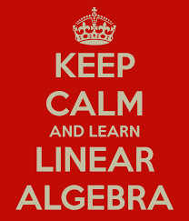
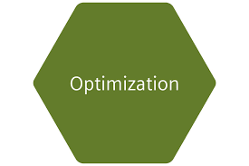

```{r setup, include=FALSE}
knitr::opts_chunk$set(echo = TRUE)
```

<style>
body {
text-align: justify}
figure figcaption {
    text-align: center;}
</style>

---

<center>

{width=70%}
</center>

---

<center> <h3>Welcome to my collected informatics works</h3> </center>

---

Over the past few months I had a good opportunity to direct and teach courses in informatics. Isn't it a good idea to compile and have them in a central location for easier access and information? Almost all lectures have video recordings, except for one or two. So, feel free to browse the series and in case you spot any errors (both of omission and commission), please feel free to report. You can contact me at _my first name_ at _gmail_ dot _com_

If you need more information about the course content, like homeworks, projects etc., you can look into the course home pages which can be accessed from my  [teaching](https://kannan-kasthuri.github.io/Teaching/teaching.html) page.

**A Note:** Although I have separate sections which probably would come under the broad theme of informatics, I don't mean to distinguish data science from informatics. To be a good data scientist, several topics in informatics are necessary, including linear algebra, statistics, signal/image processing etc. Therefore, this entire collection should come under the ambit of data science (and even more such as machine learning that I currently don't have). This is precisely the reason why the page is named "Data Science" and topics such as programming fundamentals, algorithms, optimization, linear algebra etc., have data science series. I will use the words "informatics" and "data science" interchangeably.

Why data science now? After all data analysis has been there from the days of Galileo when he measured gravity. Talking about statistics, the normal distribution was discovered by Carl Fredrich Gauss in $1809$. To see why data science is more useful now, you may want to watch the [introductory lecture](https://kannan-kasthuri.github.io/Lecture_Files/PDA_Lecture_01/Lecture_01.html) in my course. 

If you are seriously pursuing data science, it goes without saying that it will be extremely useful to learn Git. If you don't have the time to learn advanced stuffs, get the basic operations working, like, push, pull and commits. Remember, learning Git is an investment and you will be attractive to future employers.

The lectures are arranged in a manner that a typical data science projects would require analysis, although data science is an iterative process. For instance, the _wrangle_ portion will most often be required as soon as we start messing with the data and so it is in the beginning of data analysis section. The informatics basics are not necessary for manipulating data but a thorough understanding is important to master data analytics. And hence they appear at the end. 

And finally, these are based on R than on any other programming language. While the topic of data science is agnostic to the language of choice, due to teaching responsibilities that emphasized R than any other language, most of them are built on R. If one understands the general principles underneath the lectures he/she may be able to do it in any other language.

---

#### R programming basics

---

<figure style="float:left;">
  
</figure>

[Data Science 01](https://kannan-kasthuri.github.io/Informatics/DS01/DS01.html): In this lecture we introduce the basics of R programming language and introduce key concepts. Most of the time as you import data sets in R, by default, R would convert some of the factor variables into basic data types, and therefore it is important to know the underlying idea behind this such as coercion which are covered here.

[Data Science 02](https://kannan-kasthuri.github.io/Informatics/DS02/DS02.html): Linked lists form the heart of R programming language. Data frames are constructed out of lists. We study lists and basic graphics. Although `ggplot` is a better framework for plots in R, knowing basic plots is important to better appreciate the plots produced through grammar of graphics. These are presented here.

[Data Science 03](https://kannan-kasthuri.github.io/Informatics/DS03/DS03.html): This topic starts with defining conditional statements in R, functions and scope. More importantly, we introduce R markdown. Communcation and reproducability are cornerstones of science and analysis. R markdown is an excellent framework for these. It is pretty easy to get going with `Rmd`. Check it out -

---

#### Data handling & visualization basics

---

<figure style="float:right;">
  
</figure>

[Data Science 04](https://kannan-kasthuri.github.io/Informatics/DS04/DS04.html): What do you do as soon as you are given data? Where do you go from there? If these are your questions, you may want to nose dive into this lecture. This deals with what is known as _warngling_ the data. This means fighting with the data and manipulating it, which may include _gathering_, _spreading_ the variables, _joining_ different tables like databases etc. Be brave! Find out how you wrestle with the data.

[Data Science 05](https://kannan-kasthuri.github.io/Informatics/DS05/DS05.html): Let us assume you have fought hard with the data, wrangled it quite a bit, and finally made it into a format you'd use. What would you do if you want to select only certain rows or columns? What if you want to make a new variable or get some statistics for a certain category? This is where data transformation becomes really important. Data transformation, and especially the `group by` operation is one of the fundamental opertations and essential to learn. 

[Data Science 06](https://kannan-kasthuri.github.io/Informatics/DS06/DS06.html): Visualization is a deep aspect of psychology and we humans are primarily visual in nature. There are several ways we can convey information and in fact add "layers" to plots that adds information. Just like sentences have parts of speech, graphics has a grammar too. This  [Grammar of Graphics](http://byrneslab.net/classes/biol607/readings/wickham_layered-grammar.pdf) framework in R is efficiently implemented as `ggplot`. R produces amazing graphics with ggplot as the main engine. You may want to work on this lecture, if you want to be a data scientist.

---

#### Informatics basics

---

<figure style="float:left;">
  
</figure>


---

<figure style="float:right;">
  
</figure>


---

<figure style="float:left;">
  
</figure>


---

<figure style="float:left;">
  
</figure>
