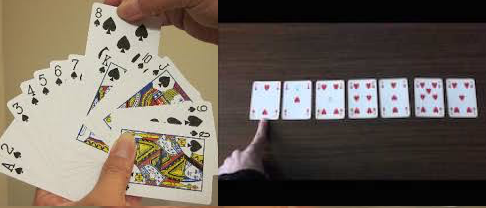
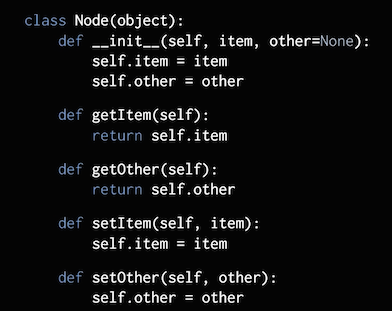
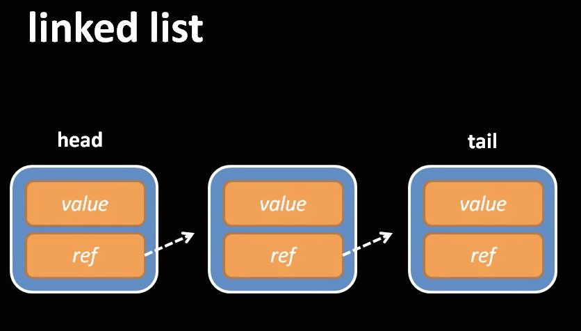

### An Introduction to Algorithms (Sept. 25, 2017)

---

This lecture is designed to give a bird's eye view of analysis of algorithms. The subject is extremely vast and it is usually a semester long course (typically a core course) in computer science departments. 

#### Motivation

Computer programs are set of instructions, or algorithm, supplied by the programmer to accomplish a certain task. There can be several algorithms that can accomplish the same computational task. For instance, consider sorting a bunch of cards. This could be done at least in two different ways, namely, by insertion sort or through selection sort -

---

<center></center>

---

Which is a "better" sort, in terms of time, as the number of cards increase? The word "better" here is often referred as _computational complexity_ in the context of analysis of algorithms. 

Fundemental to analysis of algorithms is complexity analysis which helps in determining the computational complexity of such algorithms. The computational (time) complexity of an algorithm is something that decides how fast the algorithm is run at the idea level (otherwise known as pseudocode), regardless of the programming language, operating system or the hardware. We want to evaluate and compare algorithms as they are: an actionable/programmable idea on how things could be computed. In other words, we are **not interested** in how fast a program is actually run, which depends on various factors including the structure of high-level languages, but rather how best (or worst) is the design behind the program, regardless of the language it is implemented (by analogy, a person could sort faster or slower and we are not interested in the speed someone sorts). Such meta-analysis enables us to say an algorithm has a better computational complexity than the other.

Complexity analysis also allows us to explain how an algorithm would behave as the input size become large, or if the distribution of the input changes. For example, in the case of insertion or selection sort, we can _predict_ how the algorithm would perform if we give numbers that are already sorted vs. random unsorted numbers. Such predictions are important in practical programming since we can determine the scalability of operations assuming worst-case/best-case scenario.    

---

#### Counting instructions 

Computational complexity is usually determined by counting instructions. Let's find the complexity for the following computational task.

**Task** Detrmine the minimum element in an array $A$ with $n$ elements addressed by $A[1], A[2],\dots, A[n]$.

**Algorithm (Find_Minimum_in_Array_A[1,n])** The pesudocode to do this task is as follows:

```{r eval=FALSE}

  # Assign M to the first element in the array
  M = A[1]
  # Go through the array and if the number in the array is less than M, then update M with that number
  for i = 2 to n, increment i
    if (A[i] is less than or equal to M) then
        replace M with A[i]
    end if
  end for
  # Print the answer
  print M is the smallest number and return M
    
```

To work out the complexity we will assume that our hypothetical machine can perform the following operations as one instruction each:

* Assigning a value to a variable
* Looking up the value of a particular element in an array
* Comparing two values
* Incrementing a value
* Basic arithmetic operations such as addition and multiplication

Thus, the first assignment statement:

```{r eval=FALSE}
  M = A[1]
```

will require $2$ instructions, one for looking up $A[1]$ and the other for assigning $A[1]$ to $M$. During the first time of the `for` loop, $i$ has to be assigned $2$ and the condition $2 \leq n$ needs to be evaluated, which will take two instuctions. After this, incrementing $i$ and checking if $i \leq n$ has to be done $n-1$ times, contributing $2(n-1)$ instructions.

We can now define a mathematical function $g(n)$ that, given an $n$, gives us the number of instructions the algorithm needs. Thus, if we ignore the `for` loop body (for the moment), the number of instructions would be $g(n)=2+2+2(n-1)=2n+2$.

---

#### Worst-case/Best-case complexity

Let's look into the `for` loop. The following `if` statement always executes:

```{r eval=FALSE}
  if (A[i] is less than or equal to M) then
```

which requires $2$ instructions (one for the assignment and another for comparison). However the body of the `if` statement depends on the value $A[i]$. Therefore, it is tough to define a mathematical function. For instance, if $A = \{4,3,2,1\}$ then the `if` loop will be executed every time, costing us $2$ additional instructions (one for lookup and another for replacement/assignment), a total of 4 instructions, whereas if $A = \{5,9,13,20\}$ the body of the loop will not be executed even once, costing us only $2$ instructions. 

Often we will be interested in the worst-case because that is when the computation will be maximum. This is called the _worst case complexity_ - that is, it is the situation/complexity when we are highly unlucky. Thus, in the worst-case `if` is executed everytime costing us $4(n-1)$ for the entire `for` loop. Thus, the worst-case complexity function, $W(n)$, is given by,
$$W(n) = 4+2(n-1)+4(n-1) = 6n-2.$$
The best case is when the `if` loop body doesn't execute even once. Therefore, the best-case complexity, $B(n)$, is given by,
$$ B(n) = 4+2(n-1)+2(n-1) = 4n.$$
For a given, $n$, these functions, $W(n)$ and $B(n)$ provides us a huristic on the number of instructions in the extreme cases, and gives an idea on how fast an algorithm is run as $n$ increases.

---

#### Asymptotic behavior

We should keep in mind that the **actual** number of CPU instructions would depend on the complier in our program of choice. 
For instance, the C compiler doesn't check if the specific array is within bounds, whereas a Pascal complier would. Therefore,
the assignment statement,

```{r eval=FALSE}
  M := A[i]
```

which would take just one instruction in C is equvilalent to the following statements in the Pascal language:

```{r eval=FALSE}
  if (i >= 0 && i < n) {
    M = A[i];
  }
```

It makes more sense to ignore the additive and multiplicative constants in our analysis and keep only the **rapidly growing term** that depends on the input size. Such an analysis is referred to as _asymptotic analysis_. So the asymptotic behavior of $W(n) = 6n-2$ is just $n$. Mathematically speaking, it just says that as $n$ increase, $W(n)$ could be "as *bad* as $n$" and is denoted by $O(n)$.

Let us try to analyze the asymptotic behavior of the following task. 

**Task** Print the smallest number in a matrix $A(i,j)$ where $1 \leq i,j \leq n$, noting the column of the smallest element in each iteration, through _brute-force_ approach. 

Brute force approach is where we test all possible candidates for a solution and checking whether it solves our problem. Usually that's the simplest approach for solving a computational problem. The pseudocode for such algorithm is similar to the previous example except that we need to iterate through the columns as well. 

**Algorithm (Find_Minimum_in_Matrix)** Here is the pesudocode (the lines are numbered to make the analysis easier):

```{r eval=FALSE}

01.  # Assign M to the first element in the matrix
02.  M = A[1,1]
03.  smallest_element_column = 1
04.  # For every row i, iterate through all columns to see 
05.  # If the number A[i,j] is smaller than or equal to M
06.  for i = 1 to n, increment i
07.    for j = 1 to n, increment j
08.      if (A[i,j] is less than or equal to M) then
09.          # If the number A[i,j] is smaller than or equal to M, change M to A[i,j] 
10.          replace M with A[i,j]
11.          # Note the column where the smallest element in the iteration appears
12.          smallest_element_column = j
13.      end if
14.    end for       
15.    print "Column " smallest_element_column " has the smallest element"
16.  end for         
17.  # Print the answer
18.  print M is the smallest number
```

If we assume the above criteria for our hypothetical machine for per instruction cost, we note the following:

*1.* Line $02$ will take $2$ instructions and Line $03$ will take $1$ making a total of $3$.

*2.* In the worst case, the matrix $A$ could end up like this -

$$ A = \begin{bmatrix}
    51 & 43 & 39 \\
    33 & 32 & 27 \\
    25 & 15 & 2  \\
\end{bmatrix}
$$

where $a_{ij}\leq a_{mn}$ for $i\geq m$ or $j \geq n$ and so every time the `if` loop has to be executed. Thus, Line $10$ and Line $12$ may execute $n^2$ times, each costing $5$ instructions ($2$ for the `if`, $2$ for Line $10$ and $1$ for Line $12$).

*3.* Line $15$ will execute $n$ times and 

*4.* Line $18$ will execute once costing $1$ instruction.

Therefore, the worst case complexity is given by, $$W(n) = 4+5n^2+n.$$ Hence, the aysmptotic behaviour, ignoring the constant factors and taking the rapidly growing term, is given by $O(n^2)$.

**Examples** 

1. $W(n) = 3n+2$ - asymptotic behavior is given by $O(n)$.
2. $W(n) = 217$  - asymptotic behavior is given by $O(1)$, since $217 = 1\times217$.
3. $W(n) = n + \sqrt{n}$ - asymptotic behavior is described by $O(n)$ since $n$ grows faster than $\sqrt{n}$.
4. $W(n) = n + e^{n}$ - asymptotic behavior is given by $O(e^{n})$ since $e^{n}$ rapidly grows than $n$, as $n$ increases.

**Exercises**

Find the asymptotic behavior of the following functions:

1. $W(n) = n^{3} + 3n$
2. $W(n) = 4^n + 1047$
3. $W(n) = 4^n + n^4$
4. $W(n) = n^n + n$

---

#### The complexity of selection sort


The selection sort algorithm sorts an array by repeatedly finding the minimum element (considering ascending order) from unsorted part and putting it at the beginning. The algorithm maintains two subarrays in a given array.

* The subarray which is already sorted.
* Remaining subarray which is unsorted.

In every iteration of selection sort, the minimum element (considering ascending order) from the unsorted subarray is picked and moved to the sorted subarray. Here is an example:

```{r eval=FALSE}

arr[] = 64 25 12 22 11

# Find the minimum element in arr[0...4]
# and place it at beginning
11 25 12 22 64

# Find the minimum element in arr[1...4]
# and place it at beginning of arr[1...4]
11 12 25 22 64

# Find the minimum element in arr[2...4]
# and place it at beginning of arr[2...4]
11 12 22 25 64

# Find the minimum element in arr[3...4]
# and place it at beginning of arr[3...4]
11 12 22 25 64 
```
**Algorithm (Selection_Sort)** Here is the pseudocode for this sorting algorithm given an array $A$ of $n$ input elements, where `Find_Minimum_in_Array_A[i,n]` is the algorithm defined previously.

```{r eval=FALSE}

01.  # Iterate through the array A picking minimum each time  
02.  for i = 1 to n, increment i
03.      m = Find_Minimum_in_Array_A[i,n] 
04.      # Swap A[i] and m
05.      swap(A[i],m)
06.  end for
17.  print and return A
```
<br>

Note that as $i$ increases, the number of cells that needs to be accessed will decrease by 1. Thus, for the first iteration, we will have to access $n$ elements, the next time $n-1$ elements, etc. Although we do not know the actual complexity of the `for` loop (since we do not know how many times things will be swapped), we can estimate the worst case complexity:

$$n + (n-1) + \dots + 1 = \frac{n(n+1)}{2} = O(n^2).$$

---

#### Elementary data structures


We need data to be organized to run algorithms efficiently on them. Mathematically (or logically), the models for such organization is called _abstract data types_. An example for an abstract data type is a *list* which we should be able to:

* Store a given number of elements of _any_ data type
* Read elements by position
* Modify element at a position

We need a concrete implementation of an abstract data type. For instance, arrays, are a concrete implimentation of lists.

Atomic types: numbers, strings, booleans
Composite types: arrays, records, lists etc.

A simplest data type would be a node - containing a value and a reference to another node. Nodes are the bulding blocks for several data structures like linked lists, graphs and trees.

A python implementation:

---



---

##### Linear data structures (arrays and linked lists)


**Arrays** are fixed size seqence of elements, stored contigously. It is a container which can hold a fix number of items and these items should be of the same type. Most of the data structures make use of arrays to implement their algorithms. The computational complexity for writing to and accessing an array is $O(1)$. No matter the number of elements in the array, the calculation to find the element in the array is single multiplication and addition.

`element_memory_location = start_memory_location + (size_of_element * index_in_array)`

The computational complexity of inserting an element in the middle of an array is $O(N)$, where $N$ is the number of elements in the array. The elements in the array must all be shifted up one index after the insertion, or all the elements must be copied to a new array big enough to hold the inserted element.

**Linked lists** are variable-size sequence of elements which may be heterogenous. Linked lists are typically implemented like this:

---




---

An advantage of the link structure is that it is easy to add and remove elements. To insert an element, jusy create a node, adding value and reference, and pointing the previous node's reference to this node and pointing this node's reference to the node the previous node was pointing. This is possible because the nodes are not sequentially stored, unlike an array. Each node is created seperately and given a spot in memory where ever that may be. The logical sequence is given by the chain of references. As long as we keep track of where the head is located, we can traverse to any node in the list until we reach the tail, which just points to NULL.


Linked lists are preferable over arrays when:

a) you need constant-time insertions/deletions from the list (such as in real-time computing where time predictability is absolutely critical)

b) you don't know how many items will be in the list. With arrays, you may need to re-declare and copy memory if the array grows too big

c) you don't need random access to any elements

d) you want to be able to insert items in the middle of the list (such as a priority queue)

Arrays are preferable when:

a) you need indexed/random access to elements

b) you know the number of elements in the array ahead of time so that you can allocate the correct amount of memory for the array

c) you need speed when iterating through all the elements in sequence. You can use pointer math on the array to access each element, whereas you need to lookup the node based on the pointer for each element in linked list, which may result in page faults which may result in performance hits.

d) memory is a concern. Filled arrays take up less memory than linked lists. Each element in the array is just the data. Each linked list node requires the data as well as one (or more) pointers to the other elements in the linked list.

List gives us the benefits of arrays, but dynamically allocate resources so that we don't need to worry too much about list size and you can delete items at any index without any effort or re-shuffling elements around. Performance-wise, linked lists are slower than raw arrays.

Other special type of linked lists:

**Queue**: A list with last-in-last-out procedure. For example, insertion happens through the tail and deletion happens from the head.

**Stack**: A list with last-in-first-out protocol. One can insert a node only through a head node and deletion happens only by removing the nodes upto that node. Eg. _Stack exchange_

<br>

##### Non-linear data structures (trees and graphs)

**Trees** are not linear data structures, like lists and arrays. More than one possible direction. Example, binary trees:

---

```{r fig.width=4, fig.height=4,echo=FALSE}
library(png)
library(grid)
img <- readPNG("btree.png")
 grid.raster(img)
```

---

Tree traversals are not that straight forward. 

Tree traversal: The process of _visiting_ each node in the tree exactly once in some order. And by visiting we mean, reading or processing data in a node. For example, printing the data in the node. Based on the order in which the nodes are visited, tree traversal algorithms can broadly be classified into two categories:

* Breadth-first traversal or

* Depth-first traversal

They are general techniques to search a _graph_ (a data structure). Tree is only a special kind of graph.

In breadth first search (BFS) we will visit all nodes of the same level before moving to the next level. In the above figure, $F$ is at level $0$, a root, $D$ and $J$ are level $1$, etc.

$$\{F\}, \{D,J\}, \{B,E,G,K\}, \{A,C,I\}, \{H\} $$

In BFS we visit all childern before visiting grand-childern. Whereas in depth-firt search (DFS), we will visit all nodes in the subtree of a child before moving to the next child. The relative order could be different (like one can visit the entire left-subtree, root and the right-subtree than staring with the root, right-subtree and left-subtree) but the core idea is visiting the child is visiting the complete subtree determined by the child. There are three popular approaches:

$$ <root> <left-subtree> <right-subtree> : \text{Preorder traversal} $$
$$ <left-subtree> <root> <right-subtree>: \text{Inorder traversal} $$
$$ <left-subtree> <right-subtree> <root>: \text{Postoder traversal} $$

Conventionally the left-subtree is always visited before the right-subtree. These traversals are easy to implement in recursion.

$$\text{Preorder traversal}: \{F,D,B,A,C,E,J,G,I,H,K\} $$
$$\text{Inorder traversal}: \{A,B,C,D,E,F,G,H,I,J,K\} $$
$$\text{Postorder traversal}: \{A,C,B,E,D,J,H,I,G,K,J,F\} $$

An example of a tree data structure is a **heap**. Heap is a specialized tree-based data structure that satisfies the heap property: if P is a parent node of C, then the key (the value) of node P is greater than the key of node C. A heap can be classified further as either a "max heap" or a "min heap". In a max heap, the keys of parent nodes are always greater than or equal to those of the children and the highest key is in the root node. In a min heap, the keys of parent nodes are less than or equal to those of the children and the lowest key is in the root node. A min-heap example:


---


---

**Graphs** are non-linear and non-hiearchical data structures (compare this with trees that are non-linear hierarchical). There are several applications for graphs which are used to model a variety of systems. A graph is simply a collection of vertices and edges and if we apply the previous interpretation for a node, a graph is a collection of nodes. 

If there are $N$ nodels, a tree will have $N-1$ edges, one edge for each parent-child relationship. All nodes should be reachable from the root and there should be one possible path from the root to the node. No such restrictions for a graph. A tree is a special type of graph. There are two types of graphs - _directed_ and _undirected_. A special type of directed graph is weighted directed graph:

---


---

#### An elementary graph algorithm (Dijkstra's algorithm for shortest path)

Weighted directed graphs are usually represented through adjacency matrices. Here is an example:

---


---

A good demo of Dijkstra's algorithm:

---

<iframe width="560" height="315" src="https://www.youtube.com/embed/dS1Di2ZHl4k" frameborder="0" allowfullscreen></iframe> 

---

#### Who wants to be a millionaire?


**The class P**: Problems _solvable_ in polynomial time. 

**The class NP**: Problems _verifiable_ in polynomial time, but may not be solvable in polynomial time. 

**The class NP-hard**: Class of decision problems which are at least as hard as the hardest problems in NP. More precisely, a problem H is NP-hard when **every** problem L in NP can be **reduced** in polynomial time to H. 


What is reduction?

A very simple example of a reduction is from multiplication to squaring. Suppose all we know how to do is to add, subtract, take squares, and divide by two. We can use this knowledge, combined with the following formula, to obtain the product of any two numbers:

$$ a \times b = \frac{(a+b)^2-a^2-b^2}{2} $$


Problems that are NP-hard do not have to be elements of NP; indeed, they may not even be decidable. Example: _The traveling salesman problem_: Given a list of cities and the distances between each pair of cities, what is the shortest possible route that visits each city exactly once and returns to the origin city? This is decidable though.

**The class NP-Complete**: The class of problems that belongs to NP as well as NP-hard.


Here is a **possible** venn diagram:

---


Note that since every problem in NP can be polynomially reduced to a problem in NP-Hard class, even if we polynomially solve **ONE** problem in NP-Complete class, we will solve all problems in NP in polynomial time, thus showing P=NP. In that case, we will have:

---


---

Otherwise, the original Venn diagram doesn't quite change.

Now, the million dollar question:

---


---

#### References

[A Gentle Introduction to Algorithm Complexity Analysis](http://discrete.gr/complexity/) by Dionysis "dionyziz" Zindros

[Stack exchange](https://stackoverflow.com/questions/393556/when-to-use-a-linked-list-over-an-array-array-list)

---
