

---

### An Introduction to Image Processing (Nov. 06, 2017)

---

Again, image processing is a semester long course in EE/Comp. Sci. departments. Therefore, we will study some important ideas in the following general topics in image processing.

- Digital image fundamentals
    - Relationship between pixels
    - Connectivity
- Signal processing background
    - Fourier transforms and its cousins
- Fourier Transform (FT) applications
    - FT applied to primitive images
    - FT applied to real images
- Image sampling 
    - Limits in reconstruction (Whittaker-Shannon Sampling Theorem)
- Image enhancement
    - Geometrical image transformations
    - Interpolation methods
- Image restoration
    - Noise models
    - Various filters

---

#### Digital image fundamentals

The term image refers to a 2D light-intensity function denoted by $f(x,y)$, where the value or amplitude of $f$ at spatial coordinates $(x,y)$ gives the intensity (brightness) of the image at that point.

The basic nature of $f(x,y)$ can be characterized by two components:

1. The amount of source light incident (_illumination_) on the scene:

$$
i(x,y) \text{ where } 0\leq i(x,y) \leq \infty
$$

2. The amount of light reflected (_reflectance_) by the objects:

$$
r(x,y) \text{ where } 0\leq r(x,y) \leq 1
$$

Total absorption $r(x,y) = 0$ and $r(x,y) = 1$ is never achieved.

The functions $i(x,y)$ and $r(x,y)$ combine as a product:

$$
f(x,y) = i(x,y)r(x,y) \text{ and hence } 0 \leq f(x,y) \leq \infty
$$

In order for a computer to process an image, it has to be described as a series of numbers, each of finite precision. The digitization of $f(x,y)$ is called:

1. **Image sampling** when it refers to spatial coordinates $(x,y)$ and

2. **Quantisation** when it refers to the amplitude of $f(x,y)$

The images are thus only sampled at a discrete number of locations with a discrete set of brightness levels.

The following is the height profile of Switzerland and sub-sampled height profile of Swiss.

---

 

---

Similarly, we can quantize the intensity along the red line:

---

 

---

to get the quantized version,

---

---

When considered together, the digitization process requires making decision about:

1. the size of the image array $N\times M$ and

2. the number of discrete grey-levels $G$ allowed for each pixel, $f(x,y)$

Thus,

---

---

is an image.

In digital image processing these quantities are usually powers of two, thus,

$N = 2^n$, $M = 2^m$ and $G = 2^k$ for some $n, m \text{ and } k$.

How many samples and grey-levels are required for a good approximation?

1. **Resolution** (degree of discernible detail) of an image depends on the number of samples and grey-levels

2. The bigger these parameters, the closer the digitized array approximates the original image

3. However, the storage and processing time increases rapidly.

---

##### Relationship between the pixels

Quantisation alone does not imply a spatial structure → it must be defined. We have to consider topology and metrics as well. Neighborhood is defined via metrics and vice-versa and are defined on the grid. In 2D they are defined as $4$-, $8$- or mixed-neighborhoods. We will see them now.

But before that we will define the following:

Digital image is denoted by $f(x,y)$, pixels as $p,q$ and subset of pixels of $f(x,y)$ as $S$

**Definitions** 

_$4$-Neighbours_: A pixel $p$ at spatial position $(x,y)$ has $4$ neighbors if $S$ is defined as:

$S:(x+1,y),(x-1,y),(x,y+1),(x,y-1)$

This set of pixels is called the $4$-neighborhood of $p: S=N_4(p)$. Pictorially,

---

---

_Diagonal Neighbours_: The diagonal neighbors of $p$ are $N_D(p)$ is defined as the set $S$:

$S:(x+1,y+1),(x-1,y+1),(x+1,y-1),(x-1,y-1)$

---

---

_8-Neighbourhood_: The set theoretic sum of $N_4(p)$ and $N_8(p)$. 

$S: N_4(p)+N_D(p)\rightarrow N_8(p)$

Thus,

---

---

##### Connectivity

Connectivity between pixels is important in several areas of image processing where we need to identify regions of interest, segment etc. Important to the idea of connectivity is establishing boundaries around objects and extract connected components in images.

Two pixels $p,q$ are connected if:

1. They are neighbors, e.g. $N_4(p)$,$N_8(p)$,...

2. Their grey values satisfy a specified criterion of similarity, e.g. in a binary image they have the same value of either $0$ or $1$

Let V be the set of grey-level values used to define connectivity; for example in a binary image $V=\{1\}$ or in a grey-scale image $V=\{16,17,...,32\}$. We can define two types of connectivity:

1. $4$-connectivity if two pixels p,q with values from V and q is in $N_4(p)$

2. $8$-connectivity if two pixels p,q with values from V and q is in $N_8(p)$

---

**$4$-connectivity paradox**

---

**$8$-connectivity paradox**

**Solution**

Foreground $8$-neighborhood + Background $4$-neighborhood

---

##### Fundamental steps in image processing

---

---

#### Signal processing background

---

---

##### Basic ideas

A periodic function can be represented by the sum of sines and cosines of different frequencies, multiplied by a different coefficient (Fourier Series)

Non-periodic functions can also be represented as the integral of sines/cosines multiplied by a weighting function (Fourier Transformation)

---

##### Fourier transform and its cousins

---

We will now see an example of a function and its Fourier transform. The function is defined by,

$$
f(x) = \begin{cases} A, & \mbox{if } 0 \leq x \leq X \\ 0, & \mbox{otherwise} \end{cases}
$$

---

---

Why? Because,

$$
\begin{equation} 
\begin{split}
F(u) & = \int_{-\infty}^{\infty}f(x)e^{-j2\pi ux}dx \\
 & = \int_{0}^{X}Ae^{-j2\pi ux}dx \\
 & = \frac{-A}{j2\pi u}\big[e^{-j2\pi ux}\big]_{0}^{X} \\
 & = \frac{-A}{j2\pi u}\big[e^{-j2\pi uX} - 1\big] \\
 & = \frac{A}{\pi u} sin(\pi u X)e^{-j\pi uX}
\end{split}
\end{equation}
$$

---

Discrete Fourier Transform (DFT) is the discrete analog of the Fourier transform. Since an image is a two-dimensional quantity, we need DFT in two dimensions. DFT is defined by,

$$
\mathcal{F}\{ f(x,y)\} = F(u,v) = \frac{1}{MN}\sum_{x=0}^{M-1}\sum_{y=0}^{N-1}f(x,y)e^{-j2\pi (ux/M+vy/N)}
$$

for $u = 0,1,2,\dots,M-1$ and $v = 0,1,2,...,N-1$. The _inverse DFT_ is defined by,

$$
\mathcal{F}^{-1}\{ F(u,v)\} = f(x,y) = \sum_{x=0}^{M-1}\sum_{y=0}^{N-1}F(u,v)e^{j2\pi (ux/M+vy/N)}
$$
for $x = 0,1,2,\dots,M-1$ and $y = 0,1,2,...,N-1$.

---

DFT is generally calculated using the Fast Fourier Transform (FFT). FFT is an algorithm to compute DFT in a fast and efficient manner. In general DFT takes about $O(N^2)$. Proper decomposition can reduce the number of multiplications and addition proportional to $O(N\log_2N)$. This decomposition is called the fast Fourier Transform (FFT) algorithm.

For example, let's assume that an FFT of size $8,192$ takes on one particular machine $1$ second. Using the DFT method the same Fourier Transform would require $10$ minutes $30$ seconds.

---

The dynamic range of Fourier spectra usually is much higher than the typical display device can reliably reproduce. The consequence is that only the brightest parts are shown. A useful technique that compensates for this difficulty is of displaying the following function:

$$
D(u,v) = c. \log[1+\lvert F(u,v) \lvert]
$$
We can see the application of this technique in the following voyager image:

---

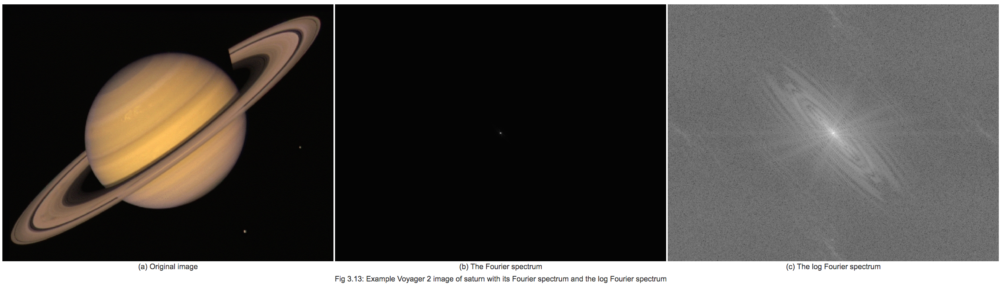

---

#### Fourier transform applications

First we will investigate the "basis" functions for the Fourier Transform (FT). The FT tries to represent all images as a summation of cosine-like images. Therefore images that are pure cosines have particularly simple FTs. Thus we will see FT's application to primitive images.

---

##### FT applied to primitive images

---

---

The images are a pure horizontal cosine of 8 cycles and a pure vertical cosine of 32 cycles. Notice that the FT for each just has a single component, represented by 2 bright spots symmetrically placed about the center of the FT image. The center of the image is the origin of the frequency coordinate system. The u-axis runs left to right through the center and represents the horizontal component of frequency. The v-axis runs bottom to top through the center and represents the vertical component of frequency. In both cases there is a dot at the center that represents the (0,0) frequency term or average value of the image. Images usually have a large average value (like 128) and lots of low frequency information so FT images usually have a bright blob of components near the center. Notice that high frequencies in the vertical direction will cause bright dots away from the center in the vertical direction. And that high frequencies in the horizontal direction will cause bright dots away from the center in the horizontal direction.

---

---

Here are 2 images of more general Fourier components. They are images of 2D cosines with both horizontal and vertical components. The one on the left has 4 cycles horizontally and 16 cycles vertically. The one on the right has 32 cycles horizontally and 2 cycles vertically. (Note: You see a gray band when the function goes through gray = 128 which happens twice/cycle.) You may begin to notice there is a lot of symmetry. For all REAL (as opposed to IMAGINARY or COMPLEX) images, the FT is symmetrical about the origin so the 1st and 3rd quadrants are the same and the 2nd and 4th quadrants are the same. If the image is symmetrical about the x-axis (as the cosine images are) 4-fold symmetry results.

---

In general, rotation of the image results in equivalent rotation of its FT. To see that this is true, we will take the FT of a simple cosine and also the FT of a rotated version of the same function. The results can be seen by:

---

At first, the results seem rather surprising. The horizontal cosine has its normal, very simple FT. But the rotated cosine seems to have an FT that is much more complicated, with strong diagonal components, and also strong "plus sign" shaped horizontal and vertical components. The question is, where did these horizontal and vertical components come from? The answer is that the FT always treats an image as if it were part of a periodically replicated array of identical images extending horizontally and vertically to infinity. And there are strong edge effects between the neighbors of such a periodic array as can be seen by:

---

Thus, what we see as the FT in the "slant" image (lower right of the image before last) is actually the combination of the actual FT of the cosine function and that caused by the edge effects of looking at a finite part of the image. These edge effects can be significantly reduced by "windowing" the image with a function that slowly tapers off to a medium gray at the edge. The result can be seen by:

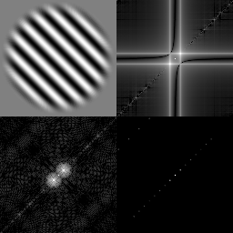

---

The windowed image is shown in the upper left. Its FT is shown in the lower left. The non-windowed FT is shown in the upper right and the actual, true FT of a cosine is shown in the lower right. These images are all scaled differently and the comparison is only qualitative, but it can be seen that the windowed image FT is much closer to the true FT and eliminates many of the edge effects.

---

##### FT applied to real images

Now, with the above introduction, the best way to become familiar with Fourier Transforms is to see lots of images and lots of their FTs. First, an interesting pair of images, one sharp and clear, and the other blurred and noisy.

---

There are 2 images, goofy and the degraded goofy, with FTs below each. Notice that both suffer from edge effects as evidenced by the strong vertical line through the center. The major effect to notice is that in the transform of the degraded goofy the high frequencies in the horizontal direction have been significantly attenuated. This is due to the fact that the degraded image was formed by smoothing only in the horizontal direction. Also, if you look carefully you can see that the degraded goofy has a slightly larger background noise level at high frequencies. This is difficult to see and perhaps not even meaningful because the images are scaled differently, but if really there, it is due to the random noise added to the degraded goofy. Notice also that it is difficult to make much sense out of the low frequency information. This is typical of real life images.

---

The next images show the effects of edges in images:

---

Notice the strong periodic component, especially in the vertical direction for the bricks image. Horizontal components appear closer together in the FT. In the blocks image, notice a bright line going to high frequencies perpendicular to the strong edges in the image. Anytime an image has a strong-contrast, sharp edge the gray values must change very rapidly. It takes lots of high frequency power to follow such an edge so there is usually such a line in its magnitude spectrum.

---

Now lets look at a bunch of different shapes and their FTs.

---

Notice that the letters have quite different FTs, especially at the lower frequencies. The FTs also tend to have bright lines that are perpendicular to lines in the original letter. If the letter has circular segments, then so does the FT.

---

Now lets look at some collections of similar objects:

---

Notice the concentric ring structure in the FT of the white pellets image. It is due to each individual pellet. That is, if we took the FT of just one pellet, we would still get this pattern. Remember, we are looking only at the magnitude spectrum. The fact that there are many pellets and information about exactly where each one is is contained mostly in the phase. The coffee beans have less symmetry and are more variably colored so they do not show the same ring structure. You may be able to detect a faint "halo" in the coffee FT. What do you think this is from?

---

---

Here are our first truly general images. Notice there is very little structure. You can see a top left to bottom right slanting line in the girl image FT. It is probably due to the edge between her hat and her hair. There are also some small edge effects in both images. The mandril image appears to have more high frequency power, probably due to the hair.

---

---

The seafan image has a lot of little holes that are about the same size and somewhat randomly oriented. The size of the holes is about 2 pixels wide so that corresponds to frequency components about 1/2 way out to the maximum. The strong horizontal components in the lake image is probably due to the tree trunk edges.

---

Now, here is your first quiz. Consider an image that is totally random. That is, every pixel is some random value, independent of all other pixels. What is its FT?

---

By the way, notice the single bright dot in the middle of the noise FT image. Why is it there? Why does the noise FT look dark gray?

---

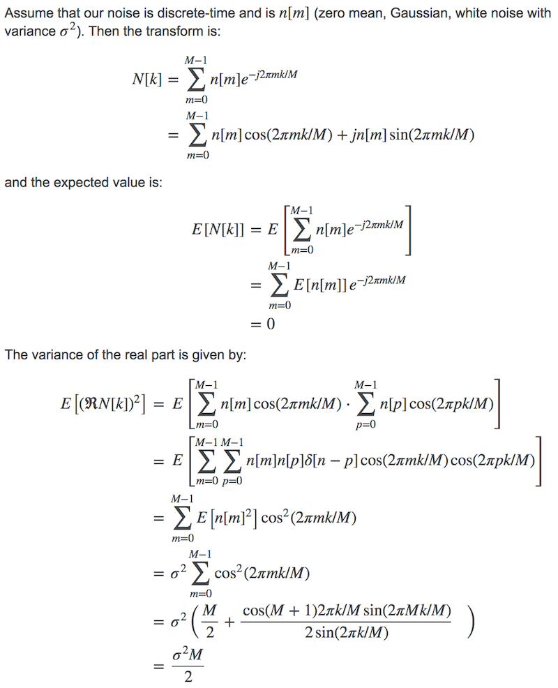

---

#### Image sampling 

Sampling is the process of measuring the brightness information only at a discrete number of locations. This is modeled as a multiplication with a 1D or 2D pattern (train) of Dirac impulses at these discrete positions.

Consider the real neighborhood function filtered $f(x)$. Suppose its FT vanishes outside the interval $u\in[-\omega,\omega]$:

---

---

To obtain a sampled version of $f(x)$ simply involves multiplying it by a sampling function $s(x)$, which consists of a train of Dirac impulses $\Delta x$ apart
Its FT $S(u)$ is also a train of Dirac impulses with a distance inversely proportional to $\Delta x$, namely $1/\Delta x$ apart:

---

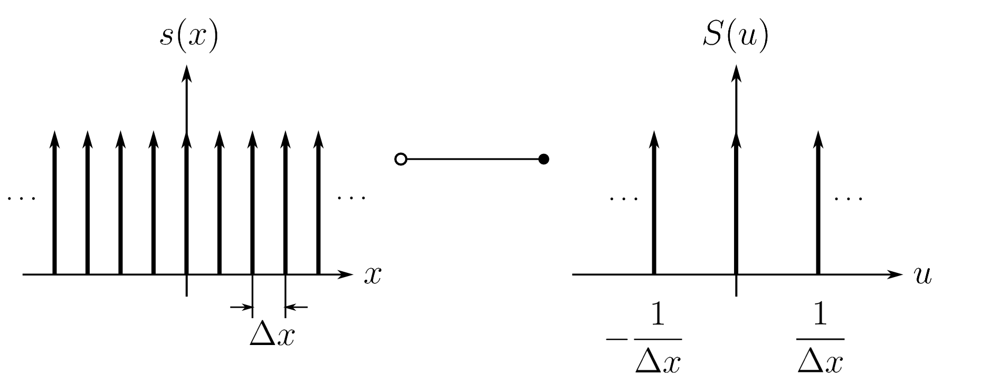

By the convolution theorem multiplication in the image domain is equivalent to convolution in the frequency domain. The transform is periodic, with period $1/\Delta x$, and the individual repetitions of $F(u)$ can overlap → **aliasing**!!! The center of the overlap occurs at $u=1/(2\Delta x)$

---

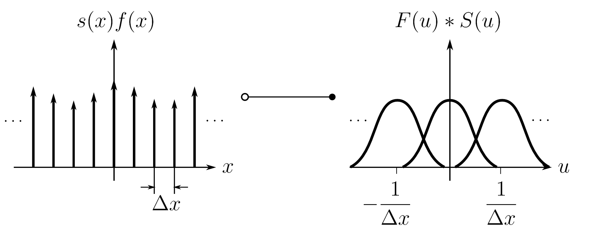

---

To avoid these problems, the sampling interval $\Delta x$ has to be selected so that $1/(2\Delta x)\ge\omega$, or

$$
\Delta x \leq \frac{1}{2 \omega}
$$

---

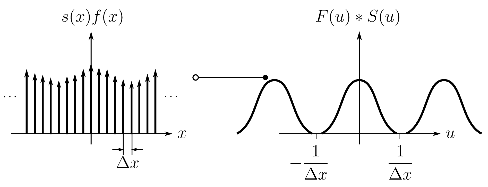

---

Once the individual $F(u)$ are separated a multiplication with the window function $G(u)$ yields a completely isolated $F(u)$:

---

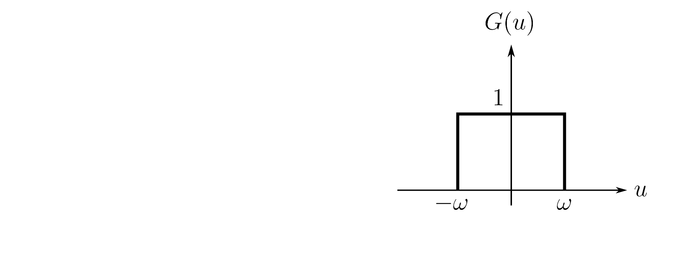

---

The inverse FT then yields the original continuous function $f(x)$. Such a complete recovery of a band-limited function $f(x)$ that satisfies the above inequality is known as the **Whittaker-Shannon Sampling Theorem**.

---

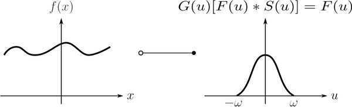

---

Mathematically, since the Fourier transform of a `sinc` function is same as the rectangular function and convolving in the signal domain is same as multiplying in the frequency (Fourier) domain, we can write this as:

$$
f(x) = \Big [ \sum_{n=-\infty}^{\infty} f(n) . \delta(x-n\omega) \Big ] * \text{sinc}\Big(\frac{x}{\omega}\Big)
$$

---

##### Example of aliasing

---

##### Example of good reconstruction

---

#### Image enhancement

The principal objective of the enhancements techniques is to process the images so that the results are more suitable than the original images for a specific application. The approaches discussed in this chapter fall mainly the category of geometrical image corrections. A geometric transform is a vector function $H$ that maps all the pixels $(x,y)$ in the source image to a new position $(x',y')$ in the rectified coordinate system with $(x',y')^\intercal=H(x,y)^\intercal$. The transformation H is either known in advance or can be determined from several known pixel correspondences in an original and transformed image pair. Depending on the geometrical distortion one has to select the most appropriate geometrical transformation $H$ from a class of transformations.

---

---

Such geometric transforms consist of two basic steps

1. Determining the pixel coordinates in the transformed image
    a. Mapping of the coordinates $(x,y)$ in the input image to the point $(x',y')$ in the output image. The output coordinates generally don't fall onto exact pixel coordinates

2.  Determining the point in the digital raster which matches the transformed point and determining its brightness/color
    a. Brightness/color is usually computed as an interpolation of several points in the neighborhood
    
    
The projective transformations form in a mathematical sense a group known as the _projective linear group_. This group can be split into various sub-groups with special properties and increasing complexity (degrees-of-freedom DOF).

1. Class I: Isometries (translation, rotation, rigid)

2. Class II: Similarity transformations

3. Class III: Affine transformations

4. Class IV: Projective transformations

The most general case of geometric transformation is the Free-form or curved transformation which we will not cover.

---

#####  Class I: Isometries (translation, rotation, rigid)

Isometries are transformations of the plane $\mathbb{R}^2$ that preserve Euclidean distance thus the term isometry (from iso = same, metric = measure). The general form of isometries is given by,

$$
x' = H_{ISM}x =
\begin{bmatrix}
    \mathcal{R(\theta)} & \mathbf{t} \\
    \mathbf{0^{T}}      & 1 \\
\end{bmatrix}x
$$

where $\mathcal{R(\theta)}$ is a $2\times 2$ (orthogonal) rotation matrix, $\mathbf{t} = [t_{x},t_{y}]$ a translation vector, and $\mathbf{0}$ a null vector.

---

Isometries have 3 degrees-of-freedom (DOF): one for rotation $(\theta)$ and two for translation $t_x,t_y$ and can be computed from two point correspondences. The invariant of isometries are lengths (distance between two points), angles (between two lines) and area.

For example, if $\theta = 45^{o}$ and $\mathbf{t} = [-100,-100]$ gives the transformation:

$$
x' = H_{ISM}x =
  \begin{bmatrix}
    0.7071 & -0.7071 & -100 \\
    0.7071 & 0.7071 & -100 \\
    0 & 0 & 1
  \end{bmatrix}x
$$

We can see the effect of the transformation:

---

 

---

##### Class II: Similarity transformations

A similarity transformation is an isometry composed with an isotropic scaling (i.e, scaling equally in all directions). In matrix terms,

$$
x' = H_{IST}x =
\begin{bmatrix}
    \mathcal{sR(\theta)} & \mathbf{t} \\
    \mathbf{0^{T}}      & 1 \\
\end{bmatrix}x
$$

where $\mathcal{R(\theta)}$ is a $2\times 2$ (orthogonal) rotation matrix, $s$ is an isotropic scaling factor, $\mathbf{t} = [t_{x},t_{y}]$ a translation vector, and $\mathbf{0}$ a null vector.

---

Similarity transformations have $4$ DOF: one for rotation $\theta$, two for translation $t_x,t_y$, and one for scaling $s$. A similarity can be computed from two point correspondences just like we did for isometry. The invariant for similarity transformations are: angles (angle between two lines) and parallel lines (are mapped to parallel lines). The length between to points is not invariant, but the ratio of two lengths is. Similarly the ratio of areas is invariant (because the squared scaling cancels out).

For example, if $\theta = 45^{o}$ and $\mathbf{t} = [-100,-100]$ and $s = 0.5$, gives the transformation:

$$
x' = H_{IST}x =
  \begin{bmatrix}
    0.3536 & -0.3536 & -100 \\
    0.3536 & 0.3536 & -100 \\
    0 & 0 & 1
  \end{bmatrix}x
$$

We can see the effect of the transformation:

---

 

---

##### Class III: Affine transformations

An affine transformation is a non-singular linear transformation (rotation, scaling and skewing) followed by a translation.

$$
x' = H_{AFF}x =
\begin{bmatrix}
    \mathcal{A} & \mathbf{t} \\
    \mathbf{0^{T}}      & 1 \\
\end{bmatrix}x
$$

where $\mathcal{A}$ is a $2\times 2$ non-singular matrix, $\mathbf{t} = [t_{x},t_{y}]$ a translation vector, and $\mathbf{0}$ a null vector. An affine transformation is _orientation-preserving_ or _-reversing_ if $det(\mathcal{A})$ is positive or negative respectively.

---

Affine transformations have $6$ DOF: four for the non-singular matrix $\mathcal{A}$, and two for translation $t_x,t_y$ and can be computed from three point correspondences. The invariant are a. parallel lines are mapped to parallel lines, 2. ratio of lengths of parallel line segments and 3. ratio of areas.

An affine transformation with:

$$
\mathcal{A} =
  \begin{bmatrix}
    0.5305 & -0.2652 \\
    0.5305 & 0.5305 
  \end{bmatrix}
$$
and $\mathbf{t} = [-100,-100]$, gives,

---

 

---

##### Class IV: Projective transformations

A projective transformation is a general non-singular linear transformation of homogeneous coordinates.

$$
x' = H_{PRO}x =
\begin{bmatrix}
    \mathcal{A} & \mathbf{t} \\
    \mathbf{v^{T}}      & v \\
\end{bmatrix}x
$$

where $\mathcal{A}$ is a $2\times 2$ non-singular matrix, $\mathbf{v^{T}}$ is a vector, $\mathbf{t} = [t_{x},t_{y}]$ a translation vector, and $v$ a scaling parameter.

---

Projective transformations have $8$ DOF. A projective transformation can be computed from four point correspondences (with no three collinear on either plane) and the invariant the cross ratio (ratio of ratio) of four collinear points. A projective transformation:

$$
x' = H_{PRO}x =
  \begin{bmatrix}
    0.5305 & -0.2652 & -100 \\
    0.5305 & 0.5305 & -100 \\
    0.001 & 0 & 1
  \end{bmatrix}x
$$

results in the following transformation of the image.

---

 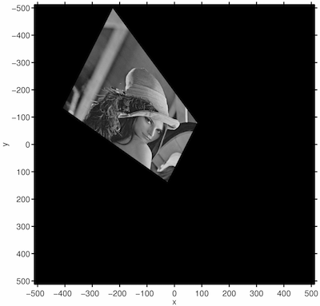

---

#### Interpolation

Once the spatial transformation ${H}$ is known, the input image has to be mapped into the output image. Two approaches are common:

1. Forward mapping: $x'=\mbox{H}x$

2. Backward mapping: $x=\mbox{H}^{-1}x'$

During forward mapping each pixel from the input image is transformed $x'=\mbox{H}x$ and copied to the output image. Problems with this approach are:

1. Pixel coordinates x' generally do not fall onto exact pixel locations

2. Two or more input pixels could be mapped to the very same output pixel

3. Some output pixels might not get a value assigned at all (gaps)

During backward mapping for each output pixel the coordinates in the input image are calculated $x=\mbox{H}^{-1}x'$ and copied over. Problem with this approach is that the pixel coordinate $x$ generally does not fall onto an exact pixel location. Efficient forward mapping is complex and computationally expensive to implement.

---

##### Backward mapping

In backward mapping for each output pixel the corresponding location in the input image is calculated using $\mbox{H}^{-1}$. As the pixel coordinates in the input image generally do not fall onto exact pixel locations, the pixel intensity/color is interpolated among the nearest input image pixels. Backward mapping is easier to implement and computationally faster than forward mapping. The problem, however is, how to interpolate (resample) the image pixels?

Three approaches:

1. Nearest-Neighbor interpolation

2. Bilinear interpolation

3. Cubic convolution methods

_Nearest-Neighbor (NN) interpolation_: Set the intensity equal to the intensity of the closest pixel. There are advantages and disadvantaes of NN interpolation. Nearest Neighbour (NN) interpolation is very fast
NN interpolation does not introduce new grey values! although NN interpolation shows heavy artefacts. 

---

---

_Bilinear interpolation_: Bilinear interpolation determines the grey level from the weighted average of the four closest pixels and can be defined as,

$$
I_{x,y} = w_4I_{u,v}+w_2I_{u,v+1}+w_3I_{u+1,v}+w_1I_{u+1,v+1}
$$
where

$$
\begin{align}
w_1 & = (x-u)(y-v) \\
w_2 & = (u+1-x)(y-v) \\
w_3 & = (x-u)(v+1-y) \\
w_4 & = (u+1-x)(v+1-y)
\end{align}
$$

Bilinear Interpolation has the following properties:

1. Better than nearest-neighbour interpolation

2. Computationally efficient to implement (about five times slower then NN, though)

But it smooths and blurs the image and thus reduces spatial resolution

---

---

_Cubic convolution methods_: This is similar to bilinear interpolation where the resampled image data are computed using $4 \times 4 = 16$ surrounding original image data.

---

Cubic convolution is better at retaining the original grey values than NN and bilinear interpolation but the computational requirement is up to $10$ times higher than NN interpolation and $2$ times higher than bi-linear interpolation. The following images shows the results of applying these interpolation techniques.

---

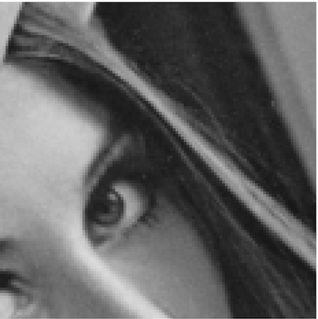

---

#### Image restoration

In contrast to image enhancement that was subjective and largely based on heuristics, restoration attempts to reconstruct or recover an image that has been distorted by a known degradation phenomenon. Restoration techniques thus try to model the degradation process and apply the inverse process in order to reconstruct the original image.

The principle sources of noise in digital images arise during image acquisition and/or transmission. The performance of imaging sensors are affected by a variety of factors during acquisition, such as,

1. Environmental conditions during the acquisition

2. Light levels (low light conditions require high gain amplification)

3. Sensor temperature (higher temp implies more amplification noise)

Images can also be corrupted during transmission due to interference in the channel for example due to lightning or other atmospheric disturbances. Depending on the specific noise source, a different model must be selected that accurately reproduces the spatial characteristics of the noise.

---

##### Various noise models

_Gaussian noise_

Because of its mathematical tractability in both the spatial and frequency domain, Gaussian noise models (aka normal distribution) are used frequently in practice. The application of the Gaussian model is so convenient that it is often used in situations in which they are marginally applicable at best.

$$
p_{G}(z) = \frac{1}{\sqrt{2\pi \sigma}}\exp \Big(\frac{-(z-\mu)^2}{2\sigma ^2} \Big) 
$$

_Rayleigh noise_

One example where the Rayleigh distribution naturally arises is when wind velocity is analyzed into its orthogonal 2-dimensional vector components. As the shape of the Rayleigh density function is skewed it is useful for approximating skewed histograms.

$$
p_{R}(z) = \begin{cases} \frac{2}{b} (z-a) \exp \Big(\frac{-(z-a)^2}{b} \Big) , & \mbox{if } z \geq a \\ 0, & \mbox{otherwise} \end{cases}
$$

where the mean and variance are given by,

$$
\begin{align}
\mu & = a + \sqrt{\pi b/4} \\
\sigma ^2 & = \frac{b(4-\pi)}{4}
\end{align}
$$

_Erlang noise_

Erlang noise occur in laser imaging.

$$
p_{E}(z) = \begin{cases} \frac{a^bz^{b-1}}{(b-1)!}\exp(-az) , & \mbox{if } z \geq 0 \\ 0, & \mbox{otherwise} \end{cases}
$$

where the mean and variance are given by,

$$
\begin{align}
\mu & = \frac{b}{a} \\
\sigma ^2 & = \frac{b}{a^2}
\end{align}
$$

_Exponential noise_

The exponential noise model is a special case of the Erlang noise model with b=1. Negative exponential noise occurs in laser-based images, and if this type of image is filtered the noise can be modeled as gamma noise. 

$$
p_{exp}(z) = \begin{cases} a\exp(-az) , & \mbox{if } z \geq 0 \\ 0, & \mbox{otherwise} \end{cases}
$$

where the mean and variance are given by,

$$
\begin{align}
\mu & = \frac{1}{a} \\
\sigma ^2 & = \frac{1}{a^2}
\end{align}
$$

_Uniform noise_

Typically, when a real value $x$ from a sensor is discretized $(x_Q)$ with a uniform quantizer, the error $x−x_Q$ is likely to be uniformly distributed.

$$
p_{U}(z) = \begin{cases} \frac{1}{b-a} , & \mbox{if } a \leq z \leq b \\ 0, & \mbox{otherwise} \end{cases}
$$
where the mean and variance are given by,

$$
\begin{align}
\mu & = \frac{a+b}{2} \\
\sigma ^2 & = \frac{(b-a)^2}{12}
\end{align}
$$

_Impulse (Salt-and-Pepper) noise_

If $b>a$, grey-level $b$ appears as a light dot (salt) in the image. Conversely, $a$ will appear as dark dot (pepper). If either $P_a,P_b$ is zero, the PDF is called unipolar. Because impulse corruption is generally large compared to the signal strength, the assumption is usually that a and b are digitised as saturated values thus black (pepper) and white (salt).

$$
p_{I}(z) = \begin{cases} P_a , & \mbox{if } z = a \\ 
P_b, & \mbox{if } z = b \\
0 & \mbox{otherwise} \end{cases}
$$

_Periodic noise_

Periodic noise typically arises from electrical or electromechanical interference during image acquisition and is spatial dependent. The parameters of periodic noise are typically estimated by inspection of the Fourier spectrum. The frequency spikes can often be detected by visual analysis. Automatic analysis is possible if the noise spikes are either exceptionally pronounced or a priori knowledge about their location is known.

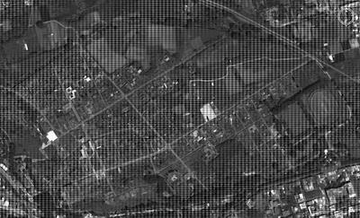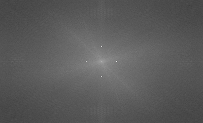

---

#### References

1. [Introduction to Signal and Image Processing](https://miac.unibas.ch/SIP/)

2. [Introduction to Fourier Transform for Image Processing](https://www.cs.unm.edu/~brayer/vision/fourier.html)

---