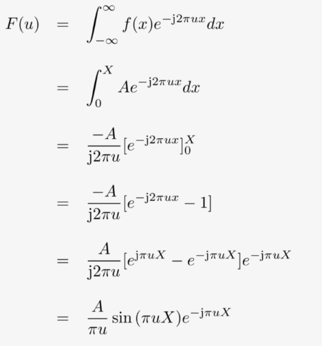
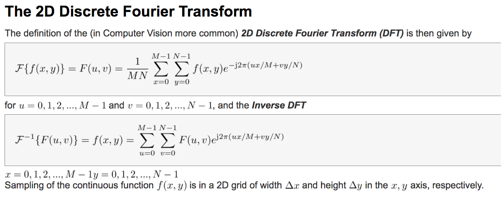

---

### An Introduction to Image Processing (Nov. 06, 2017)

---

We will study some specific ideas in the following general topics in image processing.

1. Digital image fundamentals

2. Signal processing background

3. Filtering in the frequency domain

4. Image sampling 

5. Image enhancement 

6. Image restoration

7. Image segmentation

---

#### Digital image fundamentals

The term image refers to a 2D light-intensity function denoted by $f(x,y)$, where the value or amplitude of $f$ at spatial coordinates $(x,y)$ gives the intensity (brightness) of the image at that point.

The basic nature of $f(x,y)$ can be characterized by two components:

1. The amount of source light incident (_illumination_) on the scene:

$$
i(x,y) \text{ where } 0\leq i(x,y) \leq \infty
$$

2. The amount of light reflected (_reflectance_) by the objects:

$$
r(x,y) \text{ where } 0\leq r(x,y) \leq 1
$$

Total absorption $r(x,y) = 0$ and $r(x,y) = 1$ is never achieved.

The functions $i(x,y)$ and $r(x,y)$ combine as a product:

$$
f(x,y) = i(x,y)r(x,y) \text{ and hence } 0 \leq f(x,y) \leq \infty
$$

In order for a computer to process an image, it has to be described as a series of numbers, each of finite precision. The digitization of $f(x,y)$ is called:

1. **Image sampling** when it refers to spatial coordinates $(x,y)$ and

2. **Quantisation** when it refers to the amplitude of $f(x,y)$

The images are thus only sampled at a discrete number of locations with a discrete set of brightness levels.

The following is the height profile of Switzerland and sub-sampled height profile of Swiss.

---

 

---

Similarly, we can quantize the intensity along the red line:

---

 

---

to get the quantized version,

---

---

When considered together, the digitization process requires making decision about:

1. the size of the image array $N\times M$ and

2. the number of discrete grey-levels $G$ allowed for each pixel, $f(x,y)$

Thus,

---

---

is an image.

In digital image processing these quantities are usually powers of two, thus,

$N = 2^n$, $M = 2^m$ and $G = 2^k$ for some $n, m \text{ and } k$.

How many samples and grey-levels are required for a good approximation?

1. **Resolution** (degree of discernible detail) of an image depends on the number of samples and grey-levels

2. The bigger these parameters, the closer the digitized array approximates the original image

3. However, the storage and processing time increases rapidly.

---

##### Relationship between the pixels

Quantisation alone does not imply a spatial structure → it must be defined. We have to consider topology and metrics as well. Neighborhood is defined via metrics and vice-versa and are defined on the grid. In 2D they are defined as $4$-, $8$- or mixed-neighborhoods. We will see them now.

But before that we will define the following:

Digital image is denoted by $f(x,y)$, pixels as $p,q$ and subset of pixels of $f(x,y)$ as $S$

**Definitions** 

_$4$-Neighbours_: A pixel $p$ at spatial position $(x,y)$ has $4$ neighbors if $S$ is defined as:

$S:(x+1,y),(x-1,y),(x,y+1),(x,y-1)$

This set of pixels is called the $4$-neighborhood of $p: S=N_4(p)$. Pictorially,

---

---

_Diagonal Neighbours_: The diagonal neighbors of $p$ are $N_D(p)$ is defined as the set $S$:

$S:(x+1,y+1),(x-1,y+1),(x+1,y-1),(x-1,y-1)$

---

---

_8-Neighbourhood_: The set theoretic sum of $N_4(p)$ and $N_8(p)$. 

$S: N_4(p)+N_D(p)\rightarrow N_8(p)$

Thus,

---

---

##### Connectivity

Connectivity between pixels is important in several areas of image processing where we need to identify regions of interest, segment etc. Important to the idea of connectivity is esatblishing boundaries around objects and extract connected components in images.

Two pixels $p,q$ are connected if:

1. They are neighbors, e.g. $N_4(p)$,$N_8(p)$,...

2. Their grey values satisfy a specified criterion of similarity, e.g. in a binary image they have the same value of either $0$ or $1$

Let V be the set of grey-level values used to define connectivity; for example in a binary image $V=\{1\}$ or in a grey-scale image $V=\{16,17,...,32\}$. We can define two types of connectivity:

1. $4$-connectivity if two pixels p,q with values from V and q is in $N_4(p)$

2. $8$-connectivity if two pixels p,q with values from V and q is in $N_8(p)$

---

**$4$-connectivity paradox**

---

**$8$-connectivity paradox**

**Solution**

Foreground $8$-neighborhood + Background $4$-neighborhood

---

##### Fundamental steps in image processing

---

---

#### Signal processing background

---

---

##### Basic ideas

A periodic function can be represented by the sum of sines and cosines of different frequencies, multiplied by a different coefficient (Fourier Series)

Non-periodic functions can also be represented as the integral of sines/cosines multiplied by a weighting function (Fourier Transformation)

---

##### Definition of the fourier transform

---

We will now see an example of fourier transform

---

---

---

---

---

The Discrete Fourier Transform (DFT) is generally calculated using the Fast Fourier Transform (FFT). FFT is an algorithm to compute DFT in a fast and efficient manner. In general DFT takes about $O(N^2)$. Proper decomposition can reduce the number of multiplications and addition proportional to $O(N\log_2N)$. This decomposition is called the fast Fourier Transform (FFT) algorithm.

For example, let's assume that an FFT of size $8,192$ takes on one particular machine $1$ second. Using the DFT method the same Fourier Transform would require $10$ minutes $30$ seconds.

---

#### References

1. [Introduction to Signal and Image Processing](https://miac.unibas.ch/SIP/)

2. [Introduction to Fourier Transform for Image Processing](https://www.cs.unm.edu/~brayer/vision/fourier.html)

---