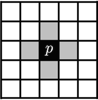
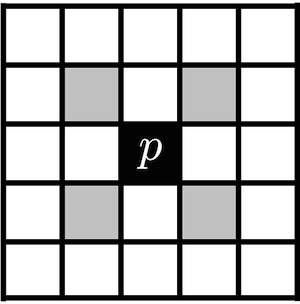
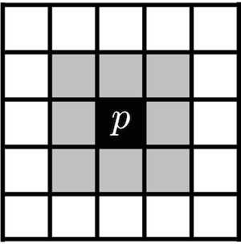
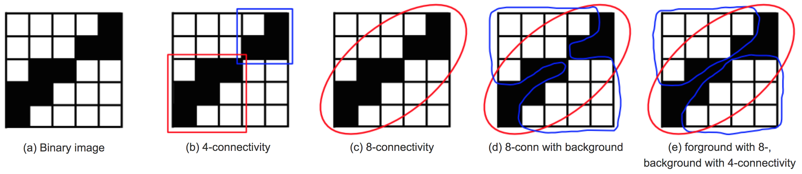
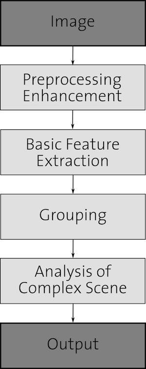
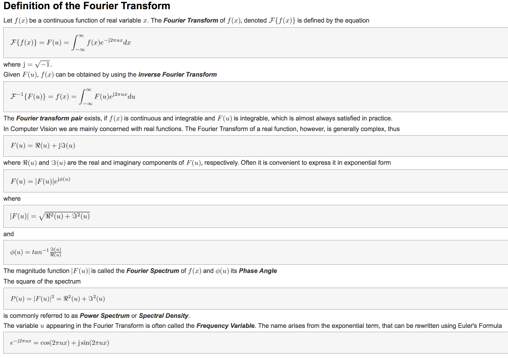

---
output:
  revealjs::revealjs_presentation: null
  pandoc_args:
  - --slide-level
  - '2'

---

### An Introduction to Image Processing (Nov. 06, 2017)

---

We will learn the following topics in this lecture.

1. Digital image fundamentals

2. Signal processing background

3. Image sampling and quantization

4. Image enhancement

5. Image restoration

6. Image segmentation

---

#### Digital image fundamentals

The term image refers to a 2D light-intensity function denoted by $f(x,y)$

The value or amplitude of $f$ at spatial coordinates $(x,y)$ gives the intensity (brightness) of the image at that point.

The basic nature of $f(x,y)$ can be characterised by two components:

1. The amount of source light incident (_illumination_) on the scene:

$$
i(x,y) \text{ where } 0\leq i(x,y) \leq \infty
$$

2. The amount of light reflected (_reflectance_) by the objects:

$$
r(x,y) \text{ where } 0\leq r(x,y) \leq 1
$$

##

Total absorption $r(x,y) = 0$ and $r(x,y) = 1$ is never acheived.

The functions $i(x,y)$ and $r(x,y)$ combine as a product:

$$
f(x,y) = i(x,y)r(x,y) \text{ and hence } 0 \leq f(x,y) \leq \infty
$$

##

In order for a computer to process an image, it has to be described as a series of numbers, each of finite precision. The digitisation of $f(x,y)$ is called:

1. **Image sampling** when it refers to spatial coordinates $(x,y)$ and

2. **Quantisation** when it refers to the amplitude of $f(x,y)$

The images are thus only sampled at a discrete number of locations with a discrete set of brightness levels.

The following is the height profile of Switzerland and sub-sampled height profile of Swiss.

---

 

---

Similarly, we can quantize the intensity along the red line:

 

to get the quantized version,

---

When considered together, the digitization process requires making decision about:

- the size of the image array $N\times M$ and

- the number of discrete grey-levels $G$ allowed for each pixel, $f(x,y)$

In digital image processing these quantities are usually powers of two, thus, $N = 2^n$, $M = 2^m$ and $G = 2^k$ for some $n, m \text{ and } k$.

##

How many samples and grey-levels are required for a good approximation?

- **resolution** (degree of discernable detail) of an image depends on the number of samples and grey-levels

- the bigger these parameters, the closer the digitised array approximates the original image

- however, the storage and processing time increases rapidly

##

##### Relationship between the pixels

Quantisation alone does not imply a spatial structure → it must be defined and we have to consider topology and metrics

Neighborhood is defined via metrics and vice-versa and are defined on the grid

In 2D they are defined as 4-, 8- or mixed-neighbourhoods. We will see them now.

But before that we will define the following:

Digital image is denoted by $f(x,y)$, pixels as $p,q$ and subset of pixels of $f(x,y)$ as $S$

##

**$4$-Neighbours**

A pixel $p$ at spatial position $(x,y)$ has $4$ neighbours:

$S:(x+1,y),(x-1,y),(x,y+1),(x,y-1)$

This set of pixels is called the $4$-neighbourhood of $p: S=N_4(p)$

**Diagonal Neighbours**

The four diagonal neighbours of $p$ are $N_D(p)$:

$S:(x+1,y+1),(x-1,y+1),(x+1,y-1),(x-1,y-1)$

**8-Neighbourhood**

$N_4(p)+N_D(p)\rightarrow N_8(p)$

---

  

---

##### Connectivity

Connectivity between pixels is important to:

1. Establish boundaries around objects

2. Extract connected components in an image

Two pixels $p,q$ are connected if

1. They are neighbours, e.g. $N_4(p)$,$N_8(p)$,...

2. Their grey values satisfy a specified criterion of similarity, e.g. in a binary image they have the same value of either $0$ or $1$

##

Let V be the set of grey-level values used to define connectivity; for example in a binary image $V=\{1\}$ or in a grey-scale image $V=\{16,17,...,32\}$. We can define two types of connectivity:

1. $4$-connectivity if two pixels $p,q$ with values from V and q is in $N_4(p)$

2. $8$-connectivity if two pixels $p,q$ with values from V and q is in $N_8(p)$

---

**$4$-connectivity paradox**

---

**$8$-connectivity paradox**

**Solution**

Foreground $8$-neighbourhood + Background $4$-neighbourhood

##

##### Fundamental steps in image processing

---

---

#### Signal processing background

---

---

##### Basic ideas

A periodic function can be represented by the sum of sines and cosines of different frequencies, multiplied by a different coefficient (Fourier Series)

Non-periodic functions can also be represented as the integral of sines/cosines multiplied by a weighting function (Fourier Transformation)

---

---

#### References

1. [Introduction to Signal and Image Processing](https://miac.unibas.ch/SIP/)

---