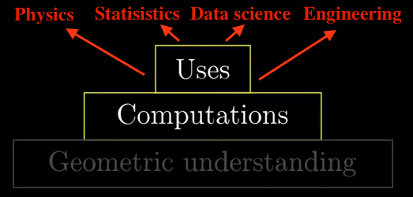
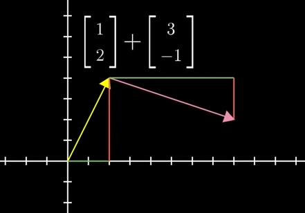
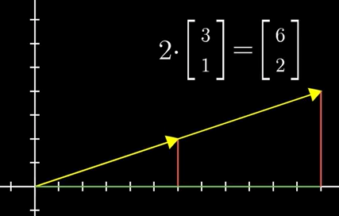
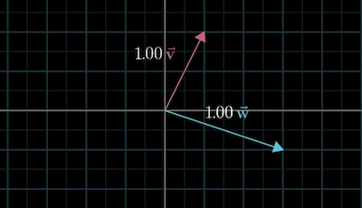
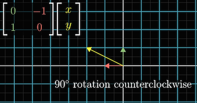
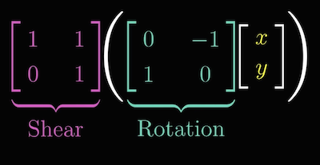

### An Introduction to Linear Algebra (Sept. 27, 2017)

_There is hardly any theory which is more elementary than linear algebra, in spite of the fact that generations of professors and textbook writers have obscured its simplicity by preposterous calculations with matrices_. - Jean Dieudonné (1906-1992)

---

#### Essence of linear algebra

Linear algebra is required knowledge for any technical discipline: Computer science, Physics, Electrical engineering, Mechanical engineering, Statistics etc. -although it is poorly understood by students. We probably would have learned so many (crazy) things like,

$$ A \times B= \begin{bmatrix}
    a_{11} & a_{12} & a_{13} \\
    a_{21} & a_{22} & a_{23} \\
    a_{31} & a_{32} & a_{33}  \\
\end{bmatrix}
\begin{bmatrix}
    b_{11} & b_{12} & b_{13} \\
    b_{21} & b_{22} & b_{23} \\
    b_{31} & b_{32} & b_{33}  \\
\end{bmatrix}= 
$$
$$
\begin{bmatrix}
    a_{11}b_{11}+a_{11}b_{21}+a_{11}b_{31} & a_{12}b_{12}+a_{12}b_{22}+a_{12}b_{32} & a_{13}b_{13}+a_{13}b_{23}+a_{12}b_{33} \\
    a_{21}b_{11}+a_{21}b_{21}+a_{21}b_{31} & a_{22}b_{12}+a_{22}b_{22}+a_{22}b_{32} & a_{23}b_{13}+a_{23}b_{23}+a_{23}b_{33} \\
    a_{31}b_{11}+a_{31}b_{21}+a_{31}b_{31} & a_{32}b_{12}+a_{32}b_{22}+a_{32}b_{32} & a_{33}b_{13}+a_{33}b_{23}+a_{33}b_{33} \\
\end{bmatrix}
$$
or determinant

$$ det(A)= 
\begin{vmatrix}
    a_{11} & a_{12} \\
    a_{21} & a_{22}\\
\end{vmatrix} = a_{11}a_{22}-a_{12}a_{21}
$$
or cross products,

$$ v \times u= 
det\begin{vmatrix}
    \hat{i} & \hat{j} & \hat{k}\\
    v_{1} & v_{2} & v_{3} \\
    u_{1} & u_{2} & u_{3}
\end{vmatrix} 
$$

or eigenvalues,

$$ det(A-\lambda I) = 0$$

But they might really come out without understanding why they are defined the way they are. We are vaguely aware of the geometric intuition behind such definitions. Numeric and geometric understanding differ fundementally. While numeric understanding allows us to do actual computations, geometric understanding is helpful for:

* judging what tools are useful for what problems, 
* feel the problem and 
* know how to interpret the results.

---

---

Without geometric understaning, professors teaching applications look like wizzards and linear algebra looks intimidating!

For example, if you are taught from your young age that `sin` function is:

$$ sin(x) = x-\frac{x^3}{3!}+\frac{x^5}{5!}+\dots+(-1)^{n}\frac{x^{2n+1}}{(2n+1)!}+\dots$$
and vaguely know it is related to triangles. If you are sitting in a physics class learning trajectories, this may seem magical.

---

---

Luckily, linear algebra is not too different! There are **visual** intuitions underlying the subject. And unlike the above `sin` example, the visual intuitions are much straight forward and lot of what it has been taught in a numeric way will sound more reasonable. In fairness, many professors will make an attempt to convey the geometric understanding, but lots of courses spend disproportinate amount of time in numerical side of things, especially in this day and age where numerical computations can be left to computers and we focussing on conceptual ideas. In the following sections, we will try to understand the basics of linear algebra through geometric intuition.

---

#### Vectors: What even are they?

_The introduction of numbers as coordinates is an act of violence_ - Hermann Weyl

Vectors are seen differently by different folks.

* Physics student perspective: Magnitude and direction. Coordinate free. Eg., _force_.

* CS student perspective: Ordered lists of numbers. Model using array of numbers where order matters. In R programming it is essentially a list with same data type.

* Math student perspective: Tries to generalize both these views. A vector can be anything as long as we can add two vectors or multiply a vector with a scalar.

The later view comes from the fact that addition and scalar multiplication is extremely useful throughout linear algebra. In math, we always think a vector is rooted in some origin. In two dimensions, every pair of numbers is associated with only one vector and every vector is associated with only one pair of numbers.

##### Vector addition

Vector addition is an extension of 1-d addition.

---

---

In general, 

$$  
\begin{bmatrix}
    x_1 \\
    y_1 \\
\end{bmatrix}  +
\begin{bmatrix}
    x_2 \\
    y_2 \\
\end{bmatrix}  =
\begin{bmatrix}
    x_1+x_2 \\
    y_1+y_2 \\
\end{bmatrix}
$$

##### Scalar multiplication

Scaling a vector by a constant expands or squishes it by the factor it is scaled,

---

---

At the end of the day, it doesn't matter if you think vectors as fundamentally arrows in space (physcists view) with numbers associated to them or lists of numbers (computer scientists view) with arrows associated with them, the usefullness of linear algebra lies in the fact that these notions are interchangeable. This gives data scientits to conceptualize numbers in a visual way (like PCA) that identifies patterns in data and gives a global view of what certain operations do. On the other hand it gives physicists and graphics programmers a language to describe and manipulate space that can be crunched and run in a computer.

**Vector space (Technical Definition)**: A space containing vectors where any two vectors can be added and any vector can be multipled by scalars, to produce another vector.

---

#### Linear combinations, span and basis vectors

---

_Mathematics requires a small dose, not of genius, but of an imaginative freedom which, in a larger dose, would be insanity._ - Angus K. Rodgers

In two dimensions, there are two special vectors, $\hat{i}$, one that points in the $x$-direction and $\hat{j}$, the one that points in the $y$-direction. Then each coordinate can be imagined as scalers. One can think of:

* $x$-coordinate as a scalar that scales $\hat{i}$ and 
* $y$-coordinate as a scaler that scales $\hat{j}$.

---

---

$\hat{i}$ and $\hat{j}$ have a special name - **basis vectors** of the $xy$- coordinate system. What if we choose different basis vectors? 

---

---

Then the _values_ of the coordinates will change depening on this change in the basis vectors. Thus, anytime, you define a vector using numbers, the coordinates implicitly depend on the basis vectors.

**Terminology**: If $\vec{u}$ and $\vec{v}$ are two vectors and $a$ and $b$ are scalars, the sum $a\vec{u}+b\vec{v}$ is called the _linear combination_ of the vectors. Why is the name called linear combination? What is so "liny" about them?

Fix one of the scalars and allow the value to roam freely, we get a line.

---

---

**Terminology**: If you allow both $a$ and $b$ freely, the resulting sum is called the _span_ of the vectors $\vec{u}$ and $\vec{v}$. 

Three things can happen in two-dimensions:

* If $\vec{u}$ and $\vec{v}$ are zero, then their span is zero.
* If $\vec{u}$ and $\vec{v}$ are in the same direction, then the span will be a line.
* If $\vec{u}$ and $\vec{v}$ are in different directions, then span will be the entire two-dimensional plane.

---

**Question**: What is the span of two vectors in 3-d space? 

---

---

How about if we add one more vector? If the third vector is in the same plane - we are trapped!!

---

---

Another way of saying this is the vectors are _linearly dependent_. Otherwise, the plane will move (think of continously varying the third vector) and the vectors are referred as _linearly independent_.

**Basis (Technical Definition)**: The _basis_ of a _vector space_ is a set of linerly independent vectors that _span_ the entire space. Why this definition makes sense?

---

#### Linear transformations and matrices

_Unfortunately no one can be told what the Matrix is. You have to see it for yourself_. - Morpheus

As the name suggests, transformation essentially means a function - takes an input vector and spits another vector. Arbitrary transformations like this are not _linear_. 

---

---

The key word is linear. All lines should remain lines and the origin should be fixed. Thus, this is not a linear transformation.

---

---

And not this as well (since origin moves)...

---

---

How about this? 

---

---

**Note**: This keeps lines as lines and the origin fixed.

---

---

In general, one can think of linear transformation as some function that keeps grid lines parallel and evenly spaced.

---

---

Some are simple to think about - like rotation for instance,

---

---

How do we describe these transformations numerically? That is,

$$  
\begin{bmatrix}
    x_{in} \\
    y_{in} \\
\end{bmatrix}  
\Rightarrow 
\text{???}
\Rightarrow
\begin{bmatrix}
    x_{out} \\
    y_{out} \\
\end{bmatrix}
$$

It turns out we need to only find out where the unit vectors $\hat{i}$ and $\hat{j}$ land. Everything will follow from that. As an example:

---

---

Thus for any arbitrary vectors $[x,y]^T$, we have:

---

---

All this says is a two-dimensional linear transformation is described by just two sets of numbers. The two coordinates where $\hat{i}$ lands and two coordinates where $\hat{j}$ lands. It is elegent to package these two sets of numbers in a $2 \times 2$ grid of numbers, called a _matrix_ and often written like this: 

$$ M= 
\begin{bmatrix}
    1 & 3 \\
   -2 & 0 \\
\end{bmatrix} 
$$

If you want to know where an arbitray point, say, 

$$ P = 
\begin{bmatrix}
   x \\
   y \\
\end{bmatrix} 
$$

goes, just multiply the first number by where $\hat{i}$ lands and the second number by where $\hat{j}$ lands. That is,

$$ P = 
x\begin{bmatrix}
   1 \\
   -2 \\
\end{bmatrix} + 
y\begin{bmatrix}
   3 \\
   0 \\
\end{bmatrix}
$$
Therefore, in general, we can think of a matrix vector multiplication,

$$\begin{bmatrix}
    a & b \\
    c & d \\
\end{bmatrix} 
\begin{bmatrix}
    x \\
    y \\
\end{bmatrix} = 
x \begin{bmatrix}
    a \\
    c \\
\end{bmatrix}+
y \begin{bmatrix}
    b \\
    d \\
\end{bmatrix} =
\begin{bmatrix}
    ax + by \\
    cx + dy \\
\end{bmatrix} 
$$

as just a transformation of points.

---

##### Some special type of transformations

Rotation:

---

Sheer ($\hat{i}$ remains the same, while $\hat{j}$ moves to $[1,1]^T$):

---

---

If the columns are linearly dependent, that is if one column is a multiple of another, the whole line squishes:

---

To sum up:

* Linear transformations are a way to move around space such that grid lines remain parallel and evenly spaced. The origin goes to origin.

* Delightfully, these transformations can be described only through a handful of numbers, the coordinates of where each basis vectors lands.

* Matrices gives us a language to describe these transformations where columns represents those coordinates

* And matrix vector multiplication shows what that transformation does to a given vector.

* Everytime you see a matrix, you can interpret it as a certain transformation of space.

* This is a very critical idea to understand linear algebra.

---

**Linear transformation (Technical Definition)**: A mapping $L$ from a vector space $V$ to another vector space $W$, is called a _linear transformation_, if for any two vectors $u,v \in V$ and a scalar $c$, we have,
$$ L(u+cv) = L(u)+cL(v) $$

---

#### Matirx multiplication and compositions

_It is my experience that proofs involving matrices can be shortened by 50% if one throws the matrices out_. - Emil Artin

Often times we may want to describe what happens when we apply one transformation and then another. For example, a rotation plus shearing. Note that the resulting final transformation is also linear becuase evenly spaced and parallel grids will remain the same, the origin being fixed. Equvivalently, 

---

---

The new transformation is commonly called the _composition_ of transformations. 

---

---

The new matrix is supped to capture the over all effect of sheering and rotating.

Let us compute the composition of two matrices $M_1$ and $M_2$.
 

---

---

In general, we can see,

---

---

Really it just represents applying one transformation after another. Note that it matters if we apply sheer or rotation first, and the other, next. In general, rotation & sheer $\neq$ sheer & rotation. That is why matrix multiplication is _non-commutative_. $M_1M_2 \neq M_2M_1$.

Associativity, $M_1(M_2M_3) = (M_1M_2)M_3$, is trivial if we think about applying transformations sequentially. Notoriously painful to think in terms of matrices. 

Also, all these ideas apply to three and higher dimensions.

