```{r setup, echo=FALSE, cache=FALSE}
library(knitr)
library(rmdformats)

## Global options
options(max.print="75")
opts_chunk$set(echo=FALSE,
	             cache=TRUE,
               prompt=FALSE,
               tidy=TRUE,
               comment=NA,
               message=FALSE,
               warning=FALSE)
opts_knit$set(width=75)
```

<style>

body {
text-align: justify;}

figure figcaption {
    text-align: center;}
</style>

---

<h3 style="text-align: center;" markdown="1"> <span style="color:#e80c7a"> Spatial Analysis + Clinical Data Integration at UT MDACC </span> </h3>

---

## Introduction

Spatial analysis can be applied to numerous technologies, as long as the following three criteria are satisfied:

1. There are enough cells of interest in our regions of interest.
2. We have the XY-coordinates for the cell locations.
3. We have identified the regions of interest (including whole slide analysis).

---

<h4 style="text-align: center;" markdown="1"> <span style="color:#e80c7a"> Yes! H&E is as precious as hi-plex technologies for spatial analysis </span> </h4>

---

In the case of H&E, condition $1$ is most often easily satisfied. However, in general, several markers are hardly expressed in certain tumors so this condition requires an explicit mention. For example, CD3+Foxp3+ is hardly expressed in triple negative breast cancers. For condition $2$, any good image processing software is sufficient (eg. QuPath). For $3$, we have **PATHOLOGISTS**, unless of course the pathologists are interested in whole slide spatial analysis.

In general, spatial analysis can tell us if a collection of cells in a given region of interest is consistent with clustering and/or inhibition. Also, it can point out dependencies and interactions between cell types. Further, using spatial statistics, proliferation patterns of various markers as well as relative risk can be estimated. Integrating these information with clinical data provides a compelling narrative for alternative strategies in cancer diagnosis and treatment. 

Several spatial statistics such as the Ripley's $K/L$ functions, nearest neighborhood function $G$, the free space function $F$ and $J$-function provide vital clues on the behavior of cells, such as clustering or inhibiting phenomena.  Ideally if the cells exhibit complete spatial randomness (ie., Poisson distributed), the $J$-function is $1$ and the $L$-function is $r$, where $r$ is the radius of any circle with a cell in its center. But such ideal cases are rare, especially in biology where proliferation and locomotion are a norm. In general, $J(r) < 1$ would indicate a collection of cells consistent with clustering phenotype while $J(r) > 1$ would be in line with cell-to-cell inhibition. Further, stochastic processes such as Cox cluster models, Gibbs inhibition models can be applied to understand the proliferation of cells and interactions between different markers. 

In the following examples, we will liberally use the $J$-function and Gibbs models to highlight the power of spatial analysis applied to various technologies, starting from lo-plex H&E single staining to highly multiplexed technologies derived from mass cytometry. However, a disclaimer should be made that several of these analysis only serve as a **proof-of-principle**. That is, no claim is made on the accuracy of the data presented. This is because of the non-availability of clinical information, and the non-confidential nature of this document. However, the analysis questions that are raised, the methods that are employed, as well as the images, are legitimate.

Moreover, there is an important point to consider in doing spatial analysis: cells are not points, has cytoplasm, and artifacts in point process models need to account for that. Nevertheless, these artifacts can be deciphered using point process methods. For example, the $L$-function when applied to lots of cell images as point patterns would show a dispersion near $0$ corresponding to the radius of the cells (assuming the cells are spherical). When corrected for these artifacts, as these examples would show, point process methods could become a critical tool for clinical and molecular pathology. 

---

<h4 style="text-align: center;" markdown="1"> <span style="color:#e80c7a"> A note about clustering and inhibition of cells </span> </h4>

---

Loss of contact inhibition of locomotion and loss of contact inhibition of proliferation are two hallmarks of cancer initiation, maintenance and vascular invasion leading to metastasis. Therefore, understanding clustering and inhibition of cell types integrated with clinically relevant questions are extremely important to deciphering the role of these phenomena in cancers. Hence, spatial analysis can provide key insights into tumor progression since it is primarily about clustering and inhibition of cells (and cell types) most often evaluated with respect to complete spatial randomness, also known as the Poisson process. 

---

## H&E, single staining

Inflammatory areas in cells can be identified through H&E staining, and spatial analysis can identify if there is clustering that happens in those areas. The following microphotographs shows H&E sections of lung  adenocarcinoma  with different levels of inflammation; A, absence or rare lymphoid infiltrates; B, mild, C, moderate and D, intense lymphoid infiltrate. Red arrows indicate lymphoid cells, black head arrows indicates malignant cells 

<div style="text-align:center" markdown="1">

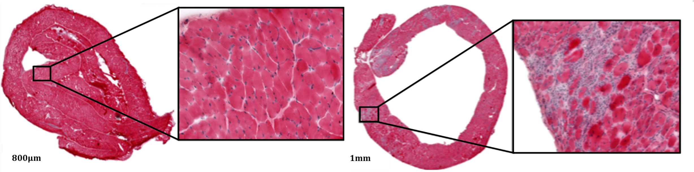{width=70%}

</div>

How much do the cells cluster in inflammatory regions in patients with a particular tumor type? If so, how is the clustering indicative of pathology staging? 

This is answered through the plot below. The plot shows the clustering index for $60$ patients determined through the spatial statistic, the $J$-function, at various regions in their tumor tissue. These values are segregated based on their tumor staging. 

<div style="text-align:center" markdown="1">

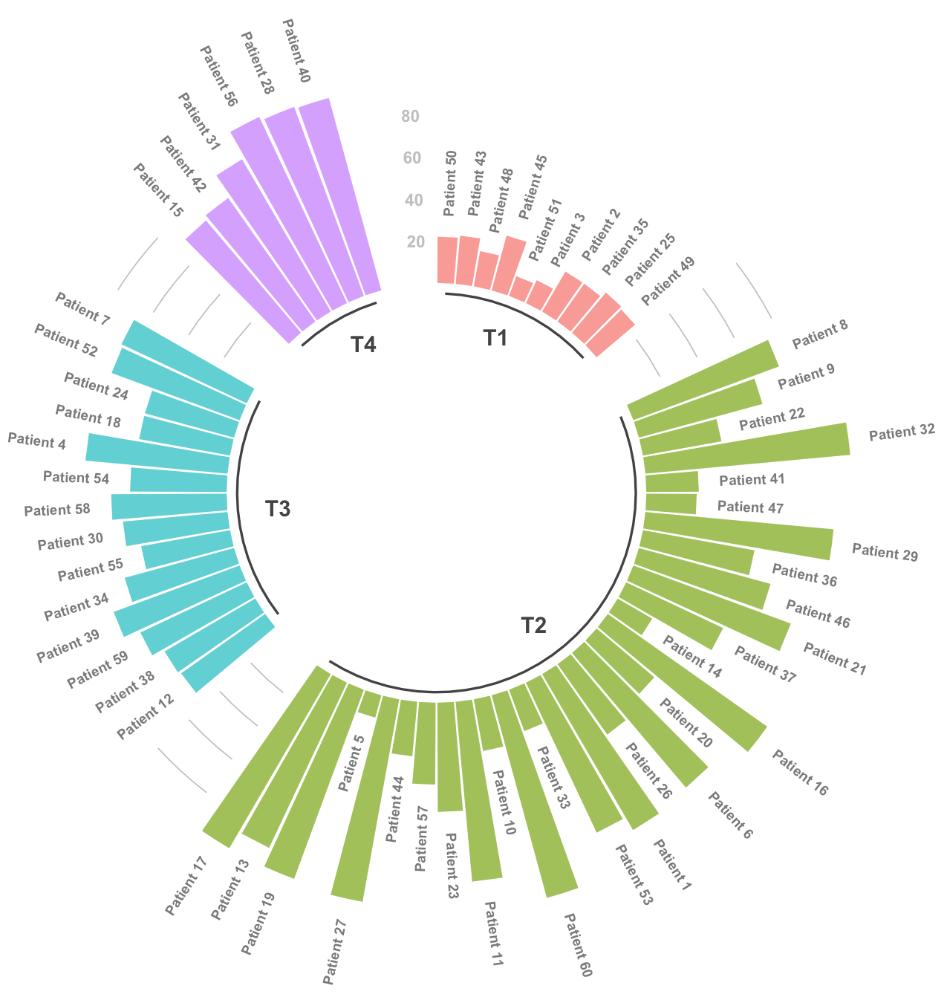{width=80%}
</div>

We can readily observe that patients with tumor stage $1$ have less clustering of their tumor cells compared to third and fourth stage patients. And in fact, fourth stage patients have clustering index between $70$ and $100$ while third stage patients have between $40$ and $70$.

Other important questions to consider -

1. Does a treatment, say, chemotherapy, change the inflammation cell dynamics as determined by the clustering density?

2. For any specific cell type, the tumor cells cluster much higher than normal cells. How much clustering happens in tumors compared to normal cells, for a given cancer type? And how is the clustering density associated with clinical variables and treatment outcomes? 

These questions can be readily answered through spatial point pattern analysis.

---

## H&E, dual staining 

Epithelial to Messenchymal Transition (EMT) is an important phenomena by which epithelial cells lose their cell polarity and adhesion, to gain migratory and invasive properties and become mesenchymal stem cells. The dual H&E staining below shows histological sections of a mouse model with lung adenocarcinoma stained with chromogenic immunohistochemistry with 2 biomarkers: red, TTF-1; and brown, Vimentin, to study epithelial and mesenchymal transition. No cell were positive for both biomarkers by standard microscopy. Digital image analysis was performed to quantify the amount of positive Vimentin cells in relation to epithelial  cells. XY coordinates were extracted for further analysis.


<div style="text-align:center" markdown="1">

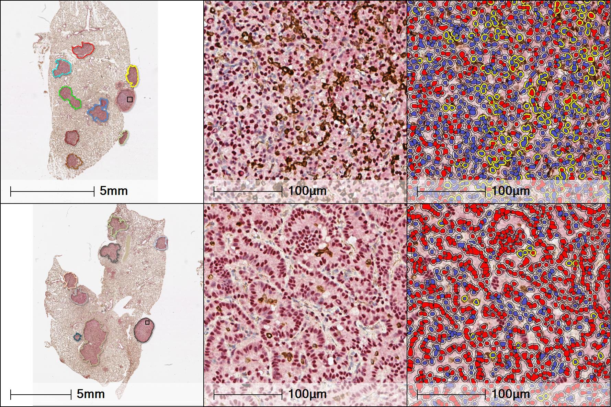{width=100%}

</div>

One of the key questions that can be asked in this type of staining is this - Assuming EMT cells cluster with epithelial and/or messenchymal cells, to what extent they cluster with these subtypes? And if this clustering happens more in central or peripheral regions of the tissue? 

To answer this question, we assume several central and peripheral regions can be stained for these markers.

The chart below shows the correlogram between epithelial, messenchymal and EMT cells in central and peripheral regions of the tumor. The diagonal figures show the density plots of average $J$-function values in epithelial, messenchymal and EMT cells in these regions of the tumor which indicates the degree to which these cells cluster. 

The lower diagonal shows the scatter plot of these values between the subtypes. The upper diagonal presents the correlation of these values, which identifies co-clustering pattern of these subtypes. From this correlogram, we can infer that EMT cells tend to co-cluster with messenchymal cells (0.696) to a large degree than to epithelial cells (0.242). Also, they are more localized to central region (0.722) than to peripheral regions (0.507). Spatial analysis can provide these types of biologically relevant directed insights.

<div style="text-align:center" markdown="1">

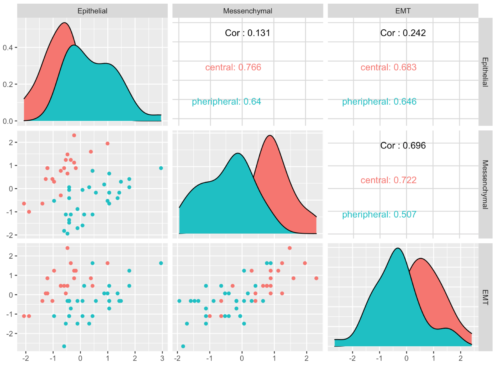{width=100%}

</div>

Needless to say, these types of directed insights can be integrated with clinical information to stratify patients for clinical trials and to perform _in vivo_ experiments in mouse models.

---

## Immunohistochemistry, Tumor

Several studies have revealed elevated CD8 positive T cells in the tumor micro-environment as an indicator of good prognosis in cancers. A recent <a href="https://jitc.biomedcentral.com/articles/10.1186/s40425-019-0797-4" target="_blank"> study </a> has shown the density and spatial tissue distribution of CD8+ immune cells predict response and outcome in melanoma patients who receive MAPK inhibitors. Here is a microphotograph showing a lung adenocarcinoma stained with CD8 by immunohistochemistry  to quantify the amount of CD8+ cells in the whole tumor tissue using Digital image analysis (Halo software, Indica Labs). Results were reported as cell densities (n/mm2). XY coordinates were extracted for further analysis.


<div style="text-align:center" markdown="1">

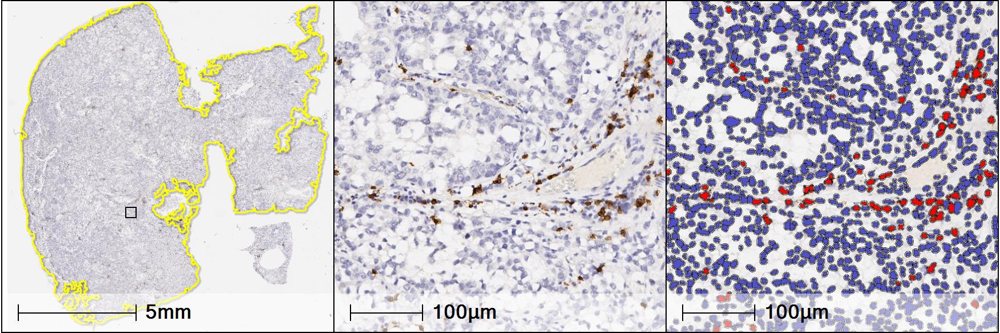{width=100%}

</div>


A pertinent question in this setting would be, how much clustering or dispersion happens in melanoma patients who have been given chemotherapy as opposed to receiving chemotherapy plus radiation?

The following figure shows the cluster index using $J$-function estimate of CD8+ cells in the above tumor for patients who received chemotherapy and those who received both chemotherapy and radiation. As mentioned above, if the $J$-function is identically $1$, that would mean the CD8+ cells are distributed randomly. The farther down from $1$, the more clustered the cells are. Thus, we see those patients who have been given chemotherapy have less clustering of CD8+ cells than those patients who have been given both chemotherapy and radiation.

<div style="text-align:center" markdown="1">

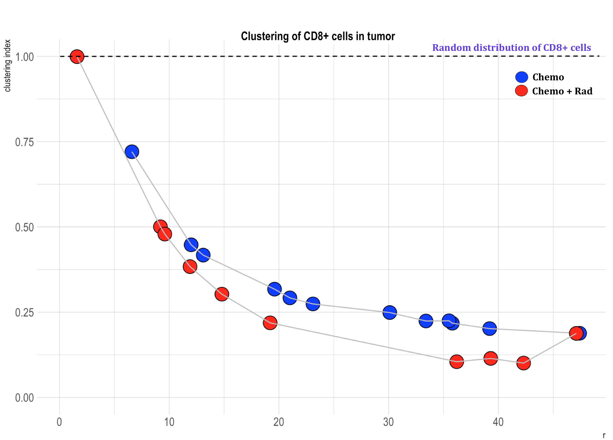{width=100%}

</div>

Note that these types of analysis could be conducted for several clinical variables such as survival, tumor staging, race, etc.

---

## Immunohistochemistry, Tumor+Stroma

Both tumor and stroma can be stained for markers in IHC which can be useful for identifying antibodies specific to these tissue types. The following is a microphotograph showing a lung adenocarcinoma stained with CD8 by immunohistochemistry  to quantify the amount of CD8+ cells in tumor and Stroma using Digital image analysis (Halo software, Indica Labs) . For segmentation, a classifier (Random Forest) was trained to create annotation with Tumor (red) and Stroma (yellow) followed for a QC by a pathologist. Mark-up images show positive cells in red in the area of interest. Results were reported as cell densities (n/mm2). XY coordinates were extracted for further analysis.


<div style="text-align:center" markdown="1">

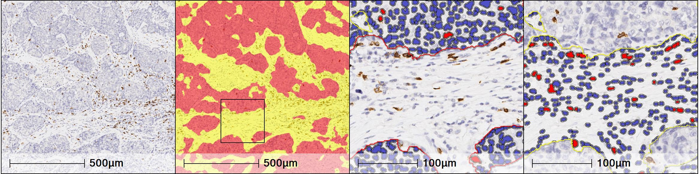{width=100%}

</div>

An immediate question is this - can we quantify the dependence of CD8 cells on tumor and whether this dependence has implications on neoadjuvancy and treatment?

This question is answered by the following plot. The plot shows the dependency between tumor cells and CD8 positive cells for various treatment regimens stratified by neoadjuvant status. We observe that patients who were treated with chemotherapy and have not undergone neoadjuvant therapy have a high dependency between tumor cells and CD8 positive cells. The same is true for patients treated with radiation and hormonal therapy. Such measures of spatial dependence can be evaluated using functions like $J$-cross and $L$-cross.

<div style="text-align:center" markdown="1">

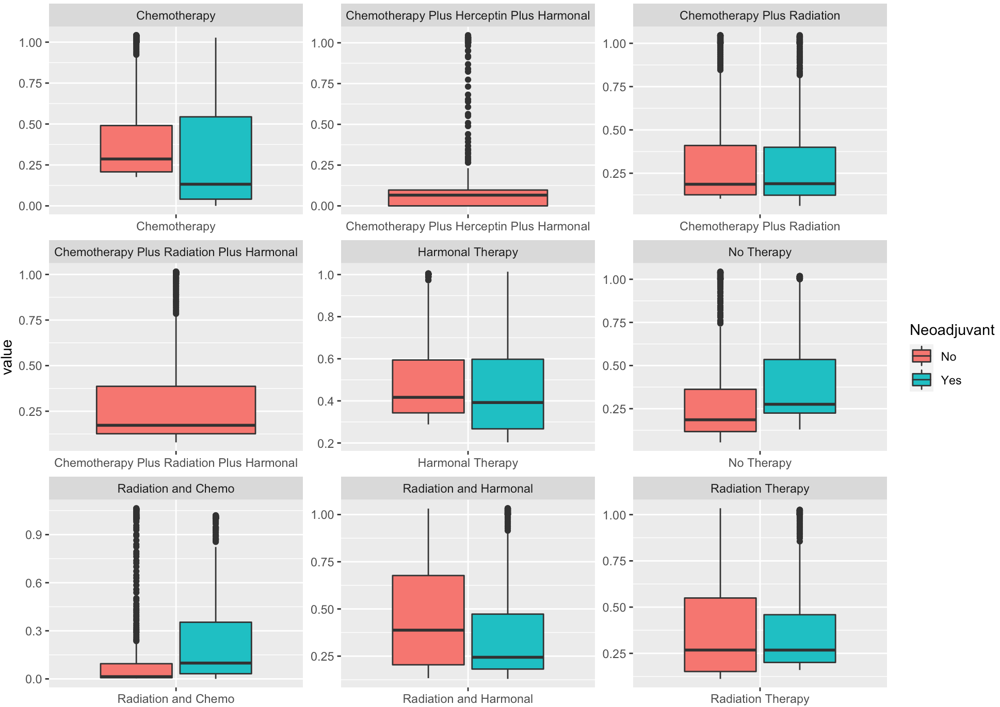{width=100%}

</div>

Similar to the comments mentioned for IHC, tumor-only analysis, also in this case of tumor and stroma analysis, several clinical variables could be correlated with the spatial statistics information to obtain directed insights for clinical trials and follow ups.

---

<h4 style="text-align: center;" markdown="1"> <span style="color:#e80c7a"> The power of spatial statistics </span> </h4>

---

The analyses above in H&E and IHC staining highlight the fact that spatial statistics can provide incredible power even to lo-plex technologies, especially when integrated with clinical information. There is a huge potential in H&E and IHC staining technologies that needs to be leveraged in the setting of translational and digital pathology.

---

## In situ hybridization, RNAscope

Spatial analysis can provide valuable information even if the point objects are not cells, since the points themselves are a representation of cells (and all analysis needs to be corrected for these artifacts and account for cell sizes and other biological variables). An highlight of this would be an in situ hybridization using RNAscope, an image analysis platform by Advanced Cell Diagnostics. We have here, microphotographs of melanoma sections stained with RNAScope for the following probes: SCLC45A (target probe), PPIB (Positive control) and DapB (negative control), showing heterogeneity of RNA expression (red dots indicated by an arrow. Digital image analysis was used for a better assessment of the level of expression.

<div style="text-align:center" markdown="1">

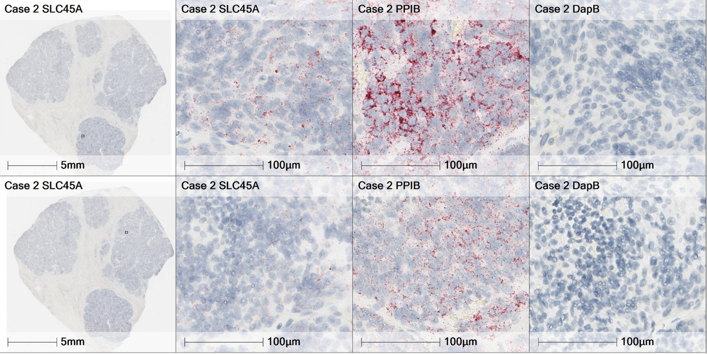{width=100%}

</div>

Although the only probes shown here are these three genes, there could be other proteins/mRNA of interest, such as, say, PD-L1, CD274, PDCD1, LAG3, PD-1 that are expressed [[2]](#references-and-credits) along with SLC45A. We would want to know the spatial dependence of these genes with SLC45A. 

Spatial point pattern analysis will answer this. The figure below shows the dependence of SLC45A on other mRNA of interest and we can use the $J$-cross function to determine this relationship. We observe that SLC45A expression is more dependent on PCDC1 than on the rest of the proteins.

<div style="text-align:center" markdown="1">

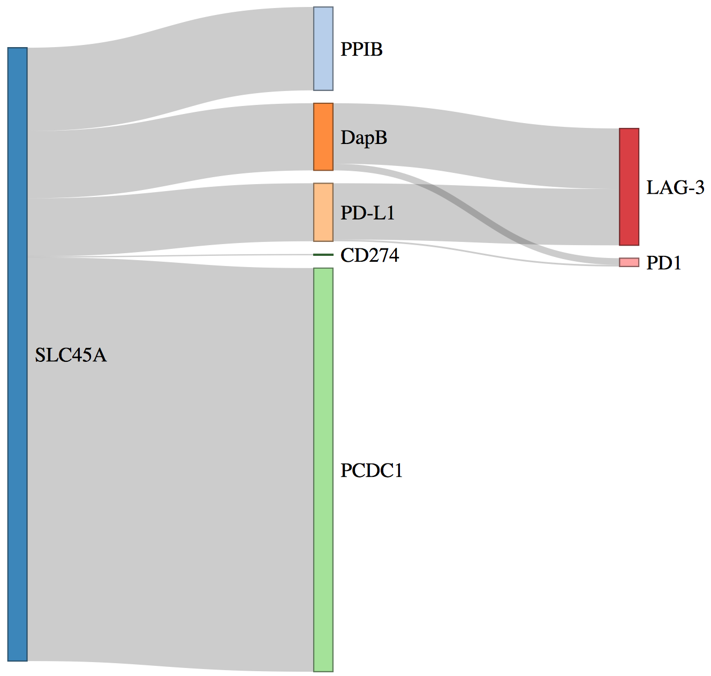{width=70%}

</div>

Integrating these insights with clinical data can provide valuable information for molecular pathology based clinical trials.

---

## Multiplexed immunofluorescence

Multiplexed immunofluorescence (mIF) enables imaging of FFPE tissue and tumor specimens at subcellular resolution for various markers. In the following figure, on the left, we see panels $1$ and $2$, each with the superposition of various immune markers (from the panel) in early stage non-small cell lung carcinoma. On the right, we have the individual cells from panel $2$, processed from a mIF image.

<div style="text-align:center" markdown="1">

{width=100%}

</div>

The processed data in the right would allow us to identify various kinds of immune cells that can be identified through defined markers. For example, T-cell antigen, cytotoxic T-cell antigen, macrophage expressing PD-L1 and carcinoma cells expressing PD-L1 can be identified through panel $1$. Similarly, T regulatory cells, memory T-cells, memory cytotoxic T-cells, effector cytotoxic T-cells and memory or effector cytotoxic T-cells can be found using panel $2$. This is shown in the following figure.

<div style="text-align:center" markdown="1">

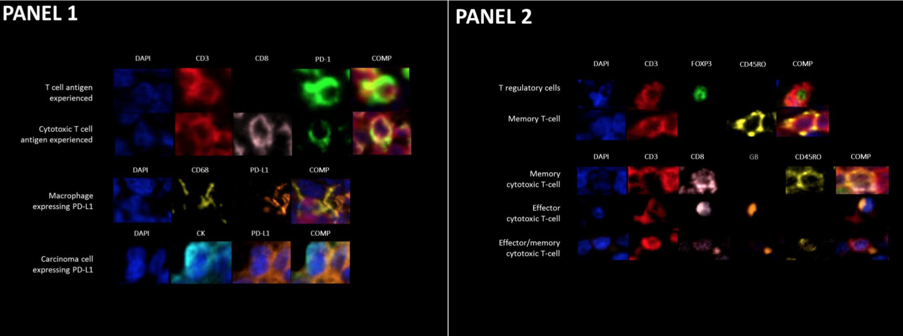{width=100%}

</div>

We would now like to identify the dependencies between the markers that will give an insight on the type of T-cells that are expressed. For example, if CD3 and CD8 cells are dependent on each other then we can expect cytotoxic T-cell antigens to be expressed than just regular T-cell antigens. This is because the markers of cytotoxic T-cell antigens are both CD3 and CD8, whereas T-cell antigens don't express CD8. 

The following plot shows the dependency distribution for markers in panel $2$.

<div style="text-align:center" markdown="1">

{width=70%}

</div>

The mean dependency is estimated through the $K$-cross function and deviations from the value $\pi r^2$ would suggest dependence between the marks. The strong dependency between CD3+CD8+Foxp3+ and CD3+CD45RO+Foxp3+ probably indicate the interactions that happen between memory cytotoxic T-cells, T-regulatory cells and memory T-cells. These directed insights can further be correlated with clinical and treatment variables.

---

## Imaging mass cytometry

The department of translational molecular pathology is currently offering Imaging Mass Cytometry (IMC) platform that can profile up to $37$ markers in a single tissue. As a pilot feasibility study we conducted imaging on breast adenocarcinoma and here is the cell segmentation (left) and spatial point pattern (right) for cytotoxic T-lymphocytes (CTLs), malignant cells, proliferative CTLs and proliferative malignant cells. 

<div style="text-align:center" markdown="1">

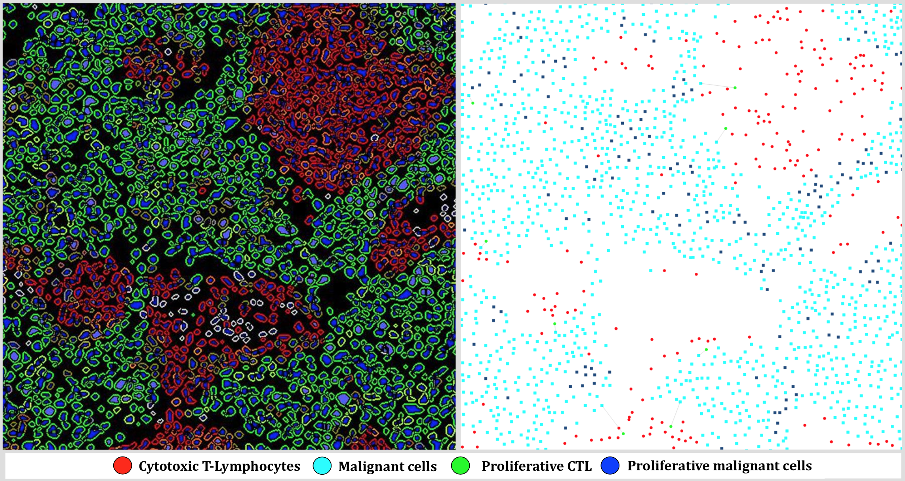{width=100%}

</div>

The plethora of marks in IMC and other hi-plex technologies would allow us to ask several questions that can be answered through spatial statistics. As an example, we can model the inhibition between the phenotypes as Gibbs hardcore process. As previously described, loss of contact inhibition of locomotion is an important mechanism for tumor invasion and metastasis. 

The figure in the left shows how the phenotypes inhibit each other. We can see the inhibition between proliferative malignant cells and malignant cells are much higher than between the rest of the phenotypes. This means that proliferative malignant cells and malignant cells are likely to repel each other which is consistent with homotypic contact inhibition of locomotion.

The figure in the right shows inhibition of several marks as a network along with the density of that particular mark, determined by three levels, high, medium or low. These networks can accurately capture the heterogeneity in the entire region of interest and can very well represent "cells-to-cells" signalling in the literal sense. When these spatial statistics are used with technologies such as CODEX that can image cells at a single cell resolution level, we can accurately model cell-to-cell spatial dynamics.

<div style="text-align:center" markdown="1">

{width=100%}

</div>

---

## Other hi-plex technologies

Several new imaging technologies are emerging at TMP. <a href="https://www.ionpath.com/mibiscope/" target="_blank"> Multiplex Ion Beam Imaging (MIBI) </a> from IONpath is similar to IMC (by Fluidigm) but offers lesser resolution. <a href="https://www.akoyabio.com/codextm/technology" target="_blank"> Co-detection by indexing (CODEX) </a> designed by Akoya systems provide single-cell level resolution and <a href="https://www.nanostring.com/scientific-content/technology-overview/digital-spatial-profiling-technology" target="_blank"> Digital Spatial Profiling (DSP) </a> offered by Nanostring technologies integrate gene expression and/or morphology with spatial imaging data.

A logical progression with these advanced hi-plex technologies will be to estimate relative risk of tumor progression with respect to different markers. This can be accomplished by applying spatial statistical methods. An illustration of relative risk of proliferation between CK+ tumor and other stromal cells for two patients with triple negative breast cancer is shown below. The relative risk function is defined here as the ratio of the CK+ tumor cells density to other stromal cells density. Using kernel density estimation methods to model these densities (Diggle, 1985), we can obtain a workable estimate for the risk of proliferation with respect to a specific mark. 

The more "yellow" the color is, higher is the rate of proliferation or relative risk of tumor growth.   

<div style="text-align:center" markdown="1">

{width=100%}

</div>

Several questions can be asked and answered that are clinically meaningful. Here are a few examples.

1. What are the rates of proliferation for other known phenotypes (like CD68+PDL1+) with respect to the rest of the cell types, or with respect to each other. In other words, how does the risk matrix looks like?

2. Are there a specific group of patients who exhibit higher proliferation of a marker than others?

3. How does the proliferation relate to pathology stages and grades?

4. Do people with higher proliferation of a phenotype survive shorter (overall and progression free) than people with lower proliferation?

5. How does risk relate to phenotype interactions?

And as a bonus, all the analysis and clinical data integration that we have done so far could be readily applied to any of these hi-plex technologies!

---

## Predictive analytics

Spatial statistics can be extremely useful for further downstream predictive analytics. The following plot shows the analysis obtained by applying $k$-means algorithm on the spatial data processed from $145$ surgically resected triple negative breast cancer specimens. 

<div style="text-align:center" markdown="1">

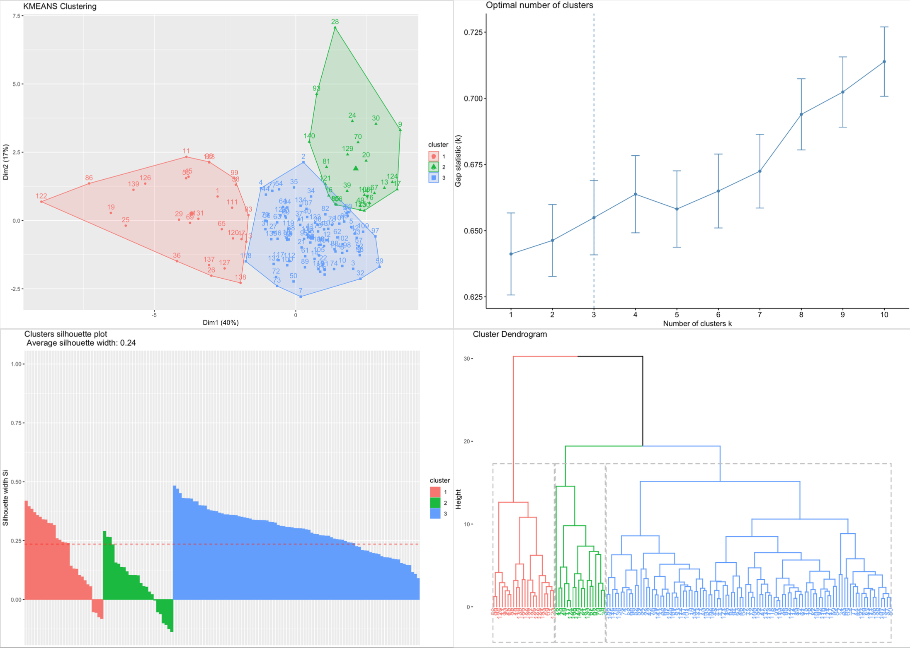{width=100%}

</div>

The $k$-means identified three groups of patients (top left) which is consistent with the optimal number of clusters (top right) as well as other algorithms such as hierarchical clustering (bottom right), and silhouette method (bottom left) that can detect clusters. One of the patient groups was associated with high survival and low tumor $N$-staging (data not shown).

---

## The science of spatial statistics

Coming soon -

---

## References and credits

1. Janis M. Taube, Geoffrey D. Young, Tracee L. McMiller, Shuming Chen, January T. Salas, Theresa S. Pritchard, Haiying Xu, Alan K. Meeker, Jinshui Fan, Chris Cheadle, Alan E. Berger, Drew M. Pardoll and Suzanne L. Topalian. Differential Expression of Immune-Regulatory Genes Associated with PD-L1 Display in Melanoma: Implications for PD-1 Pathway Blockade. _Clin. Cancer Res._ 21(17); 3969-76. [[Link to the article]](https://clincancerres.aacrjournals.org/content/21/17/3969)

2. We acknowledge and thank the following faculty and members for providing the images and the data:

  * Dr. Solis Soto, Luisa Maren, for providing the H&E single & dual staining, IHC Tumor, IHC Tumor & Stroma and ISH RNAscope images and the processed data.
  
  * Dr. Yang, Fei for providing mIF triple negative breast cancer images and data.

  * Dr. Francisco Cruz, Alejandro for providing mIF, IMC images and data.
  
  * Dr. Sanchez Espiridion, Beatriz, for helping with logistics
  
  * Dr. Parra Cuentas,Edwin Roger

  * Dr. Wistuba, Ignacio, for initiating this project.

  * TMP-IL team and TMP for their support.
  
---