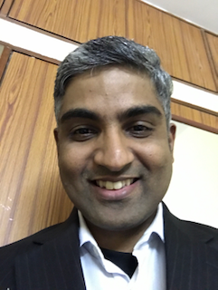

```{r setup, include=FALSE}
knitr::opts_chunk$set(echo = TRUE)
```

<style>
body {
text-align: justify}
figure figcaption {
    text-align: center;}
</style>

---

<center>

{width=70%}
</center>


---

<center> <h3> {width=20px} Click [here](https://goo.gl/forms/7PmMHrOdSIYhAJOz1) to register {width=20px}</h3> </center>

---

A 5-day intensive and immersive data science workshop. You will get trained in the fundamentals well as in advanced topics of data science using the R programming language. The workshop is designed to demystify data science and to empower participants to perform data analytics. No prior programming experience is necessary. At the end of this workshop you will know data importing, data representation, data wrangling, data visualization, data modeling, and will have ideas on taking your analytics skills to next levels, i.e., machine learning.

<center> {width=20px}{width=20px}{width=20px} </center>

* Day 1
    + Data science introduction 
    + Art and science of data visualization 
    + Problem solving case study 
    + R fundamentals and R Markdown

* Day 2
    + Data wrangling and exploration 
    + Tidyverse and pipelined programming 
    + Functional programming 
    + Case studies 
    
* Day 3
    + Grammar of graphics 
    + Data tidying 
    + Handling missing data 
    + Data visualization - do's and don'ts 


    
* Day 4
    + Data grouping 
    + Statistics and raw data 
    + Basics of data modeling 
    + Case studies
    
* Day 5
    + Advanced modeling 
    + Machine learning - an introduction 
    + Next setps in analytics 

<center> {width=20px}{width=20px}{width=20px} </center>

#### Instructors

---

<figure style="float:left;">
  
</figure>

Dr. Kasthuri Kannan, PhD, is an Assistant Professor at New York University (NYU). He has more than 10 years of experience in data science and analytics. He started his data science career in 2006 in a company where he contributed to data mining projects and obtained directed insights in aircraft movement operations at the Tinker Air Force base. He proposed efficient strategies for aircraft logistics through analysis of aircraft movement data using machine learning algorithms. He is trained in mathematics and computer science with postdoctoral training at Memorial Sloan-Kettering Cancer Center (one of the top cancer research institutes in the world), where his data science skills were extensively applied to genomics resulting in top-notch publications. He is actively advising and collaborating with several scientists and physician-scientists, translating data science findings to clinical care, and is passionate about teaching and science communication. Currently, he is directing and teaching a course in data science and biomedical informatics at NYU, a required course for a masters degree. His data science page can be can be accessed at: https://kannan-kasthuri.github.io/Informatics/lectures.html

Dr. Kannan's webpage: https://kannan-kasthuri.github.io

---


<figure style="float:right;">
  
</figure>

Dr. Anand Lakshmanan, is the Founder and CEO of Bangalore based SIRPI (http://www.sirpi.co.in) which provides training, consulting, and outsourcing in areas of data science and engineering research. He has helped academic institutions and corporates deep dive into their data and make better decisions. He has designed experiments and analyzed data in areas across domains including hardware-software interfacing, electrophysiology, computational neuroscience, microstrip antenna research, mobile phone antenna design, streamlining factory processes, and quality control in hardware testing. Most recently he worked at Apple in Cupertino, California as an Antenna Design Engineer. He has published or co-published several papers and holds 7 patents. He believes that all scientists and professionals need to be data-savvy to make decisions and persuade actions. To enable that, he travels across India and around the world giving talks on data science and R programming. He has 17+ years experience across academia and industry.

---

#### Information

---

* Venue
    + WeWork, EGL Tech Park, Bangalore
* Dates
    + Jan 8 - 12 : (9 am to 5 pm)
* Lunch & Refreshments
    + Included
* Fees 
    + INR 15,000 (early bird, dec 15)
    + INR 17,000 (after dec 15)
    + Payment Link : Please contact the below WhatsApp number.
* Registration Link
    + https://goo.gl/forms/7PmMHrOdSIYhAJOz1
* Questions ?
    + WhatsApp (A) : +91 831 076 4903
    + kasthuri at gmail dot com
      
---

