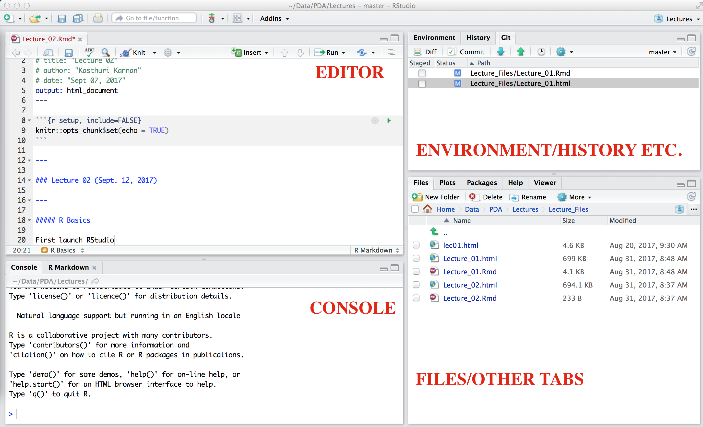

---
output:
  revealjs::revealjs_presentation: null
  pandoc_args:
  - --slide-level
  - '2'
---

### R fundamentals 01: Elementary data types 

---

<style type="text/css">
p { text-align: left; }
</style>

<style>
    .reveal .slides {
        text-align: left;
    }
    .reveal .slides section>* {
        margin-left: 0;
        margin-right: 0;
    }
    
    .reveal .slide-number {
    font-size: 24pt;
    color: #ffffff;
</style>

#### R Basics I

Launch RStudio. By default the panes should look something like this -

---



---

Note that you can [customize](https://support.rstudio.com/hc/en-us/articles/200549016-Customizing-RStudio) all of them. Initially we will be primarily working with the console before moving to the editor.

---

#### Assignments 

Assignments are of the form:

```{r eval=FALSE} 
  Object <- Object_Value
```

which can be construed to express "object gets the object's value".

For instance,

```{r eval=TRUE}
  x <- 5+13
  x
```

will reveal _object x gets the value 18_. The double hash `##` is the result as it should appear in your console.

## 

We will be using lots of assignments.

<br>

 While `=` sign will equally work for assignments, it is best to use `<-` as this will avoid lots of confusion later on. 

<br>

If you are lazy to use `<-` note that RStudio provides lots of shortcut options. 

<br>

For instance, the assignment operator `<-` has shortcut `Option+-` in Mac and `Alt+-` in windows. For a comprehensive list of shortcuts, refer to the list [here](https://support.rstudio.com/hc/en-us/articles/200711853-Keyboard-Shortcuts). 

##

Moreover, `Option+Shift+k` (in Mac) in RStudio will bring keyboard shortcut reference card. 

<br>

**Tip**: Note that RStudio automatically surrounds assignment operator with spaces. It is a good coding practice to allow spaces to enhance readability.

<br>

_Caveat_: Objects cannot start with certain charecters (such as comma, space), or start with numbers. [Snake case](https://en.wikipedia.org/wiki/Snake_case) and [Camel case](https://en.wikipedia.org/wiki/Camel_case) are a good practices for naming conventions.

##

##### Be careful of what you type

Whatever convention you prefer, maintain consistency. 

<br>

Consistancy and accuracy are critical when dealing with computers and programming. Whenever you run into errors the first thing you check are the typos. 

<br>

Case matters, typos matter. In my experience, I have found almost all the errors made by beginners are attributed to typographical errors. There is no other way than getting better at typing and checking/re-checking.

##

You can assign strings to objects using qutation marks. For example, the following code assigns the string "R rocks" to object _r_.

```{r eval=TRUE}
  r <- "R rocks"
  r
```

<br>
<span style="color:blue">**Classwork/Homework**</span>: Assign the string _hello world_ to object _h_ and print the result.
<br>

---

##

#### Rscripts

Whatever we do in the console can be saved as an RScript in the editor and run in RStudio. To do this choose:

_File_ -> _New File_ -> _RScript_, type the scripts, save it and click _Run_ in the editor.

<br>
<span style="color:blue">**Classwork/Homework**</span>: Do the above classwork as an RScript and run.
<br>

---

##

#### Data permanency and removing objects

During an R session, objects are created and stored by name. The R command:

```{r eval=TRUE}
  objects()
```

will display the objects that are currently stored in the session. 

<br>

The list of all such objects constitute the _workspace_ of R. 

##

For removing objects, the function `rm` can be handy. For example,

```{r eval=TRUE}
  rm(r)
  objects()
```

will remove the object `r` created above. 

<br>

To remove multiple objects, we just list them with a comma delimiter, like, `rm(r,x)`.

---

##

#### Functions

R has a wide-range of built-in functions that are generally of the form:

```{r eval=FALSE}
  functionName(arg1 = val1, arg2 = val2, and so on)
```

**Note**: Not all functions will have arguments. For instance, the function `date()` that prints the current date and time does not have any argument.

```{r eval=TRUE}
  date()
```

##

One of the extremely helpful feature of RStudio is the `?` operator. 

<br>

You can use this to find out the description of the function in question, including its usage and arguments. 

<br>

<span style="color:blue"> _Question the function to know more about the function in question_. </span> For instance,

```{r eval=FALSE}
  ?date()
```

would describe the function `date()` in the help tab of the IDE.

##

**Tip**: If you type `da` in console and hit TAB, RStudio will try to autocomplete the function for you, suggesting hints on what possibly could be the built-in function. Also, if you type an open paranthesis, RStudio will also supply the closed parathesis.

<br>

Note that if you type the function name without any paranthesis, R will print the source code of the function, which is not you may probably want.

<br>
<span style="color:blue">**Classwork/Homework**</span>: Consider the `seq` function. What does it do?
<br>

##

Observe that:

```{r eval=TRUE}
  seq(from=1,to=10)
```

is same as,

```{r eval=TRUE}
  seq(1,10)
```

<br>

This demonstrates how function arguments are resolved in R. 

<br>

We can always specify `from/to = value`. 

##

But if we do not, R attempts to resolve by position. So in the above code, it is assumed that we want a sequence `from = 1` that goes `to = 10`. 

<br>

Although R can try to resolve arguments on its own, best practice is to specify it.

---

#### Simple manipulations: Vector arithmetic

The function `c()` combines values into a vector or a list. 

<br>

To set up a vector named `x`, say, consisting of eight numbers, namely, 12, 20.1, 53.6, 2, 7.43, 24, 8.2, and 6, the assign statement:

```{r eval=TRUE}
  x <- c(12, 20.1, 53.6, 2, 7.43, 24, 8.2, 6)
```

will assign the vector to the object `x`. 

##

We can form mathematical expressions using `x` like any other variable. 

For example,  

```{r eval=TRUE}
  sin(x)
  sqrt(x)
```

will list the _sine_ and square root of each number in the vector `x`. 

##

We can also combine vector with itself:

```{r eval=TRUE}
  c(x,x)
```

or include some numbers in-between `c(x,0,x)`.

One of the greatest advantages in R (as opposed to say, Matlab) is that we can combine vectors of different length. For example, the following code:

```{r eval=TRUE, warning=FALSE}
   y <- c(x,0,x)
   v <- 2*x + y  + 1
   v
```

## 

is equivalent to the following addition:

```{r eval=FALSE}

 y : 12 20.1  53.6 2  7.43 24  8.2  6  0 12    20.1 53.6  2     7.43 24    8.2  6
 2x: 24 40.2 107.2 4 14.86 48 16.4 12 24 40.2 107.2  4   14.86 48    16.4 12   24
 1 :  1  1     1   1  1     1  1    1  1  1     1    1    1     1     1    1    1
-----------------------------------------------------------------------------------
sum: 37 61.3 161.8 7 23.29 73 25.6 19 25 53.2 128.3 58.6 17.86 56.43 41.4 21.2 31
-----------------------------------------------------------------------------------
```

so the expression `2*x` is scaled to the length of the longest vector (here `y`). This is called _recycling_.

<br>

Several functions work as usual, like, `mean(), max(), min(), sort()` etc. 

##

Also, as such, square root of a negative number, like `sqrt(-19)` will retrun `NaN` and a warning, but `sqrt(-19+0i)` will work.

## 

##### Logical vectors

R allows manipulation of logical quantities. Logical quantities can consist of `TRUE`, `FALSE` or `NA`. Logical vectors are generated by conditions. This assignment:

```{r eval=FALSE, warning=FALSE}
  logical_vector <- x > 13
```

generates logical vector corresponding to the elements of `x` that are greater than or less than 13.

##

##### Naming vectors

```{r eval=TRUE, warning=FALSE}
  # Create a numeric vector
  v <- c(2,15,5,7)
  # Create a naming vector
  n <- c("two","fifteen","five","seven")
  # Assign the names to the vector
  names(v) <- n
  v
```

Alternatively, one can name the vectors as follows:

```{r eval=TRUE, warning=FALSE}
  v <- c(two=2,fifteen=15,five=5,seven=7)
  v
```

##

<br>
<span style="color:blue">**Classwork/Homework**</span>: 

1. What happens if you type `names(n) <- v`? 
2. What if the length of either vectors (names or values) are not the same? 
3. What happens if you label two numbers with the same name?
<br>

##

##### Subsetting vectors

```{r eval=TRUE, warning=FALSE}
  # Subsetting by index
   v[c(1,2)]
  # Subsetting by name
  v[c("two","seven")]
  # Subset all but some
  v[-c(1,2)]
  # Subset using logicals
  v[c(FALSE,TRUE,TRUE,FALSE)]
```

## 

<br>
<span style="color:blue">**Classwork/Homework**</span>: 

1. What happens if you swap the index? 
2. What happens if you subset by the name not present, like `v[c("two","three")]`? 
3. Does the "subseting some"" operation work with names? 
4. What happens if the logical vector has less elements than the orginal vector `v` (remember _recyling_)?
<br>

##

##### Missing values 

The function `is.na(x)` gives a logical vector of the same size as `x` with value `TRUE` if and only if the corresponding element in x is NA. The function `is.na()` also returns the value `TRUE` for `NaN`. To differentiate these, R also provides a function `is.nan()` that returns `TRUE` only for `NaN`.

##

<br>
<span style="color:blue">**Classwork/Homework**</span>: 

1. Make a vector of length $5$ with `NA` in them and test for missing values using the `is.na()` function. 
2. Extend this to a vector of length $5000$.
<br>

##

##### Character vectors

Character strings are entered using either matching double `(")` or single `(’)` quotes, but are printed using double quotes (or sometimes without quotes). 

<br>

The `paste()` function takes an arbitrary number of arguments and concatenates them one by one into character strings. 

```{r eval=TRUE, warning=FALSE}
  paste(c("X","Y"), "ab,b")
```

##

Note that by default the arguments are by default separated in the result by a single blank character, but this can be changed by the named argument, `sep=string`, which changes it to string, possibly empty. Thus,

```{r eval=TRUE, warning=FALSE}
  paste(c("X","Y"), "ab,b", sep="")
```

will render the arguments together.

##

<br>
<span style="color:blue">**Classwork/Homework**</span>: Play with the `sep` argument to include other type of delimiters (like comma etc.)
<br>

---

##

#### Basic objects and data types

Vectors are the most important type of objects in R, but there are several other objects that we will encounter frequently.

##### Objects

Here is a list of other important objects. 

* _matrices_ or more generally arrays are multi-dimensional generalizations of vectors. In fact, they are vectors that can be indexed by two or more indices and will be printed in special
ways.

* _factors_ provide compact ways to handle categorical data.

##

* _lists_ are a general form of vector in which the various elements need not be of the same type, and are often themselves vectors or lists. Lists provide a convenient way to return the
results of a statistical computation.

* _data frames_ are matrix-like structures, in which the columns can be of different types. One can think of data frames as ‘data matrices’ with one row per observational unit but with (possibly) both numerical and categorical variables. Many experiments are best described by data frames: the treatments are categorical but the response is numeric.

* _functions_ are themselves objects in R which can be stored in the project’s workspace. This provides a simple and convenient way to extend R. 

##

##### Data types and coercion

The function `class()` can be used to reveal the data type. Basic data types are:

* Logical: `TRUE`, `FALSE` or `NA`

* Numeric: 2.5, 17 etc.

* Integer: Integer numeric appending the letter `L` to it: 12L, 17L, -2L etc.

* Character: "R data types rock, etc."

* Other atomic datatypes: `double`, `complex` and `raw`.

##

```{r eval=TRUE, warning=FALSE}
  # Reveal the class of the logical "TRUE"
  class(TRUE)  
  # Reveal the class of the number 2.5
  class(2.5) 
  # Reveal the class of the number 2
  class(2)  
```

##

```{r eval=TRUE, warning=FALSE}
  # Reveal the class of the integer 2L
  class(2L)
  # Reveal the class of the character "R data types rock, etc."
  class("R data types rock, etc.")
```

<br>

**Note 1**: By default an integer has a datatype as numeric as illustrated by `class(2)`

**Note 2**: One can also use <code>is.<i>datatype(y)</i></code> to reveal the underlying datatype of the variable `y`. For example, `is.logical(x)` will return `TRUE` if `x` is a logical variable. Otherwise, it will return `FALSE`.

##

One can _force_ a data type to another through what is known as _coercion_. 

<br>

The function <code>as.<i>datatype(y)</i></code> will coerce the datatype of `y` into the specified datatype.

```{r eval=TRUE, warning=FALSE}
  # Coerce "TRUE" into integer
  as.integer(TRUE)
  # Coerce "FALSE" into integer
  as.integer(FALSE)
  # Coerce 2.5 as a character
  as.character(2.5)
  # Coerce 2 as a numeric
  as.numeric("2")
  # Coerce the character "4.5" as an integer
  as.integer("4.5") 
```

**Note**: There is an information loss when coercing non-integer values to integer values as revealed by the last example. Also, coercion is not always possible. For instance, coercing a charecter "hello" into numeric/integer will result in warning and `NA`.

```{r eval=TRUE, warning=TRUE}
  as.numeric("hello")
```

---

#### Matrices

A matrix is a rectangular array of rows and columns.

##### Creating a matrix

```{r eval=TRUE, warning=FALSE}
  # Create a matrix specifying the number of rows
  matrix(1:6, nrow=2)
  # Create a matrix specifying the number of columns
  matrix(1:6, ncol=2)
```

##

```{r eval=TRUE, warning=FALSE}
  # Create a matrix specifying the number of rows &
  # distributing the numbers through rows first
  matrix(1:6, nrow=2, byrow=TRUE)
  # Create a matrix specifying both rows and columns
  matrix(1:6, nrow=2, ncol=3)
```

## 

We can paste rows or columns using the functions `cbind()` (for coumumn binding) and `rbind() (for row binding) - really **important** - you will see them in lots of applications.

```{r eval=TRUE, warning=FALSE}
  # Combine as columns
  cbind(1:3,1:3)
  # Combine as rows
  rbind(1:3,1:3)
```

## 

Naming a matrix can be done using `rownames()` and `colnames()` functions, just like we used the `names()` function for the vectors. Matrices can be combined using `cbind()` and `rbind()` functions.

##

<br>
<span style="color:blue">**Classwork/Homework**</span>: 

1. What happens if the number of rows/coumns are more than the generated numbers when using the function `matrix()`?
2. What happens in `cbind()` (and `rbind()`) if one of the columns (and rows) have more numbers than the other?
3. Combine two matrices using `cbind()`.
4. Can you "bind" two matrices of different data types? What happens when you do that?
<br>

##

##### Subsetting a matrix

```{r eval=TRUE, warning=FALSE}
  # Create a matrix
  M <- matrix(1:9,nrow=3)
  # Subsetting through indices
  # Print the element in row 2 and column 3
  M[2,3]
  # Print all the elements in column 2
  M[,2]
  # Print all the elements in row 3
  M[3,]

```

##

We can also subset multiple elements - to do this we use the combine function, `c()` along with index notation. 

Thus, `M[2,c(2,3)]` will fetch all the elements in $2$nd row and in columns $2$ and $3$. 

Subseting also works through column names and row names and could be combined with indices. Further, subsetting works on logicals the same way it works for vectors.

##

<br>
<span style="color:blue">**Classwork/Homework**</span>:

1. What will `M[5]` print? Specify the rationale behind this.
2. What does this subset print, `M[c(2,3),c(1,2)]`? 
<br>

##

##### Matrix arithmetic

`rowSums()` and `colSums()` function provide the sums of rows and columns. 

Basic arithmetic operations involving matrix and scalar hold just like for vectors. 

For example, dividing a matrix by a number will divide each element by that number. 

##

How about matrix and vector operations? Recycling:

```{r eval=TRUE, warning=FALSE}
  # Create a matrix
  M <- matrix(1:9,nrow=3)
  # Make a vector 
  v <- c(10,20,25)
  # Matirx minus the vector
  M-v
```

##

**Note 1**: The result is same as `M - matrix(v, nrow=3, ncol=3)`. 

Although recycling provides a convinient way to manipulate matrix-vector operations, it is important to use such expression with caution. 

Whenever possible, try to convert the vector into matrix and work with matrices.

**Note 2**: Matrix multiplication is element-wise, unlike standard way of multiplying matrices (as in linear algebra). Matrices and vectors are very similar. The principle of coercion and recycling works almost the same.

##

<br>
<span style="color:blue">**Classwork/Homework**</span>: What happens if you subtract/add/multiply two matrices of different size?
<br>

---

#### Selected materials and references

[An Introduction to R](https://cran.r-project.org/doc/manuals/R-intro.pdf)