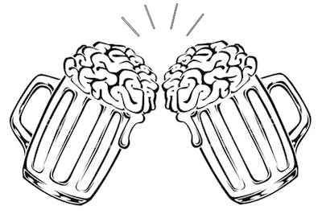

```{r setup, include=FALSE}
knitr::opts_chunk$set(echo = TRUE)
```

<style>
body {
text-align: justify}
figure figcaption {
    text-align: center;}
</style>

---

<div style="text-align:center" markdown="1">


</div>

---

<center> <h3>Beer With A Scientist Sundays (Dec. 03) </h3> </center>

---

#### Discussion topic

---

To be decided

---

#### About the scientist

---

To be announced

---

#### References

---