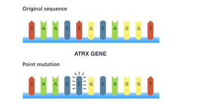

```{r setup, include=FALSE}
knitr::opts_chunk$set(echo = TRUE)
```

<style>

body {
text-align: justify;}

figure figcaption {
    text-align: center;}
</style>


---

### Research 

---

If you are quickly looking for my publication record - please click [here](https://kannan-kasthuri.github.io/Publications/publications.html). 

Research excites me as much as teaching. I have diverse academic interests - cancer biology, formal logic, physical theories, computing and mathematics. My contributions in science can be broadly classified in the areas of genomics and numerical algorithms (with applications to computational physics).

---

#### Genomics

---

<!--  -->

<figure style="float:left;">
  
  <figcaption> Nearly 70% of astrocytoma patients have mutations in ATRX </figcaption>
</figure>


As a genomics scientist, my work focuses on developing and implementing bioinformatics algorithms as well as analyzing and interpreting biological data sets facilitating researcher’s experiments and hypothesis. I have extensive research experience analyzing and interpreting data from genomics/epigenetics experiments and have made vital contributions to several studies, especially in cancer genomics. One of my landmark discoveries, after I joined NYU is in pediatric brain cancer known as Pineoblastoma. I discovered significant number of copy number variations in a gene called PDE4DIP that holds an ancestral protein domain DUF1220 which is responsible for brain growth and function. 

Another study of mine reveals key signaling pathways and genes responsible for Sudden Unexpected Death in Epilepsy (also known as SUDEP). Currently as an investigator at Genome Technology Center (GTC) in NYU, my research experience has widened to encompass cancer epigenetics and I have developed algorithms to analyze ATAC-seq and ChIP-seq data. These pipelines are being extensively applied in several studies as I continue to collaborate with physician-scientists interpreting the results of the analysis.

<figure style="float:right;">
  
  <figcaption> Subgroups in astrocytoma </figcaption>
</figure>

My tenure at Memorial Sloan-Kettering Cancer Center (between 2011-2013), shaped me to perform critical roles in several genomics studies. My expertise in cancer genomics has been primarily focused on brain tumors. One of my contributions (published in _Oncotarget_) in low-grade brain cancer called astrocytoma, identifies mutations in a gene called ATRX in 70% of the patients. This gene plays a critical role in lengthening of telomere, an important mechanism for tumor growth. In another study I helped in identifying three distinct gene expression groups of patients who contract astrocytoma, two of which harbors mutations in the gene called _Isocitrate dehydrogenase 1_ (_IDH1_), which is responsible for glucose metabolism . 


Also, I was instrumental in identifying two melanoma patient subgroups who were treated with immunotherapy and this finding was published in _New England Journal of Medicine_. Further, my work on Adenoid Cystic Carcinoma in _Nature Genetics_ identifies clinically significant mutations and pathways through robust mutation calling and pathway analysis algorithms.

Further, I have developed a keen interest on tumor evolution and population genetics. My recent publication in _Letters in Biomathematics_, establishes a formula for inferring selection in tumors by making use of an advanced mathematical result called the _Inverse Function Theorem_. 

---

#### Numerical algorithms

---

I started with mathematics, moved into computer science, writing a dissertation in multipole algorithms. [Fast Multipole Method](https://en.wikipedia.org/wiki/Fast_multipole_method) is one of the top 10 algorithms of the 20th century introduced by [Prof. Greengard](https://en.wikipedia.org/wiki/Leslie_Greengard) of the Courant institute at NYU. My work focused on generalizing the algorithm for higher order potentials/forces and when the particles are in motion. This has applications in molecular dynamics simulations.

---

1. **Kasthuri Kannan**, Hemant Mahawar and Vivek Sarin, A Multipole Based Treecode using Spherical Harmonics for the Potentials of the Form $r^{-\lambda}$. _Lecture Notes in Computer Science_. 3514, pp. 107-114, May 2005.

    _Description_: Spherical harmonics are eigenfunctions of the Laplace-Beltrami operator in spherical coordinates. And hence they serve as orthogonal basis functions, which can be used to represent Coulomb-like potentials. We make use of this property to efficiently compute these potentials using ultraspherical (Gegenbauer) polynomials.

2. **Kasthuri Kannan** and Vivek Sarin, A Treecode for Accurate Force Calculations. _Lecture Notes in Computer Science_. 3991, pp. 92-99, May 2006.

    _Description_: Computing the forces in N-body simulations is of the order $O(N^2)$. Treecodes present a fast approximation to such computations. However, accuracy in such computations are limited when using cartesian tensors. Spherical tensors provide greater accuracy for these simulations.

3. **Kasthuri Kannan** and Vivek Sarin, A Treecode for Potentials of the Form $r^{-\lambda}$, _International Journal of Computer Mathematics_. 84, 1249-1260, Jan. 2007.

    _Description_: This work presents a fast algorithm to compute potentials of the form $r^{-\lambda}$ that are used in molecular dynamics simulations. This is the exension of the first work above, where I describe the complete algorithm along with complexity analysis.

---
