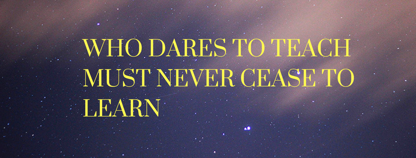

```{r setup, include=FALSE}
knitr::opts_chunk$set(echo = TRUE)
```

<style>
body {
text-align: justify}
figure figcaption {
    text-align: center;}
</style>

---

<center>

{width=70%}

</center>

---

I have beeen quite happy to teach while actively being engaged in research, working on genomics. I feel teaching should be a critical component of any active researcher. There are several ways to transmit the knowledge we have acquired - writing research articles addressed to enlightned science community, writing review articles in journals, maintaining a blog etc. But teaching facilitates direct human-human interaction, which by its very design conveys lot more information compared to other mediums. In any case, what is the fun when we acquire knowledge but don't transmit enthusiastically to students? 

Several researchers and scientists I have encountered (especially in research institutions) find teaching cumbersome. Part of the problem is how the academic system is structured. NIH doesn't award grants based on teaching records. We have very limited time and teaching requires considrable effort at least in the initial stages. Let's not go into all those issues and if you want to disuss these things, please feel to write to me and we can meet and chat over a coffee.

I am a director of three informatics courses. To know the content, click on the pages and follow the links. Happy reading!

---

#### Fall 2017

---

[Programming for Data Analysis](https://kannan-kasthuri.github.io/pda.html)

This course is designed to empower students to learn the R programming language to conduct data science in biomedical informatics. It covers a wide range of topics, including, handing and querying databases, exploratory/confirmatory analysis and visualization in R, based on the book R for Data Science. An highlight of this course is that all most all examples are constructed using medical and population health data sets than the ones used in the text. 

[Methods in Quantitative Biology](https://kannan-kasthuri.github.io/qmb.html)

This course provides an overview of foundational knowledge and essential methods relevant for all areas of biomedical informatics. It includes recurring themes and application domains most frequently used in the field. The course is technical and rigorous, and covers a number of computer science and mathematics topics. The course content has been selected by the curriculum committee, and the topics change over time. The majority of the coursework are programming assignments and readings.

---

#### Spring 2018

---

[Machine Learning](https://kannan-kasthuri.github.io/machine_learning.html)

Data science is incomplete without machine learning. This course is designed in such a way that the student will learn, understand and work on the most commonly used machine learning methods. The lectures encompass a wide-variety of topics, including ensemble schemes, support vector machines etc. Several topics have lab sessions/tutorials where students learn how these methods are applied and used in R programming language.

---
