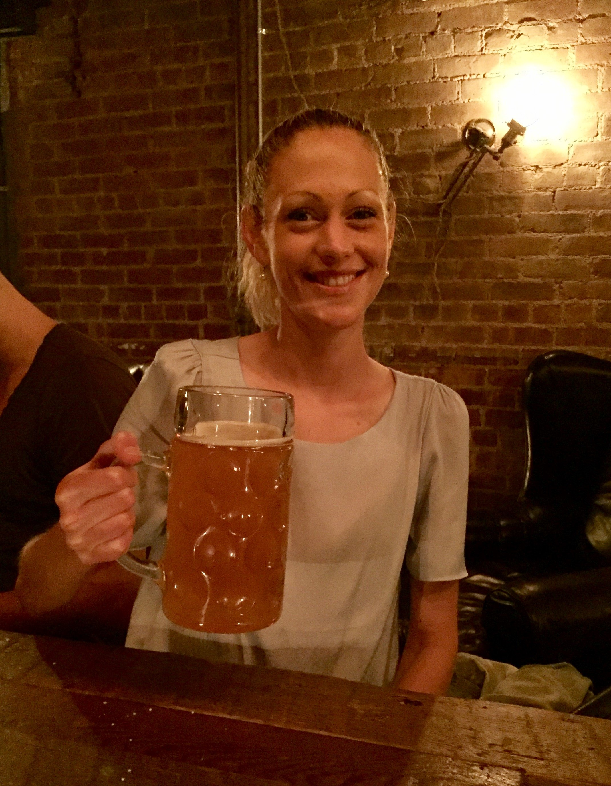

```{r setup, include=FALSE}
knitr::opts_chunk$set(echo = TRUE)
```

<style>
body {
text-align: justify}
figure figcaption {
    text-align: center;}
</style>

---

<div style="text-align:center" markdown="1">


</div>

---

<center> <h3>Beer With A Scientist Sundays</h3> </center>

---

New York City is home to some of the brightest minds, universities, and research centers in the world, having 127 Nobel laureates with roots at local institutions$^1$. The city has 15 nationally leading academic medical research institutions performing cutting-edge medicine and science. Courant Institute of Mathematical Sciences is ranked number one in applied mathematics across the entire country$^{2}$. Memorial Sloan-Kettering Cancer Center is one among the top cancer research institute in the world$^{3}$. Where are these scientists and how much do we know about the science happening in the city? 

For many scientists, the requirement to do outreach is tough - not only because of strong academic tendency towards introversion, but because there is a fundamental disconnect: public often learns best through stories and scientists through facts. Converting stories into facts doesn't come naturally to us, as hardcore scientists we are. How about converting facts into stories? Great! now, how do we do that?

We, scientists at NYU thought long and hard at this problem (in a bar actually) and had our stroke of enlightment delivered through a great beer - 

<span style="color:red"> _How about making a scientist tipsy with beer until they tells us stories on the facts they like?_ </span>

After all if it works for us, it should work for everyone. This is the idea behind Beer With A Scientist Sundays.

---

##### Okay, enough of your idea. I like it. Tell me the details

---

We plan to invite top-notch scientists from a diversity of fields to give a talk at the bar on any subject they choose. After the talk a question-answer session is planned. Thereafter, the audience are welcome to mingle with the scientist to get to know them and their work better. We aim to achieve a linear relationship between the number of beers consumed and fascinating information learned!

Depending on the availability, a debate between scientists are also on the works.

<span style="color:red"> When and Where? </span> 

**First Sunday** of each month between 7 pm-9 pm @ Alphabet City Beer Co. located at 96 Avenue C, New York, NY 10009.

---

##### You guys are crazy for sure. Who are you?

---

<figure style="float:left;">
  
  <figcaption> Jane deCider </figcaption>
</figure>

Jane Cullis is a postdoctoral fellow in the laboratory of Dr. Dafna Bar-Sagi in the Biochemistry and Molecular Pharmacology department at NYU. She has a BSc in Biochemistry from McGill University and PhD in Medical Biophysics from the University of Toronto. Jane’s research focuses on lipid metabolism in pancreatic cancer, with specific interest on how altered lipid utilization by tumor cells affects immune cells in the tumor microenvironment. When she isn’t at the lab, Jane enjoys getting biophysical over beers and metaphysical over martinis. Jane is known for thinking up her experimental designs over such bar banter or during her long meditative runs down the East river. If she wasn’t a scientist, she’d be a punmaster and a fisherman. 

---

<figure style="float:right;">
  
  <figcaption> Beermily </figcaption>
</figure>

<br> <br> <br> <br> <br> <br> <br> 

---

<figure style="float:left;">
  
  <figcaption> Brewski Janssens </figcaption>
</figure>

<br> <br> <br> <br> <br> <br> <br> <br>

---

<figure style="float:right;">
  
  <figcaption> Kannan, IPA </figcaption>
</figure>

Kasthuri Kannan, when not drinking beer, is an Assistant Professor of Pathology at NYU. He is trained in mathematics and computer science with postdoctoral training at MSKCC, where he contributed to cancer genomics efforts. He is interested in evolutionary biology and data-driven genomic analysis that leads to verifiable and useful hypotheses. His contributions to genomics include a comprehensive report of molecular alterations in adenoid cystic carcinoma (a salivary glad tumor) and high-frequency ATRX mutations in astrocytoma (a low grade brain tumor). He is actively co-advising and collaborating with several scientists and physician-scientists, translating research findings to clinical care, and is passionate about teaching and science communication.

---

#### References

1. [Education in New York City](https://en.wikipedia.org/wiki/Education_in_New_York_City)

2. [Courant Institute of Mathematical Sciences](https://en.wikipedia.org/wiki/Courant_Institute_of_Mathematical_Sciences)

3. [Memorial Sloan-Kettering Cancer Center Ranking](https://health.usnews.com/best-hospitals/area/ny/memorial-sloan-kettering-cancer-center-6213060)

---