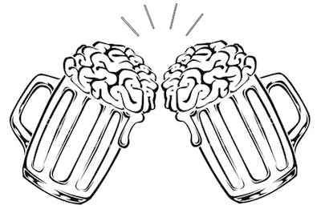

```{r setup, include=FALSE}
knitr::opts_chunk$set(echo = TRUE)
```

<style>
body {
text-align: justify}
</style>

---

<div style="text-align:center" markdown="1">


</div>

---

<center> <h1>Beer With A Scientist Sundays</h1> </center>

---


---