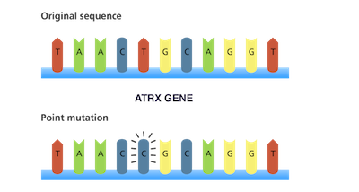

```{r setup, include=FALSE}
knitr::opts_chunk$set(echo = TRUE)
```

<style>

body {
text-align: justify;}

figure figcaption {
    text-align: center;}
</style>

---

<div align="center">
#### Contributions in Omics
</div>

---

<!--  -->

<figure style="float:left;">
  
  <figcaption> Nearly 70% of astrocytoma patients have mutations in ATRX </figcaption>
</figure>


As a genomics scientist, my work has focused on developing and implementing bioinformatics algorithms as well as analyzing and interpreting biological data sets facilitating researcher’s experiments and hypothesis. I have extensive research experience applying data science to data generated from genetics and epigenetics experiments and have made vital contributions to several studies, especially in cancer genomics. One of my [landmark discoveries](https://www.ncbi.nlm.nih.gov/pmc/articles/PMC6054684/) is in pediatric brain cancer known as Pineoblastoma. I discovered significant number of copy number variations in a gene called PDE4DIP that holds an ancestral protein domain DUF1220 which is responsible for brain growth and function. 

Another [study](https://www.ncbi.nlm.nih.gov/pubmed/29619247) of mine reveals key signaling pathways and genes responsible for Sudden Unexpected Death in Epilepsy (also known as SUDEP). During my tenure as an investigator at the Genome Technology Center (GTC) at New York University (NYU), my research encompassed cancer epigenetics and I developed algorithms and pipelines to analyze and integrate various epigenetics data generated through ATAC-seq and ChIP-seq experiments. These pipelines are being extensively applied in several studies as I continue to collaborate with physician-scientists interpreting the results of the analysis. For instance, continuing my collaboration with Dr. Jason Huse resulted in an [article](https://www.ncbi.nlm.nih.gov/pubmed/29535300) in _Nature Communications_ in which we describe a model for ATRX loss in glioma cells of origin. 

<figure style="float:right;">
  
  <figcaption> Subgroups in astrocytoma </figcaption>
</figure>

My tenure at MDACC (between 2011-2013), shaped me to perform critical roles in several genomics studies. My expertise in cancer genomics was primarily focused on brain tumors. One of my [contributions](https://www.ncbi.nlm.nih.gov/pubmed/23104868) in low-grade brain cancer called astrocytoma, identifies mutations in a gene called ATRX in 70% of the patients. This gene plays a critical role in lengthening of telomere, an important mechanism for tumor growth. In another [study](https://www.ncbi.nlm.nih.gov/pubmed/22415316) I identified three distinct gene expression groups of patients who contract astrocytoma, two of which harbors mutations in the gene called _Isocitrate dehydrogenase 1_ (_IDH1_), which is responsible for glucose metabolism . 

Also, I was instrumental in identifying two melanoma patient subgroups who were treated with immunotherapy and this finding was [published](https://www.ncbi.nlm.nih.gov/pubmed/25409260) in _New England Journal of Medicine_. Further, my [work](https://www.ncbi.nlm.nih.gov/pubmed/23685749) on Adenoid Cystic Carcinoma in _Nature Genetics_ identifies clinically significant mutations and pathways through robust mutation calling and pathway analysis algorithms.

Further, I have a keen interest on tumor evolution and population genetics. My [publication](http://dx.doi.org/10.1080/23737867.2016.1221328) in _Letters in Biomathematics_, establishes a formula for inferring selection in tumors by making use of an advanced mathematical result called the _Inverse Function Theorem_. 

---