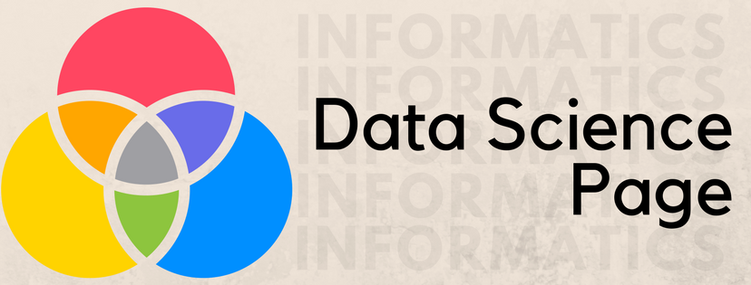
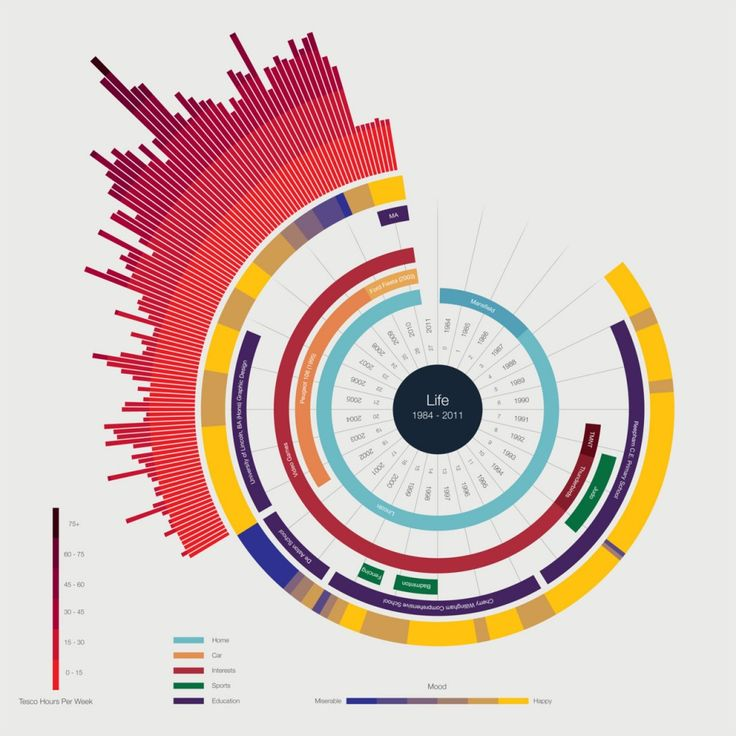
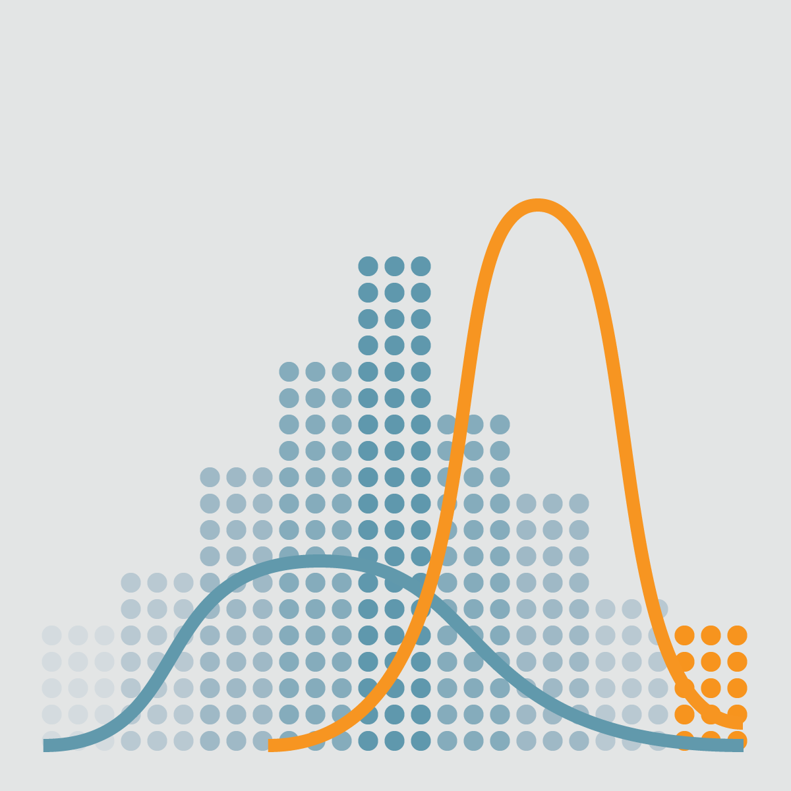
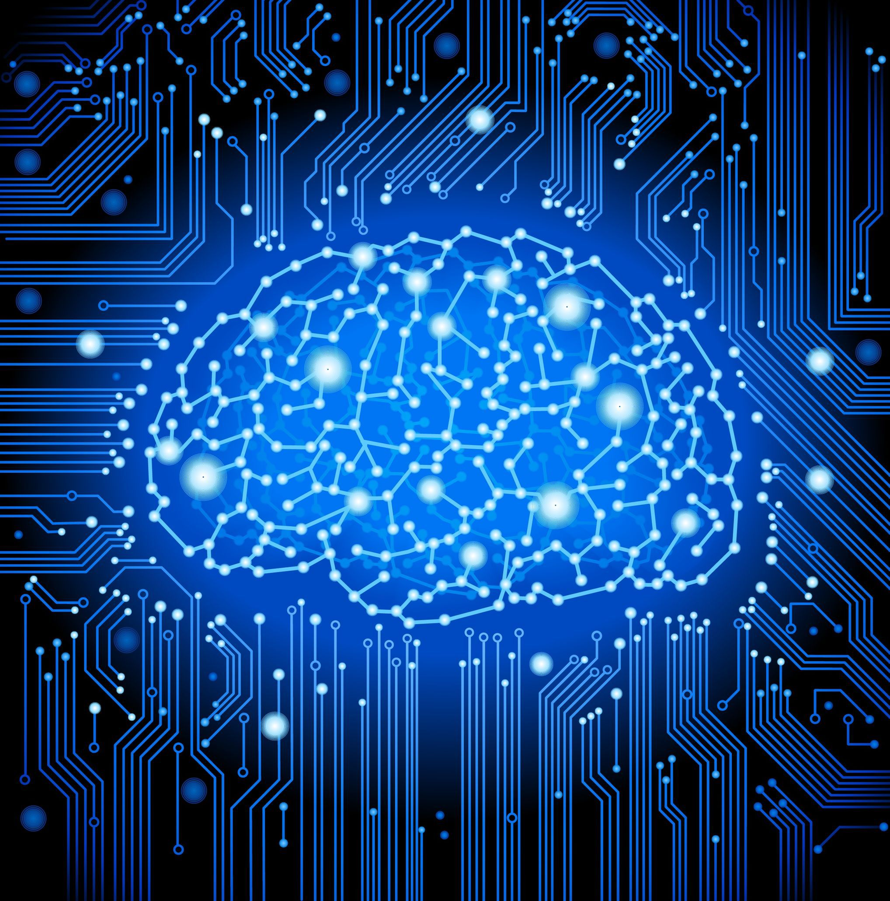

---
output:
  bookdown::gitbook:
    lib_dir: assets
    split_by: chapter
    config:
      toolbar:
        position: static
    sharing: 
      facebook: yes
      twitter: yes
      google: no
      weibo: no
      instapper: no
      vk: no
      all: ['facebook', 'google', 'twitter', 'weibo', 'instapaper']
  bookdown::pdf_book:
    keep_tex: yes
  bookdown::html_book:
    css: toc.css
documentclass: book
---

---

{width=70%}

---

## Welcome to Data Science Lectures {-}

Over the past few months I had a good opportunity to direct and teach courses in informatics. Isn't it a good idea to compile and have them in a central location for easier access and information? Almost all lectures have video recordings, except for one or two. So, feel free to browse the series and in case you spot any errors (both of omission and commission), please feel free to report. You can contact me at _my first name_ at _gmail_ dot _com_

If you need more information about the course content, like homeworks, projects etc., you can look into the course home pages which can be accessed from my  [teaching](https://kannan-kasthuri.github.io/Teaching/teaching.html) page.

### A note {-}

Although I have separate sections which probably would come under the broad theme of informatics, I don't mean to distinguish data science from informatics. To be a good data scientist, several topics in informatics are necessary, including linear algebra, statistics, signal/image processing etc. Therefore, this entire collection should come under the ambit of data science (and even more such as machine learning that I currently don't have, but planning to include as I develop the material). This is precisely the reason why the page is named "Data Science" and topics such as programming fundamentals, algorithms, optimization, linear algebra etc., have data science series. I will use the words "informatics" and "data science" interchangeably. 

**No** claim is made on the originality of the lectures. I have liberally borrowed (and in some cases shamelessly reproduced) what several people have painstakingly produced, of course giving proper credits - look at the reference section. In this day and age of information overflow, these concepts can be learnt from several sources. So this collection has to be viewed as an attempt to organizing data science ideas than as a claim to originality or authority.  

If you are seriously pursuing data science, it goes without saying that it will be extremely useful to learn Git. If you don't have the time to learn advanced stuffs, get the basic operations working, like, push, pull and commits. Remember, learning Git is an investment and you will be attractive to future employers.

### About this series {-}

Why data science now? After all data analysis has been there from the days of Galileo when he measured gravity. Talking about statistics, the normal distribution was discovered by Carl Fredrich Gauss in $1809$. To see why data science is more useful now, you may want to watch the [introductory lecture](https://kannan-kasthuri.github.io/Lecture_Files/PDA_Lecture_01/Lecture_01.html) in my course. 

The lectures are arranged in a manner that a typical data science workflow would require, although data analysis is an iterative and repetitive process. For instance, the _wrangle_ portion will most often be required as soon as we start messing with the data and so it is in the beginning of data handling section, followed by data transformation and visualization. The informatics basics are not necessary for manipulating data but a thorough understanding is important to master data analytics. And hence they appear at the end. 

And finally, these are based on R than on any other programming language. While the topic of data science is agnostic to the language of choice, due to teaching responsibilities that emphasized R, most of them are built on this language. If one understands the general principles underneath the lectures he/she may be able to reproduce it in any other language.

## R programming basics {-}

<figure style="float:left;">
  
</figure>

This series deals with the fundamentals of R programming language. R is one of the most powerful language available that is specifically meant for data manipulation and analytics. The following three lecture series introduces important aspects of R that will be needed for later sections.

### DS 01 - R fundamentals {-}

In this lecture we introduce the basics of R programming language and introduce key concepts. Most of the time as you import data sets in R, by default, R would convert some of the factor variables into basic data types, and therefore it is important to know the underlying idea behind this, such as coercion which are covered here. [[Link](https://kannan-kasthuri.github.io/Informatics/DS01/DS01.html)]

### DS 02 - R fundamentals {-}

Linked lists form the heart of R programming language. Data frames are constructed out of lists. We study lists and basic graphics. Although `ggplot` is a better framework for plots in R, knowing basic plots is important to better appreciate the plots produced through grammar of graphics. These are presented here. [[Link](https://kannan-kasthuri.github.io/Informatics/DS02/DS02.html)]

### DS 03 - R/Rmd fundamentals {-}

This topic starts with defining conditional statements in R, functions and scope. More importantly, we introduce R markdown. Communication and reproducibility are cornerstones of science and analysis. R markdown is an excellent framework for these. It is pretty easy to get going with `Rmd`. Check it out - [[Link](https://kannan-kasthuri.github.io/Informatics/DS03/DS03.html)]

## Data handling & visualization basics {-}

<figure style="float:right;">
  
</figure>

Recently someone said data science is 80% messing and transforming data bringing it into proper format, 10% is coding not related to machine learning and 10% is analytics. Although the percentages are crude estimates, by and large, this is true. As you learn data science, you'll see most of the time goes in manipulating data sets than doing analytics on them. These three lectures deal with structuring data which in my opinion forms the core of data science.

### DS 04 - Wrangle and explore {-}

What do you do as soon as you are given data? Where do you go from there? If these are your questions, you may want to nose dive into this lecture. This deals with what is known as _wrangling_ data. This means fighting with the data and manipulating it, which may include _gathering_, _spreading_ variables, _joining_ different tables like databases etc. Be brave! Find out how you wrestle with the data. [[Link](https://kannan-kasthuri.github.io/Informatics/DS04/DS04.html)]

### DS 05 - Transform and explore {-}

Let us assume you have fought hard with the data, wrangled quite a bit, and finally made it into a format you'd use. What would you do if you want to select only certain rows or columns? What if you want to make a new variable or get some statistics for a certain category? This is where data transformation becomes really important. Data transformation, and especially the `group by` operation along with `summarise` is one of the fundamental utilities and essential to learn. [[Link](https://kannan-kasthuri.github.io/Informatics/DS05/DS05.html)]

### DS 06 - Visualize and explore {-}

Visualization is a deep aspect of psychology and we humans are primarily visual in nature. There are several ways we can convey information and in fact add "layers" to plots that adds information. Just like sentences have parts of speech, graphics has a grammar too. This  [Grammar of Graphics](http://byrneslab.net/classes/biol607/readings/wickham_layered-grammar.pdf) framework in R is efficiently implemented as `ggplot`. R produces amazing graphics with ggplot as the main engine. You may want to work on this lecture, if you want to be a data scientist. [[Link](https://kannan-kasthuri.github.io/Informatics/DS06/DS06.html)]

## Data analytics basics {-}

<figure style="float:left;">
  
</figure>

Although data analytics may constitute a minor portion of data science, it cannot be ignored. After all, all the wrangling, transformations and visualizations are performed only to do statistics on them. Data analytics is essential and modeling is a critical part of it. These three topics deal with data analytics. 

### DS 07 - Exploratory Data Analysis {-}

This lecture of data science deals with Exploratory Data Analysis, or EDA for short. Before we work with data modeling, it is important to have an idea how the variables relate to each other. Finding correlations, covariations are all important part of this analysis. This part of analysis will help determine, say, if linear regression is applicable to variables in the first place. Skipping EDA can lead to unreasonable assumptions on data modeling down the line. Therefore, this shouldn't be skipped. [[Link](https://kannan-kasthuri.github.io/Informatics/DS07/DS07.html)]

### DS 08 - Inference, Linear regression {-}

The next logical step after you do EDA is basic statistical inference or linear regression. This topic deals with these analytics plus gives the conditions when such inference and regression are applicable. For instance, one of the key assumptions for linear regression is the normality of the residuals. It is important to know when linear regression is applicable and not, when dealing with complicated data sets. [[Link](https://kannan-kasthuri.github.io/Informatics/DS08/DS08.html)]

### DS 09 - Advanced modeling {-}

If you have two continuous variables that are correlated to a good degree, you may want to apply linear regression. What if you have categorical variables? Logistic regression is a powerful technique to solve some of these problems. In this chapter, we go into the nuts and bolts of how these algorithms work. We review "behind the scenes" method of maximum likelihood and principles of convex optimization. We see how stochastic gradient descent may help working with big data problems. This is slightly mathematically sophisticated, but all efforts are made to make it accessible to general audience. [[Link](https://kannan-kasthuri.github.io/Informatics/DS09/DS09.html)]

## Informatics basics {-}

<figure style="float:right;">
  
</figure>

To be a good data scientist it is important to know why things work as much as how they work. Theory is indispensable and the role of conceptual understanding cannot be underestimated. These topics deal with concepts that create the above topics and makes data science possible. These are slightly mathematically advanced but keeping up with the spirit of knowledge dissemination, a good effort has been made to make things understandable.

### DS 10 - Image processing {-}

A picture is worth 1000 words, and ImageNet contains 14 million pictures - that makes its repository worth 14 billion words! How does tech giants deal with such heavy data? Or how about diagnosing a disease from a MRI scan - is that brain portion we see a disease or a bunch of dead pixels? Image processing is ubiquitous and thanks to algorithms such as Fast Fourier Transforms and mathematical models that allow us to grab a popcorn and watch any movie of choice, in seconds. Knowing image processing can go a long way in your informatics career, and can distinguish you from other data scientists. Learn some image processing. [[Link](https://kannan-kasthuri.github.io/Informatics/DS10/DS10.html)]

### DS 11 - Linear Algebra {-}

Let's admit it - Linear Algebra can be intimidating. We can still recall those hours and hours of agony when our high school teacher made us manipulate matrices. And we made a promise that we won't touch the subject again. But Jean Dieudonné, one of the pioneering mathematician claimed "There is hardly any theory which is more elementary than linear algebra, in spite of the fact that generations of professors and textbook writers have obscured its simplicity by preposterous calculations with matrices". And there should be some truth to it. Why don't we find it out by watching this lecture? [[Link](https://kannan-kasthuri.github.io/Informatics/DS11/DS11.html)]

### DS 12 - Algorithms {-}

It wouldn't be far from truth if we say none of the above topics would make any sense without this - _Algorithms_. It is this engine that propels the whole of informatics. We make an online purchase through our credit card hoping that it is secure enough - thanks to the million dollar question that is still unanswered - _does P equals NP_? We take Google for granted because sorting and searching can be quickly executed on a machine. It is the world of algorithms we live in. Why not understand it? [[Link](https://kannan-kasthuri.github.io/Informatics/DS12/DS12.html)]