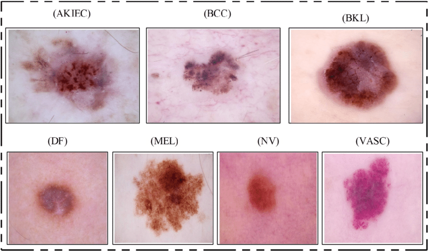
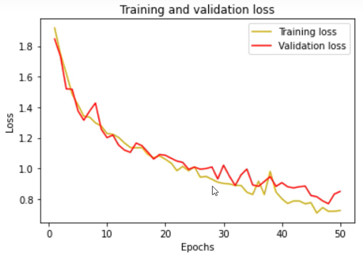
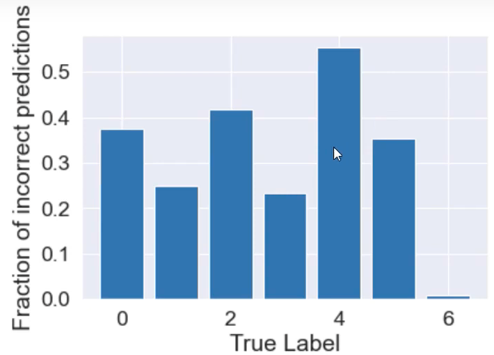

```{r setup, include=FALSE}
knitr::opts_chunk$set(echo = TRUE)
```

<style>

body {
text-align: justify;}

figure figcaption {
    text-align: center;}
</style>


---

## Hands-on introduction to AI based image classification 

---

#### Introduction

---

This hands on tutorial will introduce AI-based (python keras deep learning framework) for classifying skin cancers. We will do this in two stages, (1) reading the data set into python, and, (2) training and classifying skin lesions using the deep learning framework. The dataset used in this tutorial is HAM10000. 

---

#### What is HAM10000?

---

HAM10000 is a publically available dataset commonly used in the field of dermatology and skin image analysis. It stands for "Human Against Machine with 10,000 training images," and it's a collection of high-quality images of skin lesions. This dataset is often used for developing and evaluating deep learning models for skin cancer detection and classification. There are seven distinct diagnostic categories in HAM10000:

1. Melanocytic nevi (nv)
2. Melanoma (mel)
3. Benign keratosis-like lesions (bkl)
4. Basal cell carcinoma (bcc) 
5. Actinic keratoses (akiec)
6. Vascular lesions (vas)
7. Dermatofibroma (df)

They look like these. 

<center>

{#id .class width=50% height=50%}

</center>

More than 50% of lesions are confirmed through histopathology (histo) and the ground truth for the rest of the cases is either follow up examination (follow_up), expert consensus (consensus) or confirmation by in-vivo confocal microscopy (confocal). It also contains a metadata (csv) file with demographic information of each lesion.

More description on the HAM10000 data set can be found [here](https://arxiv.org/ftp/arxiv/papers/1803/1803.10417.pdf). 

The goal of this tutorial is to classify the images into one of the seven classes using the deep learning framework. We will first download the dataset. The download link is given below.

[HAM10000 Download Link](https://www.kaggle.com/datasets/kmader/skin-cancer-mnist-ham10000)

---

#### Reading the HAM10000 dataset into python 

---

In order to work with limited memory, we will organize the entire set of images into sub-folders for each category. To do this we first copy two sets of images into a directory called ```/all_images```.

```
# Reorganize data into subfolders based on their labels

# Sort images to subfolders first 
import pandas as pd
import os
import shutil

# Dump all images into a folder and specify the path:
data_dir = os.getcwd() + "/data/all_images/"

# Path to destination directory where we want subfolders
dest_dir = os.getcwd() + "/data/reorganized/"

```

We now read the metadata csv file and corresponding labels.

```
# Read the csv file containing image names and corresponding labels
skin_df2 = pd.read_csv('data/HAM10000/HAM10000_metadata.csv')
print(skin_df['dx'].value_counts())

label=skin_df2['dx'].unique().tolist()  #Extract labels into a list
label_images = []

```

We now copy the images into new folders.

```
# Copy images to new folders
for i in label:
    os.mkdir(dest_dir + str(i) + "/")
    sample = skin_df2[skin_df2['dx'] == i]['image_id']
    label_images.extend(sample)
    for id in label_images:
        shutil.copyfile((data_dir + "/"+ id +".jpg"), (dest_dir + i + "/"+id+".jpg"))
    label_images=[]    

```

Now we are ready to import images in sub-folders for training a neural network model. We use Keras library ```ImageDataGenerator``` module for data augmentation and pre-processing of images.

```
# Import relevant modules
from keras.preprocessing.image import ImageDataGenerator
import os
from matplotlib import pyplot as plt

```

We then define the data generator and the training directory with categorical class mode, ```batch_size``` as 16 and resizing the image to a 32x32 pixel size (```target_size```).

```
# Define datagen. Here we can define any transformations we want to apply to images
datagen = ImageDataGenerator()

# Define training directory that contains subfolders

train_dir = os.getcwd() + "/data/reorganized/"

# We use flow_from_directory
train_data_keras = datagen.flow_from_directory(directory=train_dir,
                                         class_mode='categorical',
                                         batch_size=16,        # 16 images at a time
                                         target_size=(32,32))  # Resize images

```

We are now ready to train via ```model.fit_generator```.

---

#### Classifying HAM10000 images using Keras

---

We will now train a deep convolution model and test with a training:testing set ratio of 75:25.

Import relevant modules

```
import matplotlib.pyplot as plt
import numpy as np
import pandas as pd
import os
from glob import glob
import seaborn as sns
from PIL import Image

```

Define a seed to ensure predictability and import ```keras``` and its modules for sequential convolution network.

```
np.random.seed(42)
from sklearn.metrics import confusion_matrix

import keras
from keras.utils.np_utils import to_categorical # used for converting labels to one-hot-encoding
from keras.models import Sequential
from keras.layers import Dense, Dropout, Flatten, Conv2D, MaxPool2D, BatchNormalization
from sklearn.model_selection import train_test_split
from scipy import stats
from sklearn.preprocessing import LabelEncoder

```

We now read the dataframe and convert the categories into integer lables using ```LabelEncoder```.

```
skin_df = pd.read_csv('data/HAM10000/HAM10000_metadata.csv')

# label encoding to numeric values from text
le = LabelEncoder()
le.fit(skin_df['dx'])
LabelEncoder()
print(list(le.classes_))
 
skin_df['label'] = le.transform(skin_df["dx"]) 
print(skin_df.sample(10))

```
We now do basic statistics and observe that the distribution of categories is highly skewed. For example, the "nv" category has 6705 images whereas the "df" category has just 115. Therefore, we need to balance the number of images, to say, 500 images in each category. We can do this by subsampling certain categories (which has more than 500 images) and repeated sampling in categories that has fewer than 500 images. We can also do this by adding weights when training but we will stick to sampling here.

```
# Distribution of data into various classes 
from sklearn.utils import resample
print(skin_df['label'].value_counts())

# Balance data.
# Many ways to balance data... you can also try assigning weights during model.fit
# Separate each classes, resample, and combine back into single dataframe

df_0 = skin_df[skin_df['label'] == 0]
df_1 = skin_df[skin_df['label'] == 1]
df_2 = skin_df[skin_df['label'] == 2]
df_3 = skin_df[skin_df['label'] == 3]
df_4 = skin_df[skin_df['label'] == 4]
df_5 = skin_df[skin_df['label'] == 5]
df_6 = skin_df[skin_df['label'] == 6]

n_samples=500 
df_0_balanced = resample(df_0, replace=True, n_samples=n_samples, random_state=42) 
df_1_balanced = resample(df_1, replace=True, n_samples=n_samples, random_state=42) 
df_2_balanced = resample(df_2, replace=True, n_samples=n_samples, random_state=42)
df_3_balanced = resample(df_3, replace=True, n_samples=n_samples, random_state=42)
df_4_balanced = resample(df_4, replace=True, n_samples=n_samples, random_state=42)
df_5_balanced = resample(df_5, replace=True, n_samples=n_samples, random_state=42)
df_6_balanced = resample(df_6, replace=True, n_samples=n_samples, random_state=42)

# Combined back to a single dataframe
skin_df_balanced = pd.concat([df_0_balanced, df_1_balanced, 
                              df_2_balanced, df_3_balanced, 
                              df_4_balanced, df_5_balanced, df_6_balanced])

# Check the distribution. All classes should be balanced now.
print(skin_df_balanced['label'].value_counts())

```
We will now import the balanced dataset, with the images resized.

```
# Now time to read images based on image ID from the CSV file
# This is the safest way to read images as it ensures the right image is read for the right ID
image_path = {os.path.splitext(os.path.basename(x))[0]: x
                     for x in glob(os.path.join('data/HAM10000/', '*', '*.jpg'))}

# Define the path and add as a new column
skin_df_balanced['path'] = skin_df['image_id'].map(image_path.get)

# Use the path to read images.
skin_df_balanced['image'] = skin_df_balanced['path'].map(lambda x: np.asarray(Image.open(x).resize((SIZE,SIZE))))

```
As a next step, we need to convert the dataframe column of images into numpy array and split the data into training and testing set.

```
# Convert dataframe column of images into numpy array
X = np.asarray(skin_df_balanced['image'].tolist())
X = X/255.  # Scale values to 0-1. You can also used standard scaler or other scaling methods.

Y=skin_df_balanced['label']  # Assign label values to Y
Y_cat = to_categorical(Y, num_classes=7) # Convert to categorical as this is a multiclass classification problem

# Split to training and testing
x_train, x_test, y_train, y_test = train_test_split(X, Y_cat, test_size=0.25, random_state=42)

```
We now define a sequential convolution mode with ```relu``` activation, ```maxpool``` and ```dropout``` layers. Finally we flatten the 2D array and add two dense layers with ```softmax``` activation that will help predict as probabilities. Finally, we compile the model with ```crossentropy``` with ```Adam``` optimizer.

```
# Define the model.
num_classes = 7

model = Sequential()
model.add(Conv2D(256, (3, 3), activation="relu", input_shape=(SIZE, SIZE, 3)))
model.add(MaxPool2D(pool_size=(2, 2)))  
model.add(Dropout(0.3))

model.add(Conv2D(128, (3, 3),activation='relu'))
model.add(MaxPool2D(pool_size=(2, 2)))  
model.add(Dropout(0.3))

model.add(Conv2D(64, (3, 3),activation='relu'))
model.add(MaxPool2D(pool_size=(2, 2)))  
model.add(Dropout(0.3))

# Flatten the 2D array
model.add(Flatten())

# Add two dense layers
model.add(Dense(32))
model.add(Dense(7, activation='softmax'))

# Sumarize and compile the model with cross entropy and Adam optimizer
model.summary()
model.compile(loss='categorical_crossentropy', optimizer='Adam', metrics=['acc'])

```
We can now train the model.

```
# Training the model

batch_size = 16 
epochs = 50

history = model.fit(
    x_train, y_train,
    epochs=epochs,
    batch_size = batch_size,
    validation_data=(x_test, y_test),
    verbose=2)

score = model.evaluate(x_test, y_test)
print('Test accuracy:', score[1])

```
The accuracy for the training set is around 60% - not bad. We can now plot training and validation accuracy at each epoch.

```
# Plot the training and validation accuracy and loss at each epoch
loss = history.history['loss']
val_loss = history.history['val_loss']
epochs = range(1, len(loss) + 1)
plt.plot(epochs, loss, 'y', label='Training loss')
plt.plot(epochs, val_loss, 'r', label='Validation loss')
plt.title('Training and validation loss')
plt.xlabel('Epochs')
plt.ylabel('Loss')
plt.legend()
plt.show()


acc = history.history['acc']
val_acc = history.history['val_acc']
plt.plot(epochs, acc, 'y', label='Training acc')
plt.plot(epochs, val_acc, 'r', label='Validation acc')
plt.title('Training and validation accuracy')
plt.xlabel('Epochs')
plt.ylabel('Accuracy')
plt.legend()
plt.show()

```
<center>

{#id .class width=50% height=50%}
</center>

We now predict on the test data and plot confusion matrices and misclassification bar plots

```
# Prediction on test data
y_pred = model.predict(x_test)
# Convert predictions classes to one hot vectors 
y_pred_classes = np.argmax(y_pred, axis = 1) 
# Convert test data to one hot vectors
y_true = np.argmax(y_test, axis = 1) 

#Print confusion matrix
cm = confusion_matrix(y_true, y_pred_classes)

fig, ax = plt.subplots(figsize=(6,6))
sns.set(font_scale=1.6)
sns.heatmap(cm, annot=True, linewidths=.5, ax=ax)


#PLot fractional incorrect misclassifications
incorr_fraction = 1 - np.diag(cm) / np.sum(cm, axis=1)
plt.bar(np.arange(7), incorr_fraction)
plt.xlabel('True Label')
plt.ylabel('Fraction of incorrect predictions')

```

Here is the bar plot for misclassifications.

<center>
{#id .class width=50% height=50%}
</center>

As we see the label 4 performs really bad whereas label 6 does the best. It is likely that the worst performing classes could be the repeated sampling ones whereas the best performing classes are the ones we sub-sampled. This needs to be verified though.

---

#### Selected materials and references

[Link to codes - Reading the preparing the HAM10000 data](https://github.com/bnsreenu/python_for_microscopists/blob/master/202_2_ways_to_load_HAM10000_data.py)

[Link to codes - training and classifying HAM10000](https://github.com/bnsreenu/python_for_microscopists/blob/master/203b_skin_cancer_lesion_classification_V4.0.py)

[DigitalSreeni](https://www.youtube.com/@DigitalSreeni)

---